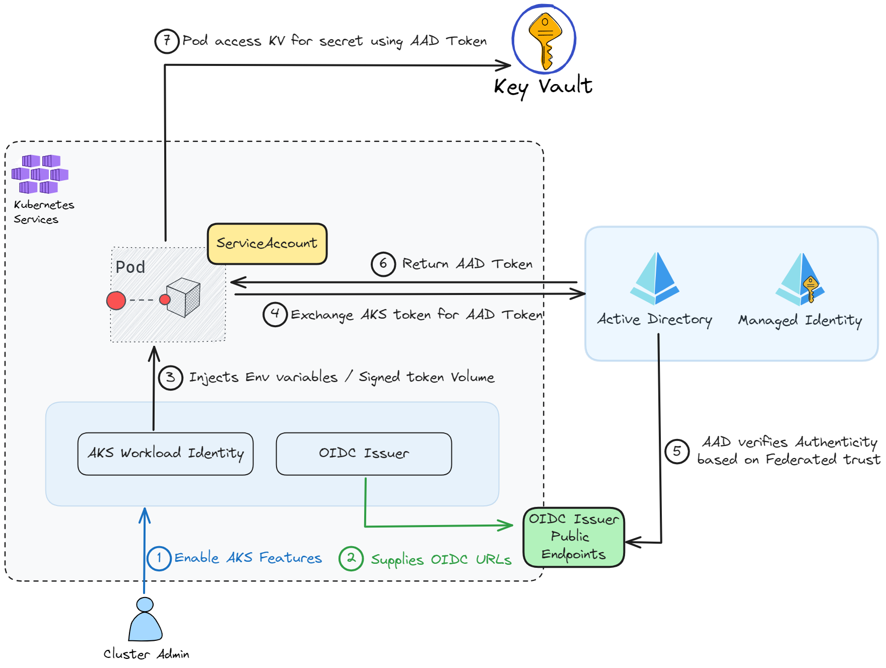
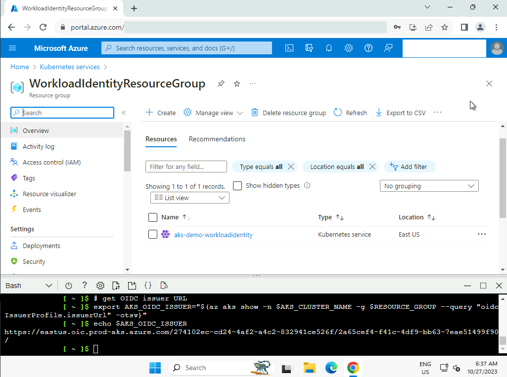
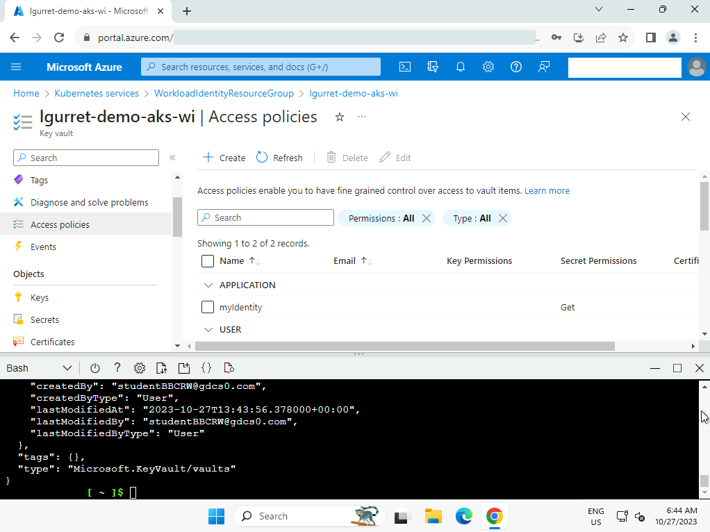
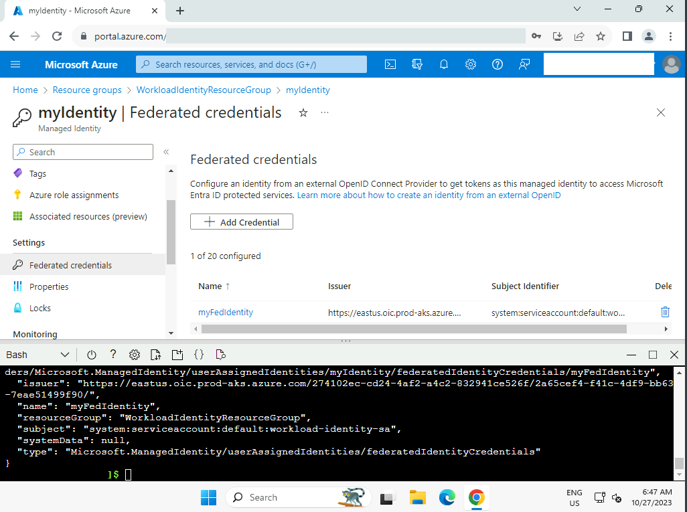
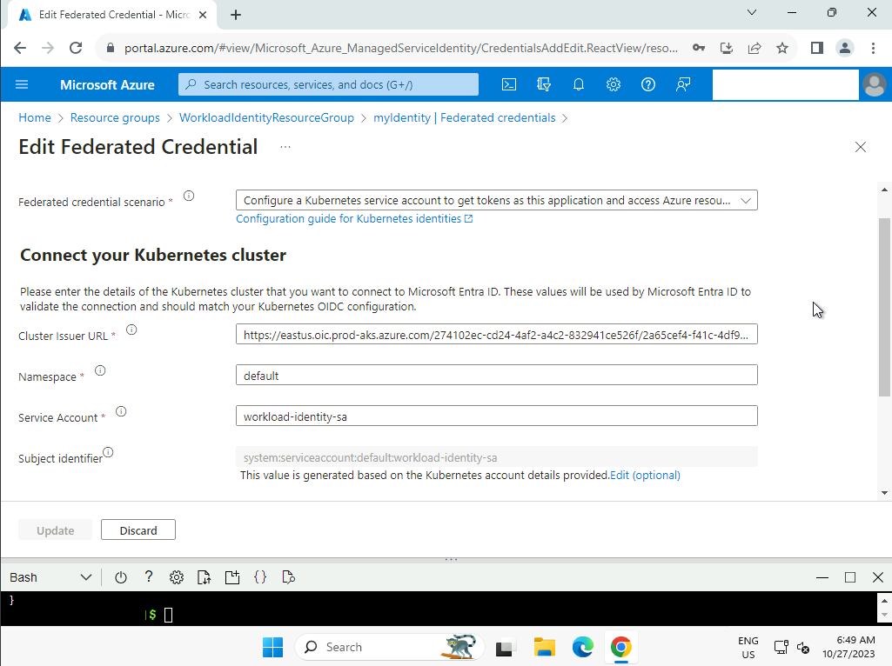
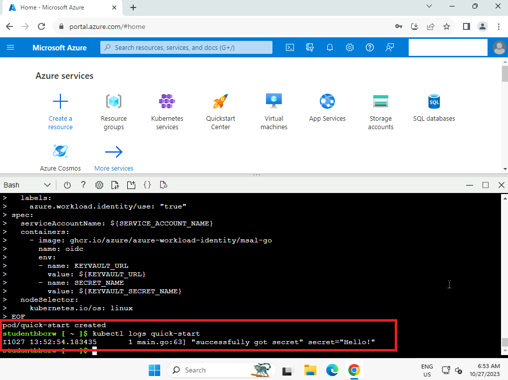

------------------------------------------------------------------------------------

---

## Introduction

In Kubernetes, [Secrets](https://kubernetes.io/docs/concepts/configuration/secret/) are API objects designed for storing sensitive information such as passwords, tokens, and keys. They function similarly to [ConfigMaps](https://kubernetes.io/docs/concepts/configuration/configmap/). Secrets are used to maintain a separation between sensitive data and application code, facilitating their independent management from the application. Within Pods, these Secrets can be utilized as environment variables, command-line arguments, or configuration files stored in a volume.

It's important to note that the data within Kubernetes Secrets **is not encrypted** as it is encoded in base64 and only protected by RBAC upstream. To enhance security, Kubernetes offers encryption at rest through [EncryptionConfig](https://kubernetes.io/docs/tasks/administer-cluster/encrypt-data/). This mechanism encrypts sensitive data when creating a Secret using a dedicated encryption key.

Alternatively, it is recommended to use external secret management systems such as [Vault](https://www.vaultproject.io/) or [Azure Key Vault](https://azure.microsoft.com/en-us/products/key-vault). This approach represents a best practice for storing and managing sensitive data, thereby enhancing security within Kubernetes.

## Introduction to Microsoft Workload Identity

A Workload Identity is an identity assigned to a software workload (such as an application, service, script, or container) to authenticate and access other services and resources.

They rely on the OIDC (OpenID Connect) protocol, which is an authentication protocol based on the OAuth 2.0 standard. It allows a user to authenticate with an application using a third-party identity provider, such as in our case, Microsoft Azure AD.

In an AKS context, it enables pods to access Azure resources, **eliminating the need to store authentication secrets**.

For example, for a workload that can store files in Azure Storage, when it needs to access these files, or as in this article, access an Azure KeyVault to **retrieve a password**.

Below is the conceptual diagram of our demo:



We observe several key points:

- Enabling two features in AKS
- Creating a Kubernetes service account
- Creating an Azure Managed Identity
- A federation link between the service account, OIDC Issuer, and the managed identity

Let's now proceed with the setup of the infrastructure and a test application.

## Setting Up the Infrastructure

### Environment Variables

Before executing our AZ CLI commands, we will preconfigure environment variables to make it easy for you to adapt the setup of this demonstration.

```bash
export AKS_CLUSTER_NAME=aks-demo-workloadidentity
export RESOURCE_GROUP="WorkloadIdentityResourceGroup"
export LOCATION="eastus"
export SERVICE_ACCOUNT_NAMESPACE="default"
export SERVICE_ACCOUNT_NAME="workload-identity-sa"
export SUBSCRIPTION="$(az account show --query id --output tsv)"
export USER_ASSIGNED_IDENTITY_NAME="myIdentity"
export FEDERATED_IDENTITY_CREDENTIAL_NAME="myFedIdentity"
export KEYVAULT_NAME="lgurret-demo-aks-wi"
export KEYVAULT_SECRET_NAME="my-secret"
```

### Creating the AKS Cluster and Its Features

Let's start by creating our resource group:

```bash
az group create -n $RESOURCE_GROUP -l $LOCATION
```

We can create the AKS cluster by enabling the necessary features:

```bash
az aks create -g $RESOURCE_GROUP -n $AKS_CLUSTER_NAME --node-count 1 --enable-oidc-issuer \
  --enable-workload-identity --generate-ssh-keys
```

Now that the cluster is created, we can retrieve the kubeconfig and the OIDC issuer URL for the rest of the demo:

```bash
# get cluster credentials; requires kubectl
az aks get-credentials -g $RESOURCE_GROUP -n $AKS_CLUSTER_NAME --admin

# get OIDC issuer URL
export AKS_OIDC_ISSUER="$(az aks show -n $AKS_CLUSTER_NAME -g $RESOURCE_GROUP --query "oidcIssuerProfile.issuerUrl" -otsv)"
```



### Creating the KeyVault

Here, we will create the KeyVault, its secret, and retrieve its URL for later use in the demonstration:

```bash
# Create a KV
az keyvault create --resource-group "${RESOURCE_GROUP}" --location "${LOCATION}" --name "${KEYVAULT_NAME}"

# Add secret
az keyvault secret set --vault-name "${KEYVAULT_NAME}" --name "${KEYVAULT_SECRET_NAME}" --value 'Hello!'

# Get KV URL
export KEYVAULT_URL="$(az keyvault show -g "${RESOURCE_GROUP}" -n ${KEYVAULT_NAME} --query properties.vaultUri -o tsv)"
```

### Creating a Managed Identity in Azure

Now, let's create a Managed Identity:

```bash
# get current subscription id
export SUBSCRIPTION_ID="$(az account show --query "id" -otsv)"

# create user assigned managed identity
az identity create --name $USER_ASSIGNED_IDENTITY_NAME --resource-group $RESOURCE_GROUP \
  --location $LOCATION --subscription $SUBSCRIPTION_ID

# Set an access policy for the managed identity to access the Key Vault secret
export USER_ASSIGNED_CLIENT_ID="$(az identity show --resource-group "${RESOURCE_GROUP}" --name "${USER_ASSIGNED_IDENTITY_NAME}" --query 'clientId' -otsv)"
```

We add an access policy to allow it to read secrets from the KeyVault:

```bash
az keyvault set-policy --name "${KEYVAULT_NAME}" --secret-permissions get --spn "${USER_ASSIGNED_CLIENT_ID}"
```



### Creating a Service Account in Kubernetes

We can now initiate the creation of resources on the AKS cluster. Let's start by creating the service account that will be used by our demonstration POD to connect to the KeyVault:

```bash
cat <<EOF | kubectl apply -f -
apiVersion: v1
kind: ServiceAccount
metadata:
  annotations:
    azure.workload.identity/client-id: ${USER_ASSIGNED_CLIENT_ID}
  name: ${SERVICE_ACCOUNT_NAME}
  namespace: ${SERVICE_ACCOUNT_NAMESPACE}
EOF
```

The link between our service account and our managed identity is established through an annotation in the manifest. Concurrently, webhook pods run in the background during the creation or update of pods. These webhook pods ensure that the service account's authentication token is correctly associated with a file in the pod's container, and they configure the necessary environment variables to allow the pod to securely access Azure resources.

### Establishing a federated trust relationship between Kubernetes and AAD (Azure Active Directory)

We create the federated identity between the managed identity, OIDC issuer, and the service account:

```bash
az identity federated-credential create --name ${FEDERATED_IDENTITY_CREDENTIAL_NAME} --identity-name ${USER_ASSIGNED_IDENTITY_NAME} --resource-group ${RESOURCE_GROUP} --issuer ${AKS_OIDC_ISSUER} --subject system:serviceaccount:${SERVICE_ACCOUNT_NAMESPACE}:${SERVICE_ACCOUNT_NAME}
```





### Infrastructure Validation

We will now validate by creating a POD using our service account and the password stored in Azure KeyVault. For this, we will use an msal-go image dedicated to this validation, as it has everything needed to read our secret using our workload identity:

```bash
cat <<EOF | kubectl apply -f -
apiVersion: v1
kind: Pod
metadata:
  name: quick-start
  namespace: ${SERVICE_ACCOUNT_NAMESPACE}
  labels:
    azure.workload.identity/use: "true"
spec:
  serviceAccountName: ${SERVICE_ACCOUNT_NAME}
  containers:
    - image: ghcr.io/azure/azure-workload-identity/msal-go
      name: oidc
      env:
      - name: KEYVAULT_URL
        value: ${KEYVAULT_URL}
      - name: SECRET_NAME
        value: ${KEYVAULT_SECRET_NAME}
  nodeSelector:
    kubernetes.io/os: linux
EOF
```

*In practice, we obviously recommend managing Workload Identities with Infrastructure as Code (IaC) using a tool like Terraform.*

The following command allows us to verify that we can read our password!

```bash
kubectl logs quick-start
```



### Using Microsoft Entra Workload ID Feature

Now that we have set up the infrastructure allowing us to use Workload Identities, we can move on to the next step by **integrating** it into our container images and workloads.

The Microsoft Entra Workload ID feature integrates with the range of client libraries, such as [Azure Identity](https://learn.microsoft.com/azure/aks/workload-identity-overview?tabs=dotnet#azure-identity-client-libraries), and the [Microsoft Authentication Library (MSAL)](https://learn.microsoft.com/azure/active-directory/develop/msal-overview), especially when opting for app registration.

Here is an example Java code for retrieving a secret via Workload Identities:

```java
import java.util.Map;

import com.azure.security.keyvault.secrets.SecretClient;
import com.azure.security.keyvault.secrets.SecretClientBuilder;
import com.azure.security.keyvault.secrets.models.KeyVaultSecret;
import com.azure.identity.DefaultAzureCredentialBuilder;
import com.azure.identity.DefaultAzureCredential;

public class App {
    public static void main(String[] args) {
        Map<String, String> env = System.getenv();
        String keyVaultUrl = env.get("KEYVAULT_URL");
        String secretName = env.get("SECRET_NAME");

        SecretClient client = new SecretClientBuilder()
                .vaultUrl(keyVaultUrl)
                .credential(new DefaultAzureCredentialBuilder().build())
                .buildClient();
        KeyVaultSecret secret = client.getSecret(secretName);
    }
}
```

**In cases where you cannot use these libraries**, it is still possible to retrieve our secret in Bash using curl:

```bash
# We can also use a POST with a JSON
AZURE_FEDERATED_TOKEN=$(cat $AZURE_FEDERATED_TOKEN_FILE)
RESP=$(curl -sL \
        -X GET "$AZURE_AUTHORITY_HOST/$AZURE_TENANT_ID/oauth2/v2.0/token" \
        --form 'grant_type="client_credentials"' \
        --form 'client_id="'$AZURE_CLIENT_ID'"' \
        --form 'scope="https://vault.azure.net/.default"' \
        --form 'client_assertion_type="urn:ietf:params:oauth:client-assertion-type:jwt-bearer"' \
        --form 'client_assertion="'$AZURE_FEDERATED_TOKEN'"')

ACCESS_TOKEN=$(echo "$RESP" | jq -r '.access_token')
RESP=$(curl -sL \
        -H "Authorization:Bearer $ACCESS_TOKEN" \
        -H "Content-Type:application/json" \
        ${KEY_VAULT_URL}/secrets/${SECRET_NAME}/?api-version=7.4)

export SECRET=$(echo "$RESP" | jq -r '.value')
```

In this script, only the environment variables SECRET_NAME and KEY_VAULT_URL are required!

## Sources

- https://learn.microsoft.com/azure/aks/workload-identity-overview?tabs=dotnet#azure-identity-client-libraries
- https://learn.microsoft.com/en-us/azure/aks/learn/tutorial-kubernetes-workload-identity
- https://learn.microsoft.com/en-us/entra/workload-id/workload-identity-federation
- https://learn.microsoft.com/en-us/azure/aks/workload-identity-overview?tabs=dotnet#how-it-works
- https://azure.github.io/AKS-DevSecOps-Workshop
