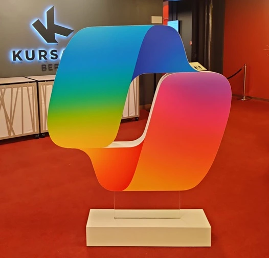
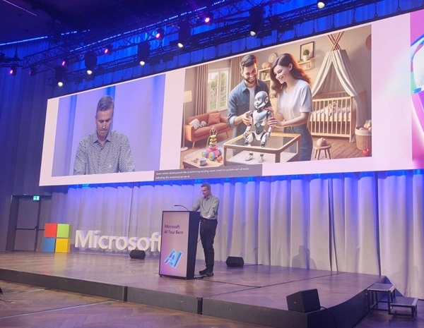
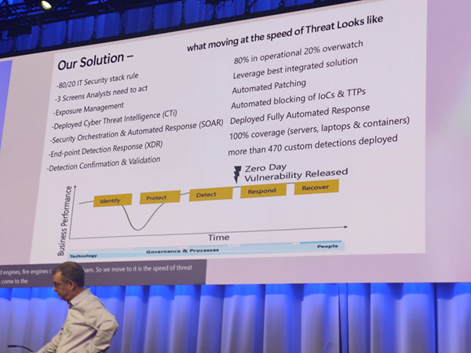

------------------------------------------------------------------------------------

---
## Introduction

Hello everyone!

In this blog, I’ll share my experience at the Azure AI Tour, an inspiring event I had the chance to attend.

It was a day filled with hands-on demos, insightful examples of AI in action, and valuable discussions with industry experts and peers. I also got to meet passionate professionals and explore how AI is transforming businesses.

Grab your coffee, and let’s dive into the key moments and takeaways from this exciting day!

## Opening Keynote

### Summary

[Roger Altorfer](https://www.linkedin.com/in/roger-altorfer/) presented the results of a [study](https://shorturl.at/V2r0Y) on the impact of AI in Switzerland. He began by highlighting that AI predates ChatGPT, with roots tracing back to the 1940s and Alan Turing. Sharing a personal story, he recalled receiving a chess computer from his father, which allowed him to win against him—a prelude to the historic moment when Garry Kasparov was defeated by Deep Blue in 1997. Thirty years after this milestone, AI has come a long way, as evidenced by the study findings shared during the keynote.

The study delved into Switzerland's unique "success model," emphasizing four key pillars:

- **Entrepreneurial spirit and innovation strength**
- **Openness to the world and local roots**
- **Adaptability, pragmatism, and opportunism**
- **Neutrality and independence**

Switzerland’s federalist nature often slows processes, but AI offers a promising way to increase efficiency and foster innovation!

### Key takeaways

- AI can boost Switzerland’s entrepreneurial spirit.
- Results of the study highlighted:
  - **86%** believe AI can significantly increase innovation.
  - **73%** see potential for profitability growth.
  - **68%** expect a rise in economic productivity.
- Opinions on job displacement were split:
  - **50%** foresee no impact.
  - **25%** anticipate a negative impact.
  - **25%** predict a positive impact.
- AI has fueled the growth of over **700 startups**, predominantly in:
  - Health and life sciences
  - Finance and insurance
  - Industry 4.0 & manufacturing
  - Marketing
  - Climate and sustainability

### Challenges AI can address

1. Enhancing research excellence (**short-term impact**)
2. Addressing the shortage of skilled labor (**medium-term impact**)
3. Tackling growth and innovation pressure (**medium-term impact**)

### Final thoughts

Experts believe small and medium-sized businesses can significantly benefit from AI. However, its implications extend beyond economics, potentially supporting democracy—or posing challenges. Ensuring the quality of education remains a top priority in adapting to this new AI-driven era.

For further details, you can explore the study through this [link](https://shorturl.at/V2r0Y).

## Copilot Demo

### Summary

[Stefanie Thommen](https://www.linkedin.com/in/stefaniethommen/) and [Didier Hubounig](https://www.linkedin.com/in/didierhu/) showcased how Copilot can help save time in our daily lives. They demonstrated that **Copilot is "the UI for AI"** and introduced **Copilot Studio**, which enables users to create or customize their own agents. The presentation emphasized the growing ubiquity of agents, envisioning a future where everyone has a personal assistant powered by AI.

They also introduced the **Copilot Control System**, designed to help IT professionals securely and confidently manage Copilot and its agents.

### Key takeaways

- **Copilots boost efficiency** by integrating into everyday workflows.
- Copilot examples from companies like **LGT**, **Rhätische Bahn**, and **UBS** highlighted its real-world applications.
- Copilot Studio empowers users to:
  - Customize AI agents for specific tasks.
  - Deploy personal assistants tailored to individual needs.
- The **Copilot Control System** ensures IT teams can manage and monitor these tools securely.

### Highlights from the demo

1. Didier demonstrated the capabilities of Copilot by role-playing as a CTO returning from vacation:
   - Copilot provided a **summary of missed updates** by analyzing emails, calendar events, and more.
   - It allowed for detailed insights into specific meetings.
   - Copilot generated a **meeting summary** from a Word document.
   - It even created an agenda, which could be easily shared via a Pages system.

2. Examples of AI agents:
   - A **travel expense buddy** that:
     - Calculated costs for attending an event in Geneva.
     - Drafted an email for managerial approval when it detected the budget had been exceeded.

3. Copilot in PowerPoint:
   - Quickly created a presentation from a data source.
   - Leveraged **company templates** for consistent and professional results.

### Final thoughts

The demo highlighted how Copilot can seamlessly integrate into various professional scenarios, enabling users to save time, streamline workflows, and focus on higher-value tasks. Its potential spans multiple industries, making it a valuable asset for businesses of all sizes.

## Coexistence of Humans and (Artificial) Superintelligence

### Summary  

[Rainer Kessler](https://www.linkedin.com/in/rainerkessler/) delivered a captivating talk blending technical, philosophical, legal, and ethical perspectives on AI. His presentation was both entertaining and thought-provoking, addressing the current and future challenges posed by artificial superintelligence.  

### Key takeaways  

- **Definition of AI**: AI mimics human behavior and decision-making. Engineers have long sought to make systems "intelligent."  
- In 2010, it was estimated that **33% of people** could not distinguish between a human and a machine in a conversation.  
- The rapid progress in AI can be partially attributed to **Moore's Law**, as transistors become faster and cheaper.  
- Machines can surpass human abilities:
  - A machine solving "1+1=2" is akin to humans having 500 years to complete the calculation.

### Key concepts explained  

- **Neuron**: The basic unit in a neural network, mimicking the way the human brain processes information.  
- **Neural network**: A system of interconnected neurons that processes data and learns from it, inspired by the human brain.  
- **Weight**: Values that determine the importance of inputs in a neural network; they are adjusted during learning.  
- **Machine Learning (ML)**: A subset of AI where systems learn from data to improve their performance without being explicitly programmed.  
- **Deep Learning**: A type of ML that uses neural networks with many layers to analyze complex patterns.  
- **Reinforcement Learning**: A learning method where systems are trained to make decisions by receiving rewards or penalties based on their actions.  

### Ethical dilemmas and future concerns  

- **Artificial General Intelligence (AGI)**: A hypothetical intelligence that could perform any intellectual task a human can, potentially humanity's "last invention."  
- **Tests for AI safety**:
  - **Lovelace Test**: Measures whether an AI can convincingly pass as human in conversation for more than 30% of the time.  
  - **Metzinger or Turing Test**: AI must contribute to discussions on artificial consciousness with its own arguments and theories.  
- **Autonomy and responsibility**: Questions arise about accountability in AI systems, such as self-driving cars:
  - Who is responsible for accidents?  
  - Could reinforcement learning be used to "punish" AI systems?  

### Societal and ethical implications  

- Ethics vary across human and machine interactions, influenced by numerous factors, including cultural and religious considerations.  
- The real challenge is not job loss but **transforming society** to coexist with AI.  
- We must act as role models to guide AI development responsibly.  

### Conclusion  

> "Will AI teach us to dream bigger? Or remind us why we need a better time? My response to Generative AI and to the world is: I am positive that it will be the first and not the latter."  

This inspiring statement encapsulated the optimistic outlook Rainer Kessler holds for the future of AI and humanity.  

## One Step Ahead - AI & Security  

By [Roger Halbheer](https://www.linkedin.com/in/rhalbheer/) and [Jeff Schiemann](https://www.linkedin.com/in/jeff-schiemann/)  

### Summary  

This talk focused on the intersection of AI and cybersecurity, addressing the evolving challenges posed by cyberattacks and how AI can be leveraged to enhance security measures. The speakers shared insights on reaction times, automation, and innovative strategies to stay ahead in the AI arms race.  

### Key Takeaways  

- **Reacting Quickly is Critical:**  
  - Jeff emphasized that the most important aspect of a security breach is the speed of response.  
  - Companies must aim to act within minutes of detecting an intrusion to mitigate damage effectively.  

- **Accepting Compromises:**  
  - Organizations are starting to accept that breaches are inevitable. The focus has shifted from prevention to building **digital resilience**.  
  - Roger explained how the term "resilience" resonates more with business stakeholders than "security."  

- **Trusted Digital Fabric:**  
  - This Microsoft approach combines identity, network, and endpoint controls into a **Zero Trust** strategy. It continuously authenticates identities and access in real time, ensuring adaptive and comprehensive security.  

- **Kill Chain Strategy:**  
  - A framework used to identify, disrupt, and neutralize cyberattacks by analyzing each stage of the attack lifecycle, from initial reconnaissance to execution.  

- **Automation is Essential:**  
  - Both speakers stressed the importance of automating responses to threats. Jeff highlighted the need for speed, even if it means sacrificing some accuracy.  

- **The AI Arms Race:**  
  - The rapid evolution of AI in cybersecurity, both for defense and attack, is a pressing concern for Jeff, who referred to it as the "AI arms race."  

- **Microsoft's Commitment to Data Privacy:**  
  - Roger assured that Microsoft does not use customer data to train their AI models, addressing a common concern.  

- **Building Insights with Data Lakes and Graphs:**  
  - By creating a **datalake** of logs and layering a **graph** on top, organizations can gain a better understanding of their security landscape.  
  - This allows for real-time visibility and improved detection of anomalies.  

- **Data Governance Enhancements:**  
  - Updates in **Microsoft Purview** include features for solving governance challenges, especially around **data classification**.  

- **Practical Tips:**  
  - Jeff: Use AI in your daily workflow to familiarize yourself with its capabilities.  
  - Roger: Explore tools like [Lakera Gandalf](https://gandalf.lakera.ai/baseline) to better understand and mitigate prompt injection vulnerabilities.  

### Conclusion

AI is transforming cybersecurity, helping organizations move from reactive to proactive strategies. However, the challenges posed by the AI arms race and evolving attack vectors require vigilance, automation, and innovation to stay ahead.  

> "Automation is no longer optional—it's a necessity."  

## Panel Session - AI at Work

**Speakers**: [Nadia Fischer](https://www.linkedin.com/in/nadiafischer/), [Martin Lauber](https://www.linkedin.com/in/martin-lauber/), [Simona Gabetti](https://www.linkedin.com/in/simona-gabetti-9b2726/), [Matthias Leybold](https://www.linkedin.com/in/matthiasleybold/), and [Boris Ovcak](https://www.linkedin.com/in/boris-ovcak/), interviewed by [Stephan Lendi](https://www.linkedin.com/in/slendi/)

### Summary

The session featured a panel discussion exploring the various ways artificial intelligence (AI) is utilized in the workplace, including challenges, benefits, and strategies for adoption.

### Key Points

**1. Speaker Introductions and Use of AI:**

- **Nadia Fischer**: Founder of **Witty**, a digital writing assistant focused on inclusive language. Witty detects bias, suggests inclusive writing, and educates users in real time. It supports organizations in fostering inclusive cultures.
- **Martin Lauber**: Works at **Swiss Post**, where AI is leveraged to modernize and enhance traditional processes.
- **Simona Gabetti**: Focuses on sales transformation, analyzing customer data for preferences, automating routine tasks, predictive forecasting, and improving chatbots and virtual assistants.
- **Matthias Leybold**: Uses AI to identify opportunities, create blueprints, and assist customers in adopting AI solutions.
- **Boris Ovcak**: Works in consulting, guiding customer transformations involving chat AI and Copilot technologies.

**2. Current AI Adoption:**

- Large organizations are leading in AI adoption, while smaller and medium-sized companies are still considering its integration.
- Challenges include investment costs, skill gaps, and the pressure of higher salaries for specialized roles.

**3. Key Challenges and Solutions:**

- **Employee Concerns**: Simona highlighted employees' fear of job losses due to AI adoption.
- **Division-Specific Needs**: Matthias emphasized the importance of understanding that different departments have unique requirements. The value of AI depends on aligning it with team needs.
- **Resistance to Change**: Boris pointed out that demonstrating business value and running pilot projects can help overcome resistance.

**4. Strategies for Scaling AI:**

- **Skills and Training**: Simona stressed the need for skill development and ongoing training.
- **Open Discussion**: Encourage dialogue to alleviate fears and promote trust.
- **Pilots and ROI**: Start with pilot programs, show tangible benefits, and measure ROI, as AI can be costly.
- **Human Touch**: A warning from Simona—AI should not replace human interaction entirely, as it could impact customer relationships.

**5. Cultural Considerations and Bias:**

- **Nadia Fischer** discussed cultural biases in LLMs. For example, job descriptions that include phrases like "Digital native jobs" might inadvertently exclude older candidates, potentially missing out on valuable talent during hiring processes.
- **Martin Lauber** mentioned that ChatGPT has sparked more interest in AI, making it easier to convince people of its benefits, despite the challenges of integrating it into existing systems.

### Conclusion

I really enjoyed this event. I learned many new terms related to both security and AI, which gave me a deeper understanding of how AI is being used in the workplace. This knowledge is valuable for both my daily work and my role as a consultant. We are just at the beginning, and it's exciting to see what the future holds for AI and its impact on our professional lives! 

Thanks for reading :)

