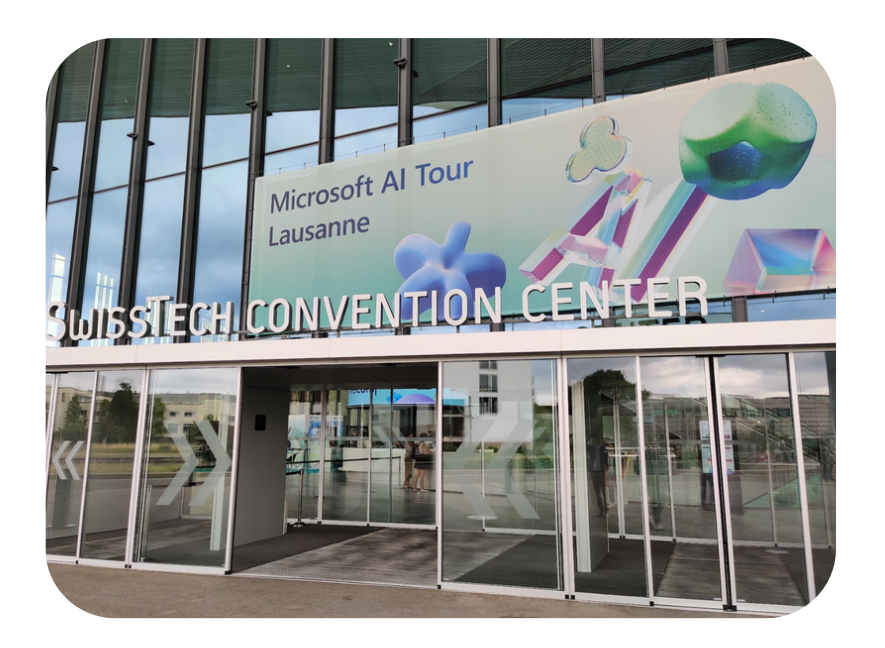
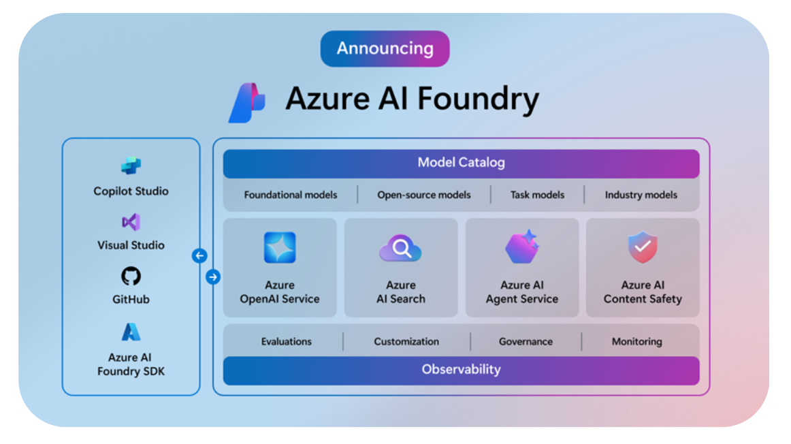
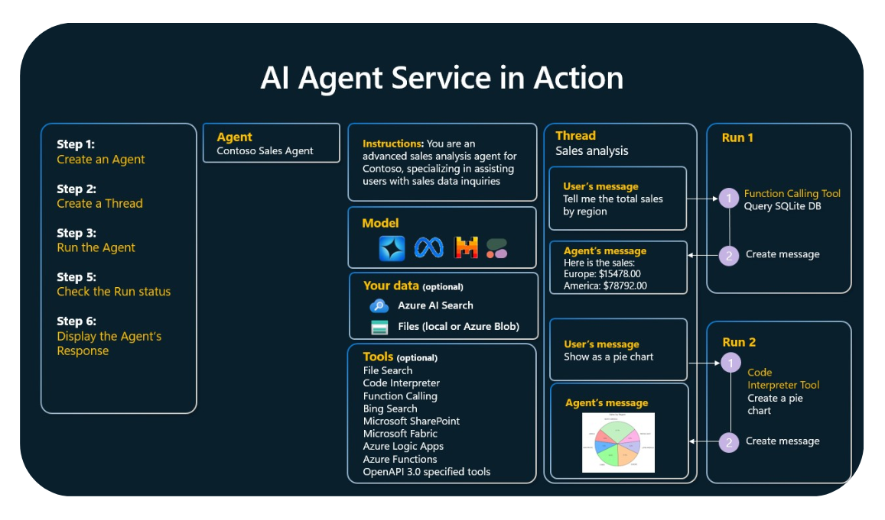
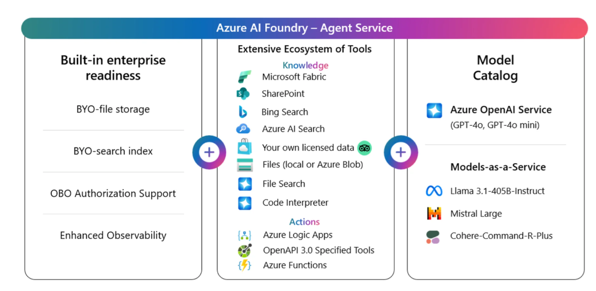
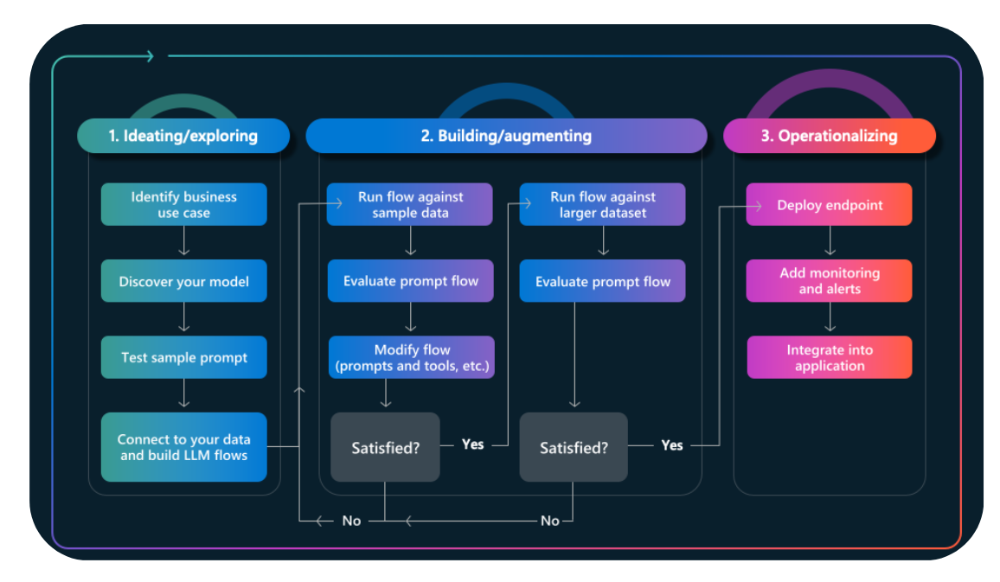

------------------------------------------------------------------------------------

---
## Introduction

I had the chance to attend the **Microsoft AI Tour in Lausanne**, a free, one-day event dedicated to the latest innovations in Microsoft Cloud and AI. The day was packed with insightful sessions, hands-on workshops, and opportunities to connect with Microsoft engineers, industry experts, and fellow tech enthusiasts.

With so many interesting topics on the agenda—ranging from building generative AI apps, making data AI-ready, to exploring Azure AI Foundry—I had to make some choices and couldn’t attend every session. In this article, I share my key takeaways and highlights from the sessions I joined.

Enjoy the read!

## Welcome Speech at Microsoft AI Tour Lausanne: Innovation, Investment, and Responsibility

The Microsoft AI Tour in Lausanne kicked off with a powerful welcome speech from [Catrin Hinkel](https://www.linkedin.com/in/catrinhinkel/), CEO of Microsoft Switzerland, and [Samer Abu-Ltaif](https://www.linkedin.com/in/samer-abu-ltaif-2b621b8/), President of Microsoft Central & Eastern Europe, Middle East & Africa.

### A Strong Message from Switzerland

Catrin Hinkel opened the day by celebrating Switzerland’s role as a leading country in innovation. She emphasized Microsoft’s strong and growing commitment to the Swiss market:

- Continued investments in local **cloud and AI infrastructure**
- Deployment of more **GPU/CPU resources**
- A goal to **train 1 million people in AI skills by 2027**
- Supporting companies to accelerate their **time-to-market**

She described this point in time as one of the **most extraordinary in human history**, given the speed and scale of AI advancements.

> 📰 Learn more about Microsoft's strategic investment:  
> [Microsoft deepens Switzerland’s digital future](https://news.microsoft.com/de-ch/2025/06/02/microsoft-deepens-switzerlands-digital-future-with-strategic-investment-in-cloud-and-ai-infrastructure-startups-skilling-and-innovation/)

### AI Momentum: Global and Local Impact

Samer Abu-Ltaif followed with examples showcasing the real-world impact of AI:

- According to a **PwC study**, AI could lead to a **15% increase in global GDP**
- For **every $1 spent on AI**, businesses could expect up to **$7 in return**
- Local use cases like the **Lucerne Cantonal Hospital** show AI already transforming healthcare — for example, **staff scheduling optimization with AI**

> 🏥 Read the story: [Lucerne Cantonal Hospital revolutionizes staff scheduling with AI](https://news.microsoft.com/de-ch/2024/04/22/lucerne-cantonal-hospital-luks-revolutionizes-staff-scheduling-with-ai/)

He also mentioned how AI is accelerating **drug discovery**, highlighting the technology's potential in both economic and societal progress.

### Microsoft’s European Commitments

Catrin reminded the audience of Microsoft’s **five core commitments to Europe**:

> 🔗 Full announcement: [European Digital Commitments](https://blogs.microsoft.com/on-the-issues/2025/04/30/european-digital-commitments/)

1. Help build a broad AI and cloud ecosystem across Europe  
2. Uphold Europe’s digital resilience, even during geopolitical tensions  
3. Comply with European laws and values  
4. Defend and protect Europe’s cybersecurity  
5. Strengthen Europe’s economic competitiveness — including support for open source  

### Ethics and Skills at Scale

Samer concluded the welcome by underscoring two key focus areas for Microsoft going forward:

- **Ethical AI development**
- **Skilling at scale** to ensure everyone can benefit from — and contribute to — this technological revolutions

## Opening Keynote – AI Transformation  

[Dona Sarkar](https://www.linkedin.com/in/donasarkar/) & [Francesco Sodano](https://www.linkedin.com/in/fsodano79/)

The opening keynote was led by Dona Sarkar, Director of Tech Evangelism at Microsoft, and Francesco Sodano, Cloud Solution Architect. Together, they provided a clear, developer-focused vision of how AI is transforming software development — not replacing it.

### Developers Will Not Be Replaced

Dona began with a reassuring and empowering message: **AI will not replace developers**.

She drew on historical context to emphasize this point — technologies like COBOL, Visual Basic, FrontPage, PowerApps, and others have all transformed the way we build software, but none have eliminated the need for developers. In fact, each wave of innovation has **increased the demand for developers**, not reduced it.

### Understanding AI: From Foundation Models to Frameworks

Dona then walked the audience through the **mechanics of modern AI**:

- How **language models** work
- Parameters like **temperature** and **top-p** that influence generation
- The use of **instructions** to guide AI behavior
- The role of **frameworks** in AI development
- Core AI concepts such as:
  - **Knowledge & Action models**
  - **Agents**
  - **Retrieval-Augmented Generation (RAG)**
  - **Function calling**

She also explained Microsoft's approach to empowering every kind of builder — from **no-code** and **low-code** users to **code-first developers** — and emphasized the growing ecosystem of AI-powered development tools.

### Azure AI Foundry: Your Enterprise AI Hub

One of the standout announcements was **Azure AI Foundry** — described as the **"full enterprise package"** for AI innovation.

- Includes access to **11,000+ models**
- Functions as a **central hub** for all AI development within the enterprise
- Seamlessly integrates with tools like **GitHub Copilot** and **Visual Studio Code**, giving developers a powerful set of building blocks

### Demo: From Code to AI Function in Minutes

Francesco Sodano gave a live demo that showcased the power of AI-assisted development:

- Using **Dev Box** and **GitHub Copilot**, he completed a coding task in just **5 minutes** — a task that would traditionally take around **30 minutes**.
- Once the code was ready, he moved to **Copilot Studio** and **Azure AI Foundry** to turn that logic into a **deployable agent**, all within minutes.

This demo underlined how AI is not just theoretical — it’s already accelerating real-world development workflows today.

## Breakout 1 – Build Your Code-First App with Azure AI Agent Service  

### [Aymen Furter](https://www.linkedin.com/in/aymenfurter/) & [Anastasia Salari](https://www.linkedin.com/in/anastasia-salari/)

This session was focused on building powerful AI-driven applications using the **Azure AI Agent Service**, with a strong emphasis on **code-first development**.

### From No Agent to Multi-Agent Systems

Anastasia Salari started by explaining the **evolution of LLM-based solutions**:

- **No Agent** → **Single Agent** → **Multi-Agent Systems**

She defined an **AI agent** as:

> *“A semi-autonomous software that can be given a goal and will work to achieve that goal without you knowing in advance exactly how it's going to do that or what steps it will take.”*

To achieve this, agents must be able to:

1. **Reason** over a provided business process  
2. **Retrieve context** to support the task  
3. **Perform actions** on behalf of the user

She highlighted how agents are powered by **LLMs**, but use additional tools such as **retrieval**, **actions**, and **memory** to produce contextual outputs from given inputs.

### Demos: Real-World Use Cases

Anastasia presented two demos:

- **E-commerce use case**: analyzing sales data for a camping gear store. She used an agent to generate graphs using data pulled from a **database** and even from a **PDF file**.
- **Conversational vacation planner**: an AI **voice bot** that helps users book vacations by providing dates, destinations, and selecting hotel options through a dynamic, natural conversation.

### AI Agent Service in Action

Aymen Furter then walked through how to implement the **Azure AI Agent Service**:

1. **Create an agent**  
2. **Create a thread**  
3. **Run the agent**  
4. **Check the run status**  
5. **Display the agent’s response**

He explained **function calling**, detailing how it includes:

- **Instructions** (the prompt or goal)
- The actual **functions** (capabilities the agent can invoke)

During his demo in **Azure AI Foundry**, Aymen showcased an end-to-end agent implementation that could:

- Query a **SQL database**
- Use **vector search**
- Generate **graphs**
- Perform searches using **Bing Search**

### Key Takeaways

Both speakers concluded with practical advice:

- **Start small**: Identify one high-impact use case  
- **Assess your data**: Make sure it’s AI-ready  
- **Leverage function calling**: Extend your LLMs with real actions  
- **Level up with Azure AI Agent Service**: Unlock capabilities like function calling, code generation, file search, and more

## Breakout 2 – Getting Started with AI Agents in Azure  

### [Amalia Spataru](https://www.linkedin.com/in/amalia-spataru/) & [Dominique Broeglin](https://www.linkedin.com/in/dominiquebroeglin/)

This session felt like a **natural continuation of the previous breakout**, diving deeper into **how to get started with AI Agents in Azure**, and exploring architecture considerations, tools, and use cases.

### Understanding Agents in LLM-Based Applications

Amalia Spataru opened the session by revisiting the definition of an agent:

> *“An agent in LLM-based applications is a semi-autonomous software entity leveraging large language models to perform specific tasks through natural language interaction.”*

An agent typically:

- **Creates a plan**
- **Retrieves context**
- **Performs an action**

### The Need for More Than Just LLMs

She highlighted the **limitations of LLMs** when used without RAG:

- Responses may lack relevance or accuracy
- Responses are limited to the model’s training data
- High risk of **hallucination** (fabricated answers)

Then, she walked through a **progressive enhancement** of generative AI solutions:

- **Generative AI + RAG**:  
  - Relevant answers for users, but limited to the data provided  
  - Good for **information retrieval**, not for **action-based** tasks  
  - Can’t handle unexpected or out-of-scope queries well  

- **Generative AI + Agents**:  
  - Capable of handling **complex tasks**  
  - Can **plan actions** and interact with tools  
  - Leverages business processes and **knowledge bases**  

- **Multi-Agent Systems**:  
  - Agents have **specific roles and scopes**  
  - No need for complex prompts  
  - Improved control over tools and data exposure  

She also shared important **AI agent design considerations**:

- **Knowledge**: What does the agent know?  
- **Actions**: What can it do?  
- **Security**: How do you ensure safe, scoped execution?

### Use Cases for AI Agents

Some concrete use cases discussed included:

- Travel booking and expense management  
- Employee onboarding  
- Personalized customer support  
- Data analytics and reporting  

### How to Build AI Agents with Microsoft Tools

Amalia explained the **3 main models** available:

- **IaaS**: Bring your own GPUs and containers  
- **PaaS**: Azure AI Foundry  
- **SaaS**: Copilot Studio  

She also touched on **multi-agent architectures**:

- **Hierarchical**
- **Network-based**
- **Maker-Checker**
- **Supervisor/Worker**

### Demo Time – The Power of Narrative

Dominique Broeglin then took over and focused on **Azure AI Foundry Agent Service**, presenting it as a **centralized hub** for:

- AI tools (e.g. **KBs and actions**)  
- Access to curated and custom **models**  
- Enterprise-grade **trust** (BYO storage, index, network, authentication, content filtering)

He clarified that **connecting agents** is different from building a **true multi-agent workflow**, which typically involves **Semantic Kernel**, deployed within Azure AI Foundry.

#### A Lord of the Rings Demo to Rule Them All

Dominique delivered what was arguably one of the most **engaging and effective demos** of the entire day.

He created one agent per **character from the Lord of the Rings** saga and had them interact with each other in a meaningful, task-driven conversation.  
This wasn’t just entertaining for fans—it was a **brilliant illustration** of how multi-agent systems can function in practice.

> I genuinely loved this demo—not just because I’m a fan of the lore, but because it was way more **concrete** than most agent-based demos I’ve seen before.

## Breakout 3 – Code-first GenAIOps: From Prototype to Production with GenAI Tools 

### [Tiago Duarte](https://www.linkedin.com/in/tjaduarte/), [Daniela Dorneanu](https://www.linkedin.com/in/danieladorneanu/), [Jason Johnson](https://www.linkedin.com/in/jasonbjohnson/)

This session tackled a critical challenge: **how to make GenAI applications real and useful at enterprise scale**—beyond just prototypes.

### Daniela Dorneanu – Making GenAI Apps Real

Daniela kicked off the session by asking the key question:

> *“How do we make GenAI apps real and useful to organizations?”*

She identified three essential concerns:

- Getting apps to handle **real-world inputs**
- **Debugging** and understanding failures
- **Automating infrastructure** for production

#### LLM Lifecycle in Real-World Applications

She presented the typical lifecycle:

1. **Ideating / Exploring**
2. **Building / Augmenting**
3. **Operationalizing**

To support each phase, she mentioned a set of tools available:

- **Azure Developer CLI (azd)** templates  
- **Prompty**
- **VS Code**
- **GitHub Actions**
- **Azure AI SDK**, **Semantic Kernel**, **LangChain**

### Jason Johnson – Focus on Prompty & Developer Tooling

Jason introduced **Prompty**, a **language-agnostic prompt asset** manager that enables structured prompt development and evaluation.  
He walked us through a demo showing how Prompty helps design and **engineer prompts** cleanly and reproducibly.

#### AI Project Templates with Azure Developer CLI

He emphasized the benefits of using Azure Developer CLI (`azd`):

- **Quickly deploy GenAI apps** using `azd up`
- Get access to **starter scenarios** and best practices
- Integrates with **GitHub Actions** for CI/CD and model evaluation
- Enables consistent workflows across CLI, editors, and pipelines

#### Tracing & Debugging with Prompty Tracing SDK

This was one of the **highlight moments** of the session:

**Benefits of Prompty Tracing SDK**:

- Enable tracing with **just 2 lines of code**
- **Framework agnostic**: works with Prompty, LangChain, Semantic Kernel, Autogen
- Supports both **local and cloud runs**
- Based on **OpenTelemetry**, logs into **Azure Application Insights**
- Detailed insights per LLM call: prompts, messages, params, tokens, latency
- Integrated visualization in **Azure AI Studio**

#### Production Monitoring with Azure Monitor

Jason showed how to **monitor GenAI deployments in production**:

- **Effortless logging** of production data
- Operational metrics: **error rates, latency**
- Token metrics: **usage tracking**
- **Comprehensive UI** in Prompt Flow for monitoring results
- Alerting based on custom thresholds and **recurring evaluation**

### Tiago Duarte – Enterprise Practices for Scaling GenAI

Tiago wrapped up with practical, proven **best practices for making GenAI work in enterprise environments**.

#### 1. Establish Strong Data Governance

> *"Garbage in, garbage out."*

- Ensure high-quality, updated data inputs
- Resolve ambiguity (e.g. conflicting labels or vague fields)
- Emphasize **source traceability** for user trust and compliance

#### 2. Design for Scalability

- **Keep prompts organized** and versioned to avoid chaos
- Use `azd` to **prototype quickly** and automate infra provisioning
- Avoid model overload:
  - Watch token limits
  - Use concise prompts and relevant context
  - Pick the right model for the right job

#### 3. Enable End-to-End Observability

- Use **Azure AI SDK** for logging and output routing
- Leverage **AI Foundry’s evaluation framework**
  - Collect SME feedback
  - Automate regression testing
- Don’t forget the surrounding ecosystem:
  - Instrument all supporting services
  - Correlate infrastructure and GenAI usage
  - Set up dashboards & alerts for actionable observability

## Closing Keynote – Navigating the Future of Intelligence  

**Speaker:** [Cyrill Glockner](https://www.linkedin.com/in/cyrill-glockner/)

---

### 🚀 The Acceleration of AI

Cyrill opened the keynote by illustrating how AI capabilities have dramatically accelerated since 2019. The progress in benchmarks reflects an exponential trajectory, showing that the future of intelligence is arriving faster than many expected.

---

### 📊 Notable Benchmarks

- **SWE-bench**  
  - Evaluates AI models’ ability to resolve **real-world GitHub issues**.  
  - As of **June 2025**, the **leading model achieved a 70% success rate** on the SWE-bench verified subset.

- **OpenAI SWE-Lancer Benchmark**  
  - Tests AI on **1,400 real freelance coding tasks** (worth $1M).
  - **Claude 3.5 Sonnet** topped results with:
    - **26.2% completion rate** (~$400k value)
    - **45% success rate** on **managerial tasks**, such as selecting proposals
  - Shows **current limitations** of AI in many real-world tasks.

---

### 🧠 AGI (Artificial General Intelligence)

- AGI is the hypothetical level of AI with **human-level cognitive capabilities** across a wide range of tasks.
- Reference: [https://arcprize.org](https://arcprize.org)  
  - Benchmarks designed to **objectively measure progress toward AGI**

---

### 🗣 Expert Predictions on AGI

| Expert | Quote / Prediction |
|--------|--------------------|
| **Yoshua Bengio** | “95% confidence of superhuman intelligence in 5–20 years. 50% chance in 5 years.” |
| **Yann LeCun** | “Autoregressive LLMs will not reach human intelligence.” |
| **Geoffrey Hinton** | “AGI in <10 years. We’re raising a tiger cub and hoping it won’t eat us.” |
| **Demis Hassabis** | “50% chance of AGI in 5–10 years. Solve intelligence to solve everything else.” |
| **Dario Amodei** | “By 2026–2027: AI systems will be better than most humans at almost everything.” |
| **Sam Altman** | “In 2025, the first AI agents may join the workforce.” “We’re now confident we know how to build AGI.” |
| **Daniel Kokotajlo** | “2027 will see an intelligence explosion with a 5× multiplier in algorithmic progress.” |

---

### 📈 Why Change Still Feels Slow

Cyrill explained that:

- **Science is moving exponentially**, but
- **Human adoption happens linearly**, so societal perception often **lags behind** technical progress.

---

### 🌍 "The future is already here – it’s just not evenly distributed"

He emphasized that the most advanced technologies exist, but are not yet **accessible or adopted** by everyone *(like waymo cars!)*.

---

### 💬 Audience Q&A Highlights

- **Robotics & Space**: He expects **major breakthroughs** in both fields soon.
- **Free Time**: We will have to rethink how we use **our free time** as daily tasks become increasingly automated.
- **Sustainability**: True progress will require **governmental action** more than corporate responsibility. Microsoft and others can optimize, but **policy must drive systemic change**.

---

### 🎯 Final Impression

This was a **deeply inspiring and forward-looking talk**. Cyrill combined technical insights with societal reflections, leaving the audience with both **awe** and **urgency** to consider what lies ahead in the age of intelligent systems.

## Conclusion

This event was another great opportunity to dive into the world of AI, connect with passionate professionals, and discover the latest innovations from Microsoft. Having now attended the Microsoft AI Tour in Lausanne, Bern, and Zurich, I can truly appreciate the diversity and energy of the Swiss AI community.

If you’re interested in more insights and feedback from previous editions, feel free to check out my articles on the other events:

- [Microsoft AI Tour Bern](https://thedevopsrunner.com/azure_ai_tour_bern/)
- [Microsoft AI Tour Zurich](https://thedevopsrunner.com/azure_ai_tour_zurich/)

Thanks for reading!
