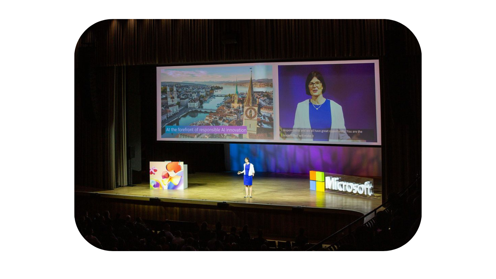
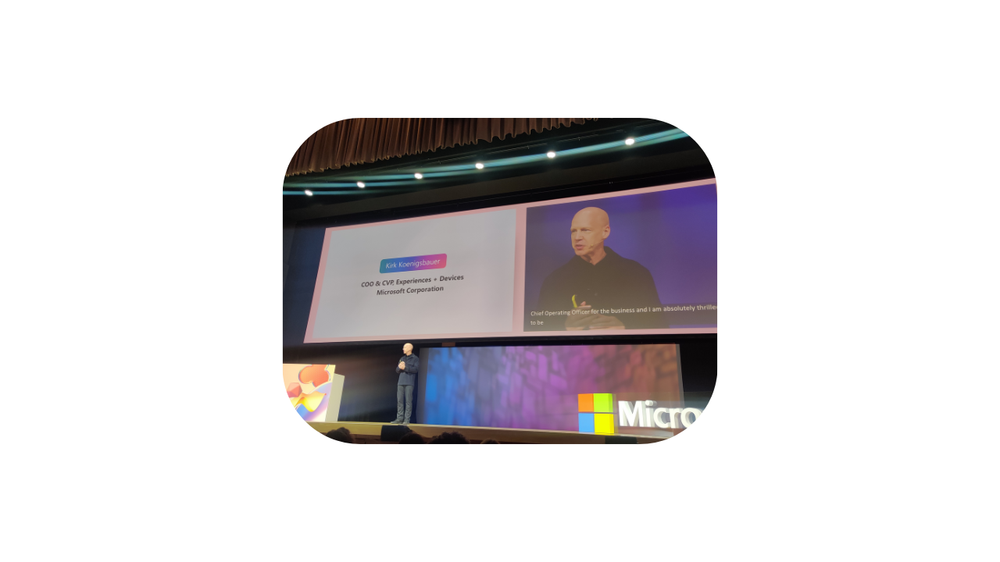
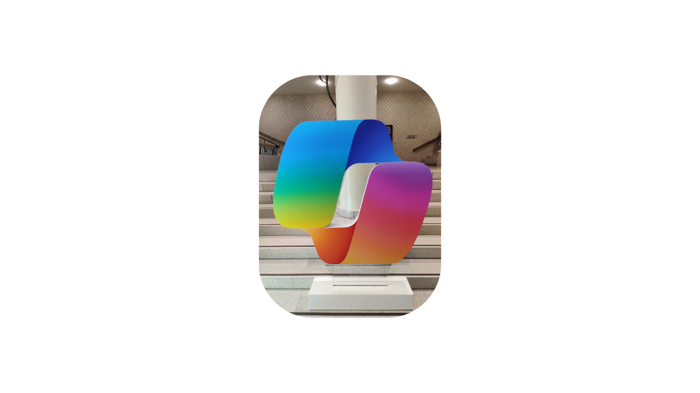
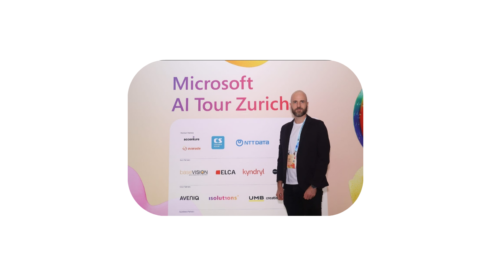
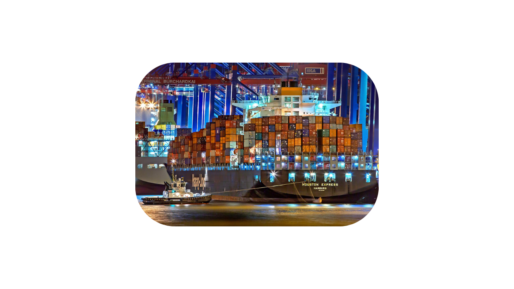

------------------------------------------------------------------------------------

---
## Introduction

During my participation in the **Microsoft AI Tour in Zurich**, I had the opportunity to explore a wide range of insightful sessions on artificial intelligence. This one-day, free, in-person event offered over 20 sessions split across five main tracks: Modern Work & Copilot, Security for and with AI, Business Apps & Copilot Extensibility, Foundations to Production, and AI Infrastructure.

Although the event featured many interesting talks, ***I had to make some choices and could not attend all the sessions.*** In this article, you’ll find my notes and key takeaways from the sessions I was able to attend.

Enjoy reading!

<!--  -->

## Welcome

[Catrin Hinkel](https://www.linkedin.com/in/catrinhinkel/), CEO of Microsoft Switzerland, opened the event with a powerful message about the current state of artificial intelligence. She emphasized that we are living in a truly transformative era where AI is already reshaping how we live and work - not as a distant future prospect, but as our present reality.

She highlighted that AI's impact extends beyond technological advancement, touching **social, economic, and environmental** spheres. To illustrate this point, she referenced the European Space Agency's Hera mission, which was planned for launch in October 2024 to study the effects of the DART impact on Dimorphos (a satellite of the asteroid Didymos).

According to Catrin Hinkel, AI's influence will be felt across **both commercial and public sectors**, bringing with it tremendous responsibility alongside opportunity. She stressed the obligation of professionals to ensure that AI serves humanity's best interests.

Comparing our current situation to the Industrial Revolution, she noted the exponential growth in computing power, which is doubling monthly, and how generative AI is democratizing access to artificial intelligence technologies.

### Key takeaways

- **Switzerland** maintains its position as one of the world's **most innovative** countries, with numerous AI implementation examples:
  - UBS has deployed 50,000 Copilot licenses
  - Lucerne Hospital uses AI to manage staff schedules, reducing administrative work by one-third
  - Swiss3 leverages AI to enhance collaboration among team members

- Copilot serves as the **user interface for AI**, making these technologies accessible to everyone
  
- The next phase in AI development involves **AI agents** that provide greater control, connect to data stores and frameworks, and deliver tangible business value

- While AI will redefine human work, **critical judgment remains uniquely human**

- Microsoft emphasizes the importance of **transparency** in AI development and deployment

- Switzerland must maintain its position at the innovation forefront to remain competitive in this rapidly **evolving landscape**

## Opening Keynote

[Kirk Koenigsbauer](https://www.linkedin.com/in/kirk-koenigsbauer/), Chief Operating Officer & Corporate Vice President, Experiences and Devices Group at Microsoft, delivered an inspiring keynote reflecting on the rapid advancement of AI technology. He pointed out that Microsoft Copilot for M365 was launched just two years ago, and the progress since then has been remarkable.

Kirk emphasized the importance of customer feedback in guiding Microsoft's AI development. He showcased several practical applications of Copilot, including:

- **Copilot for Teams**: Generating meeting transcripts, summarizing discussions, and answering questions about meetings users have missed
- **Copilot for Word**: Responding to RFPs using templates, assisting with editing, and incorporating meeting notes into documents

He shared some interesting statistics: while **75% of users are already utilizing AI tools** (a positive trend), **78% are bringing their own AI tools** into the workplace, highlighting the need for better control and integration to address potential challenges.

Kirk introduced Copilot Chat, a free tool available to everyone, reinforcing Microsoft's vision that "Copilot is the UI for AI."

One of the most impressive demonstrations was a Know Your Customer (KYC) agent that provides valuable information before client meetings, including services used, open incident tickets, and other relevant data. The agent even offers an "open dossier" option to create a PowerPoint presentation for a more visually appealing client overview.

Kirk passed the microphone to [Kleber Flugel](https://www.linkedin.com/in/kleberfluegel/), who presented the Copilot & Agents portion of the keynote. Kleber outlined Microsoft's vision:

- **A Copilot for every person**
- **An agent for every process**

His demonstration showcased Teams with **real-time speech translation** capabilities. He then explained how organizations can create their own agents using Copilot Studio for office, sales, finance, or HR processes. He also mentioned the availability of third-party agents from platforms like LinkedIn, SAP, and ServiceNow.

Using McKinsey & Company as an example, Kleber demonstrated how an agent can analyze an email and suggest appropriate actions. He showed the audience h**ow to create agents starting from a prompt**, with guided assistance from Copilot Studio.

Kirk returned to discuss **Copilot PCs**, sharing his personal experience with excellent battery life, superior performance, and optimization for natural language processing. These devices can run LLMs locally and are reportedly **58% faster than a MacBook Air M3**.

Kirk addressed Microsoft's AI infrastructure, describing AI Foundry as the middle tier or app server in the cloud. He highlighted Microsoft's extensive network of 60 regions and 300 data centers supporting AI operations.

He emphasized the importance of **data residency**, noting that in Switzerland, data remains within the country's borders.

The presentation concluded with a case study of EKZ, demonstrating how they've leveraged GitHub Copilot to achieve significant productivity gains.

### Key takeaways

- Microsoft's AI tools have evolved dramatically in just two years since the launch of Copilot for M365
- Customer feedback plays a crucial role in Microsoft's AI development strategy
- Copilot integration in Microsoft products enables practical applications like meeting transcription and document assistance
- While AI adoption is strong (75% of users), the challenge of controlling unauthorized AI tools (78% bringing their own) remains significant
- Microsoft's agent strategy involves "a Copilot for every person" and "an agent for every process"
- Organizations can create custom agents using Copilot Studio with guided assistance
- Copilot PCs offer extended battery life, enhanced performance, and can run LLMs locally

## Leverage AI for infrastructure management with Microsoft Copilot in Azure

[Mayank Bhatia](https://www.linkedin.com/in/mayank-bhatia-65045253/) delivered an insightful presentation on how AI can enhance infrastructure management, focusing on two key perspectives: **Infrastructure for AI** and **AI for Infrastructure**.

Many companies are still in the evaluation phase of AI adoption and are looking to implement and develop AI solutions. Microsoft’s ambition is not just to innovate with AI but to ensure **scalability**. The key takeaway is to start small while keeping **scaling in mind**.

To facilitate this, Microsoft provides a platform designed for scalability, supporting both **business use cases** and enabling **developers and IT teams** to build AI applications efficiently.

Mayank addressed common challenges companies face when implementing AI, breaking them down into the following components:

1. **Landing Zones**
   - Landing zones include **policies, monitoring, networking, IAM (Identity and Access Management), and shared services** (such as Microsoft Entra ID).
   - "If launching an AI agent was like landing a plane, you wouldn’t build a new airport each time – build once and scale with agility."

2. **Data**
   - 75% of customers acknowledge that **data migration is essential** for AI adoption.
   - Co-locating cloud resources can result in a **1-2x speed improvement** for Generative AI applications.

3. **Security**
   - Threat protection and monitoring for **Generative AI applications** using **Microsoft Defender for Cloud**.
   - Azure AI Content Safety helps prevent attacks, ensuring risk and safety monitoring alerts.
   - Microsoft Defender for Cloud provides **contextual security alerts**.

4. **Networking**
   - Not discussed in depth, as it varies significantly depending on the use case.

5. **Management**
   - **Cost, performance, compliance, and governance** are critical aspects.
   - **Microsoft Azure’s FinOps suite** helps manage costs and measure ROI.
   - Monitoring should be enabled to track **error rate, latency, token usage, and AI quality (groundedness and coherence).**

Mayank highlighted **Solution Accelerators** available on GitHub ([Microsoft Solution Accelerators](https://github.com/microsoft/solution-accelerators)) that help companies deploy AI solutions more efficiently.

### Key Takeaways

**Top Repeatable AI Use Cases**

- Knowledge worker productivity
- Developer productivity
- Self-service assistance
- Contract processing and review

**Key Capabilities of Copilot for Azure**

- Understand your Azure environment (retrieve resource information, find recommandations)
- Work smarter with Azure services (execute commands, deploy virtual machines efficiently)
- Write and optimize code (generate terraform configuration or Kubernetes manifests)

## Preparing for your organization's AI workloads

In this session, [Francisco Teles](https://www.linkedin.com/in/franciscoteles/) discussed the **risks** associated with introducing new AI applications and how to ensure they remain **controlled and compliant**. He highlighted the importance of **governance and compliance** for Azure AI services, covering key areas such as **identity management, network security, and cost control**.  

He emphasized that **AI workloads should be managed like any other workload**, requiring **security, monitoring, governance, and maintenance**. The session included **live demonstrations** showcasing best practices for securing and governing AI-related workloads.  

## Key Takeaways

### Managing AI Workloads in Azure  

- **Understanding Azure ML vs. Azure OpenAI**  
  - Azure ML requires **multiple resources**.  
  - Azure OpenAI simplifies deployment with **a single resource**.  

- **Authentication, Authorization, and RBAC**  
  - Use **Managed Identities** to secure AI workloads!  

- **Network Access and Data Loss Prevention (DLP)**  
  - Restrict public access using **IP ranges** or **private endpoints**.  
  - Different network architectures for AI workloads:  
    - **Allow internet outbound managed VNet** (most permissive).  
    - **Allow approved outbound managed VNet** (control via private endpoints, service tags, and FQDNs).  
    - **Manage your own VNet** (Hub-and-Spoke model).  

- **Monitoring AI Workloads**  
  - Use **Azure OpenAI dashboards** and **Azure ML model monitoring signals**.  

- **Governance for AI Workloads**  
  - Enforce compliance with **Azure Policies**.  

### Key Lessons  

✅ **AI is just another workload that requires proper management.**  
✅ **Lack of AI workload governance introduces risks.**  
✅ **Set up authentication and authorization to limit access.**  
✅ **Restrict network access and implement DLP policies.**  
✅ **Monitor AI workloads for performance, quality, and anomalies.**  
✅ **Use governance policies at scale to ensure compliance.**  

## Leverage cloud native infra for intelligent apps

In this session, [Mohammad Nofal](https://www.linkedin.com/in/mnofal/) and [Mirza Delic](https://www.linkedin.com/in/mirzaegal/) demonstrated how to **deploy AI-powered applications** using scalable cloud-native infrastructure. They explained how **Kubernetes and cloud-native tools** streamline AI inferencing, reduce operational overhead, and optimize intelligent applications.  

They highlighted that **intelligent apps leverage AI to continuously improve** user experiences through **natural language interactions, data-driven personalization, and adaptive learning**. Industries such as **financial services and retail** are already benefiting from AI-powered applications, enhancing **fraud detection and hyper-personalization**.  

Microsoft provides a **comprehensive cloud application platform**, with **Azure Kubernetes Service (AKS)** playing a crucial role. Many Microsoft services, including **ChatGPT**, run on **AKS backed by Azure Cosmos DB** and are **developed on GitHub**.  

### Key Takeaways  

#### What is an Intelligent App?  

- Unlike traditional apps, intelligent apps offer:  
  - **Natural language interactions**.  
  - **Data-driven, personalized experiences**.  
  - **Continuous learning and improvement**.  
- Investment in **intelligent apps is growing exponentially**!  

#### Azure Application Platforms for AI  

- Microsoft is a **leader** in **container management** and **cloud application platforms** (e.g., **AKS, App Service, Functions**).
- **Microsoft streamlines AI app development** with:  
  - AI-assisted coding (e.g., **GitHub Copilot**).  
  - **Scalable and high-performance app platforms**.  
  - **Guidance and templates** for streamlined operations.  
- Many **Microsoft AI services run on AKS**, including **ChatGPT**, which is backed by **Azure Cosmos DB**.  

#### Building an Intelligent App  

- Start **small** with **Azure Container Apps (ACA), AKS, and Azure OpenAI**.  
- As the app matures, add:  
  - **API Management** (for **semantic caching, token handling, permissions...**).  
  - **Vector stores** (e.g., **Azure AI Search, Cosmos DB, PostgreSQL**).  
  - **Data storage** (Databases, Storage Accounts).  
  - **Data ingestion** via **ACA, AKS, or Azure Functions** to create embeddings.  
  - **DevOps services** like **GitHub, GitHub Copilot, and Azure DevOps**.  
  - **Network exposure** with **App Gateway, Firewall, Load Balancer**, etc.  

#### AKS – Enterprise-Ready Kubernetes  

- Introduction to **AKS Automatic** (for streamlined AKS management).  
- Future AKS Automatic features:  
  - **Custom (BYO) Virtual Network**.  
  - **Private Clusters**.  
  - **Cloud Shell with Private Clusters**.  
  - **NAP Node Pool Templates for ARM64**.  
  - **Hosted System Node Pools**.  

📢 *For more details on AKS Automatic, check out my video:* [🔗 Watch here](https://www.youtube.com/watch?v=CfTE2yYFbIg)  

#### AI Workloads on Kubernetes – KAITO  

- **KAITO (Kubernetes AI Toolchain Operator)** simplifies the deployment and management of **open-source AI models** on Kubernetes clusters.  
- Available in **preview** for **AKS**.  

#### Migration Tools for AI Workloads  

- **Rehost** (Lift & Shift): Use **Azure Migrate** for VM migrations.  
- **Replatform, Refactor, Rearchitect, Replace**:  
  - **AppCat** (Application and Code Assessment Tool for .NET and Java)
  - **Partner tools** like CAST, DrMigrate, Unify Cloud

#### Live Demo  

Mirza showcased an AI-powered online store**, dynamically generating:  

- **Product descriptions**.  
- **AI-generated product images**.  

## Pave the path to AI-readiness with Azure

[Johan Barthas](https://www.linkedin.com/in/johan-barthas/) emphasized that infrastructure is the foundation of everything in AI and that AI development should be accessible to everyone, from low-code solutions empowering beginners to deep-level coding for advanced developers. Microsoft provides a full AI development platform, covering GitHub, Visual Studio, Infrastructure & data services, Copilot Studio, and Foundry.

He highlighted the challenges of AI adoption, noting that while 95% of decision-makers see AI as key, the path is often unclear. Repeatability is crucial for AI success (63%), yet many struggle to scale AI efforts (76%). AI pilots take an average of 7 months to reach production, and only 54% of AI projects successfully transition to production, often due to a lack of AI-ready infrastructure.

Johan presented Microsoft’s AI-optimized infrastructure, which includes the largest cloud infrastructure with over 60 Azure regions and 300+ data centers worldwide. This optimized end-to-end infrastructure refines every layer, from data centers to silicon, with custom CPUs, GPUs, AI accelerators, and networks. Microsoft helps optimize CPU & GPU needs and is committed to sustainable AI infrastructure through low-carbon materials, efficient energy & water management, and improved AI energy efficiency.

He also highlighted Azure AI Innovations, such as the Azure MAIA 100 AI-optimized processors and Azure Boost, a Microsoft-designed system that offloads server virtualization processes from the hypervisor and OS to dedicated hardware & software.

Addressing cloud & security challenges, Johan touched on compliance in a multi-cloud environment, Infrastructure as Code (IaC) adoption, and enterprise-grade security, noting Microsoft’s heavy investment in securing workloads.

Finally Johan gave a quick demo about Copilot for Azure with promising features.

### Key takeaways

✅ **The Copilot Stack** is the **AI innovation platform**.  
✅ The **foundation of AI** is **purpose-built cloud infrastructure**.  
✅ **Azure offers the best value** for AI workloads and secures them **end-to-end**.  
✅ Azure **meets organizations wherever they are** in their AI journey, providing **adaptive cloud solutions**.  

## Closing Keynote - From Switzerland to Space and Back: The Role of AI in Exploration and Innovation

[Prof. Dr. Thomas Zurbuchen](https://www.linkedin.com/in/zurbuchen/), a Swiss-American astrophysicist and former NASA science chief, delivered an inspiring closing keynote that took the audience on a journey from his humble beginnings in Switzerland to the frontiers of space exploration. His talk emphasized the transformative power of AI in space exploration and its potential to drive innovation on Earth.

Thomas highlighted the importance of questioning initial assumptions, drawing parallels to historical beliefs like Earth being the center of the universe. He discussed his involvement in groundbreaking missions, including the Europa Clipper, launched on October 14, 2024, to study Jupiter's moon Europa and its potential for harboring life. Thomas emphasized that scientific research is a collaborative effort, stressing the importance of diverse thinking in strengthening teams.

He also discussed how AI enables rapid and critical decision-making in complex engineering systems, unlocks new possibilities for exploration, and dramatically enhances efficiency. AI is used to identify priority data and images, communicate priorities to other assets in space, and compress data efficiently. Thomas drew connections between space exploration and Earth-based applications, such as using AI to identify potential natural disasters like hurricanes or landslides.

During an interview, Thomas shared valuable leadership lessons:

- **Team building**: It's crucial to find not only the most competent individuals but also those who best fit into a collective.
- **Embracing AI**: He believes the world is ready for AI, which will bridge various gaps in technology and knowledge.
- **Think small before thinking big**: Thomas advises learning to think small before attempting to think big.
- **Inclusive leadership**: He emphasized that everyone matters in a team, and recognizing diversity in thinking strengthens the group.

Thomas concluded with advice for individuals and professionals:

1. **Think small when using AI tools**.
2. **Focus on outlearning competitors**.
3. **Embrace the opportunities AI presents for bridging knowledge gaps and driving innovation**.

The keynote left the audience inspired to explore the intersections of space technology, AI, and innovation, encouraging them to think beyond traditional boundaries and embrace the collaborative spirit that drives scientific progress.

## Conclusion

In conclusion, I thoroughly enjoyed this event. It was not only inspiring due to its innovative presentations but also provided an excellent opportunity to connect with many like-minded individuals passionate about AI. The ideas shared and networking opportunities were particularly enriching.

If you're interested in AI and want to learn more about Microsoft's latest innovations, I highly encourage you to join the [**Microsoft AI Tour in Lausanne**](https://aitour.microsoft.com/) on **June 16, 2025**. I hope to see many of you there!

Thanks for reading :)

