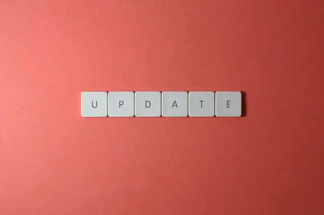

------------------------------------------------------------------------------------

---
## Azure DevOps & Cloud-Native Updates - September 2023

## Introduction

**Welcome to our Monthly Azure DevOps and Cloud Tech Updates Series!**

In the fast-paced realm of DevOps and cloud technology, staying current with the latest advancements is essential. That's why we've embarked on a monthly journey to bring you a curated collection of updates, enhancements, and innovations from the Azure ecosystem and the world of DevOps. Whether you're a seasoned professional or just starting your cloud journey, my series provides a reliable source of information, sparing you the time and effort of scouring various channels for the freshest insights.

Welcome aboard, and let's explore the limitless possibilities with Azure together!

## Azure Container App

### GA: Azure Container Apps support for UDR, NAT Gateway, and smaller subnets

You can define UDRs to manage **how outbound traffic is routed to your container app environment’s subnet** by enabling network appliances such as firewalls for workload profiles environments.

### GA: Azure Key Vault references for secrets in Azure Container Apps

Azure Key Vault references enable you to **source a container app’s secrets from secrets stored in Azure Key Vault**. Using the container app's **managed identity**, the platform automatically retrieves the secret values from Azure Key Vault and injects it into your application's secrets.

*Both versioned and non-versioned secrets are supported.*

Learn more: [Learn Microsoft](https://learn.microsoft.com/fr-ch/azure/container-apps/manage-secrets)

### GA: Session affinity for Azure Container Apps

**Azure Container Apps now supports session affinity**, also known as sticky sessions, for HTTP-based workloads. Session affinity enables you to route all requests from a single client to the same Container Apps replica. This is useful for **stateful workloads** that require session affinity.

### GA: Secrets volume mounts for Azure Container Apps

In addition to referencing secrets as environment variables, you can now **mount secrets as volumes in your container apps**. Your apps can access all or selected secrets as files in a mounted volume.

This feature works with secrets stored directly in Azure Container Apps and secrets referenced from Azure Key Vault.

### GA: Init containers in Azure Container Apps

Init containers are **specialized containers that run to completion before application containers are started** in a replica, and they can contain utilities or setup scripts not present in your container app image. Init containers are useful for performing initialization logic such as setting up accounts, running setup scripts, and configuring databases.

## Azure Container Registry

### GA: Artifact cache for Azure Container Registry

Artifact cache allows you to cache container images and OCI artifacts inside your Azure Container Registry. Caching your container images inside your Azure Container make **pull operations more reliable**.

With the generally available release, we now support seven public registries, as follows:

- Docker Hub
- Microsoft Artifact Registry
- Quay.io
- ECR Public
- GitHub Container Registry
- Nvidia (Azure CLI only)
- registry.k8s.io (Azure CLI only)  

To learn more, visit: [Learn Microsoft](https://aka.ms/acr/cache)

## Azure Kubernetes

### GA: Node OS patching - NodeImage feature in AKS

This feature provides an exclusive channel to **control OS security updates for your nodes**. With this feature, you can have a flexible and customized strategy for node-level OS security updates and a separate plan for cluster-level Kubernetes version auto-upgrades.
The strategy could be "None" (which is not a good idea), is could be "Managed" (i.e update linux every night), "Security patch and Node image" (weekly option for security and bug fixes.)

### GA: Auto-upgrade scheduled maintenance for AKS

AKS cluster has regular maintenance performed on it automatically. By default, this work can happen at any time.
Planned Maintenance allows you to **schedule weekly maintenance windows** to perform updates and minimize workload impact. Once scheduled, upgrades occur only during the window you selected.
This gives you better control and scheduling capability for auto upgrade and Node OS upgrade schedule as part of planned maintenance configuration.

### GA: Dedicated table support for AKS diagnostics logs

This feature makes it easier and faster to query your logs, while also optimizing costs and enhancing query performance. You can **send your AKS diagnostic logs to resource-specific tables in Log Analytics**, which allows you to take advantage of dedicated schemas that support the “Basic Log” plan. This plan offers reduced data ingestion costs and retention periods, so you can save costs while still getting the insights you need.

### GA: AKS image cleaner

With image cleaner, > all the unused, vulnerable images are detected and removed from the AKS nodes automatically. This allows you to save time by no longer needing to manually remove unused images. It also minimized security risks by removing unused and potentially vulnerable images from your AKS clusters.

### GA: Vertical Pod Autoscaling add-on for AKS

Vertical Pod Autoscaling is a Kubernetes open-source project which aims to > help right size your workloads by setting up to date resource requests and limits for the containers in your pods > based on past usage, ensuring stability, cost-efficiency, and improved cluster utilization for your workloads.

### GA: Kubernetes 1.27 support in AKS

Kubernetes 1.27 contains over 50 features and enhancements focused on improving security, scalability, reliability, and performance of cloud native applications. With the general availability of 1.27 support, you can now take advantage of these capabilities in production.

To learn more, visit: [Kubernetes Changelog](https://github.com/kubernetes/kubernetes/blob/master/CHANGELOG/CHANGELOG-1.27.md)

## Sources

[John Savill's youtube channel](https://www.youtube.com/@NTFAQGuy)  
[Microsoft Dev Blog](devblogs.microsoft.com)  
[Azure Website](https://azure.microsoft.com)
