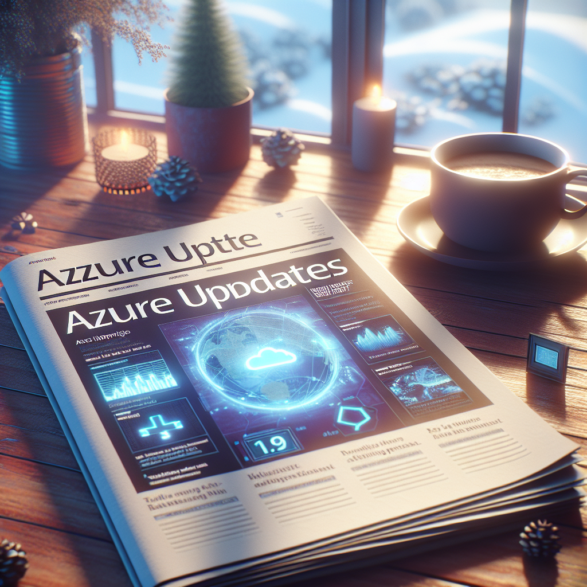

## Introduction

**Welcome to our Monthly Azure DevOps and Cloud Tech Updates Series!**

Welcome to my monthly blog series where we bring you a concise roundup of significant Azure updates pertinent to DevOps, keeping you in the loop with the latest advancements.

Let's check what's new!

## Updates

### AI + machine learning
- [Launched] Generally Available: Azure Databricks Agent Bricks Knowledge Assistant

### Compute
- [Retirement: Support for Python 3.10 ends on October 1, 2026 – upgrade your Azure Functions apps to Python 3.13](https://azure.microsoft.com/updates?id=545771)
- [Launched] Generally Available: Azure AMD Turin Dasv7, Easv7, and Fasv7-series Virtual Machines
- [In preview] Public Preview: 7th generation Intel-based VMs – Dlsv7/Dsv7/Esv7
- [In preview] Public Preview: Azure Command Launcher for Java
- [Launched] Generally Available: Deployment safeguards – pod security standard support in AKS
- [Launched] Generally Available: Ubuntu 24.04 support in AKS

### Databases
- [Launched] Generally Available: Latest PostgreSQL minor versions supported by Azure Database for PostgreSQL – Flexible Server
- [In preview] Public Preview: Azure Cosmos DB Mirroring with Private Endpoints

### DevOps
- [Retirement: "Send data to Event Hubs & Storage (Preview)" retiring July 31, 2026](https://azure.microsoft.com/updates?id=551523)

### Developer tools
- [Launched] Generally Available: Reporting in Playwright Workspaces (part of Azure App Testing)
- [Launched] Generally Available: Azure Load Testing in Switzerland North

### Networking
- [Launched] Generally Available: StandardV2 NAT Gateway with zone-redundancy and StandardV2 public IPs

### Storage
- [In preview] Public Preview: Azure NetApp Files support in OpenShift Virtualization
- [Launched] Generally Available: Application volume group for Oracle create data protection volume group (API)
- [Launched] Generally Available: Azure File Sync in Israel Central
- [In preview] Public Preview: User delegation SAS for Azure Tables, Azure Files, and Azure Queues

## Sources

- [Azure Website](https://azure.microsoft.com?wt.mc_id=MVP_357193)
- [Microsoft Dev Blog](https://devblogs.microsoft.com)
