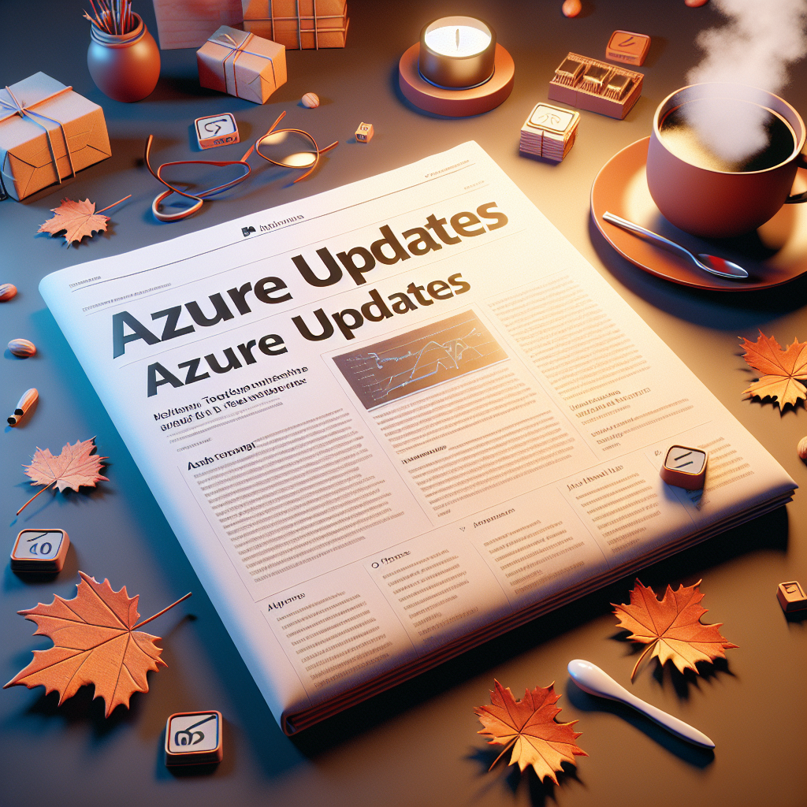

------------------------------------------------------------------------------------
---
# Azure DevOps & Cloud-Native Updates - November 2025

## Introduction

**Welcome to our Monthly Azure DevOps and Cloud Tech Updates Series!**

Welcome to my monthly blog series where we bring you a concise roundup of significant Azure updates pertinent to DevOps, keeping you in the loop with the latest advancements.

Let's check what's new!

## Updates
### AI + machine learning
- [[In preview] Public Preview: Claude Opus 4.5 Available in Microsoft Foundry](https://azure.microsoft.com/updates?id=534541)
- [Retirement: Migrate to dedicated VM for your compute clusters](https://azure.microsoft.com/updates?id=501658)
- [[In preview] Public Preview: Azure Managed Redis integration with Microsoft Foundry](https://azure.microsoft.com/updates?id=532188)
- [[In preview] Public Preview: Microsoft Foundry data connection for Azure Databricks](https://azure.microsoft.com/updates?id=527678)
- [[In preview] Public Preview: Azure Databricks Genie in Copilot Studio](https://azure.microsoft.com/updates?id=527668)
- [[In preview] Public Preview: Claude in Microsoft Foundry](https://azure.microsoft.com/updates?id=532303)
- [[In preview] Public Preview: Microsoft Foundry Fine-Tuning Updates](https://azure.microsoft.com/updates?id=526742)
- [[In preview] Public Preview: Microsoft Foundry Control Plane & Entra Agent ID](https://azure.microsoft.com/updates?id=526665)
- [[Launched] Generally Available: Model Router in Microsoft Foundry](https://azure.microsoft.com/updates?id=526330)
- [[In development] Private Preview: Foundry Local Android support](https://azure.microsoft.com/updates?id=526198)
- [[In preview] Public Preview: Foundry Local updates](https://azure.microsoft.com/updates?id=526193)
- [[In preview] Public Preview: Foundry IQ by Azure AI Search](https://azure.microsoft.com/updates?id=526150)
- [[Launched] Generally Available: Foundry Tools (rebrand from Azure AI Services)](https://azure.microsoft.com/updates?id=526132)
- [[Launched] Generally Available: Content Understanding in Microsoft Foundry](https://azure.microsoft.com/updates?id=526123)
- [[In preview] Public Preview: Enrich agents with a unified catalog of prebuilt and custom tools in Microsoft Foundry](https://azure.microsoft.com/updates?id=526114)
- [[In preview] Public Preview: Built-in memory in Foundry Agent Service](https://azure.microsoft.com/updates?id=526004)
- [[In preview] Public Preview: Multi-agent workflows in Foundry Agent Service](https://azure.microsoft.com/updates?id=525999)
- [[In preview] Public Preview: Hosted agents in Foundry Agent Service](https://azure.microsoft.com/updates?id=525994)
- [[Launched] Generally Available: Observability in Foundry Control Plane](https://azure.microsoft.com/updates?id=525985)
- [[In preview] Public Preview: Enterprise MCP enhancements in Foundry Agent Service](https://azure.microsoft.com/updates?id=525976)
- [[In preview] Public Preview: Microsoft Foundry one-click deploy channels in Teams, M365 and non-Microsoft](https://azure.microsoft.com/updates?id=525971)
- [[In preview] Public Preview: LLM Speech in Microsoft Foundry](https://azure.microsoft.com/updates?id=525962)
- [[In preview] Public Preview: Bring Your Own AI Gateway to Foundry Agent Service](https://azure.microsoft.com/updates?id=525957)
- [[In preview] Announcing: Developer Training tier for low-cost fine-tuning training](https://azure.microsoft.com/updates?id=525952)
- [[Launched] Generally Available: Streamline IT governance, security, and cost management experiences with Microsoft Foundry](https://azure.microsoft.com/updates?id=525942)
- [[In preview] Public Preview: New granular controls for network and integration security in Microsoft Foundry](https://azure.microsoft.com/updates?id=525933)
- [[In preview] Public Preview: Agent mitigations and guardrail customization](https://azure.microsoft.com/updates?id=525923)
- [[In preview] Public Preview: New AI templates in Microsoft Foundry](https://azure.microsoft.com/updates?id=522554)

### Analytics
- [[Launched] Generally Available: SQL database in Microsoft Fabric](https://azure.microsoft.com/updates?id=525388)

### Compute
- [[In development] Private Preview: Azure Boost confidential device](https://azure.microsoft.com/updates?id=530661)
- [[In development] Private Preview: Azure Boost remote storage throughput and network bandwidth enhancements](https://azure.microsoft.com/updates?id=530287)
- [[Launched] Generally Available: Custom handler support in Azure Functions Flex consumption](https://azure.microsoft.com/updates?id=512413)
- [[In preview] Public Preview: Container network metrics filtering in Advanced Container Networking Services for (ACNS) for AKS](https://azure.microsoft.com/updates?id=523076)
- [[Launched] Generally Available: MCP support for AI toolchain operator add-on in AKS](https://azure.microsoft.com/updates?id=523152)
- [[Launched] Generally Available: Cluster-wide Cilium network policy with Azure CNI powered by Cilium for AKS](https://azure.microsoft.com/updates?id=523120)
- [[Launched] Generally Available: Local redirect policy in Azure CNI powered by Cilium for AKS](https://azure.microsoft.com/updates?id=523081)
- [[Launched] Generally Available: Layer 7 policy with Advanced Container Networking Services (ACNS) for AKS](https://azure.microsoft.com/updates?id=523115)
- [[Launched] Generally Available: Trusted Launch is now supported for Arm64 Marketplace Images](https://azure.microsoft.com/updates?id=529797)
- [[In preview] Public Preview: Recommended alerts for Azure Monitor Workspace](https://azure.microsoft.com/updates?id=515505)
- [[In preview] Public Preview: Managed Instance on Azure App Service](https://azure.microsoft.com/updates?id=523623)
- [[In preview] Public Preview: NCv6 Virtual Machines](https://azure.microsoft.com/updates?id=530208)
- [[In preview] Public Preview: Azure Network Watcher Topology – AKS Visualization](https://azure.microsoft.com/updates?id=527810)
- [[In preview] Public Preview: Azure Kubernetes Service desktop](https://azure.microsoft.com/updates?id=526242)
- [[Launched] Generally Available: Pod sandboxing on AKS](https://azure.microsoft.com/updates?id=526237)
- [[Launched] Generally Available: Managed namespaces on AKS](https://azure.microsoft.com/updates?id=526232)
- [[In preview] Public Preview: Windows Server 2025 on AKS](https://azure.microsoft.com/updates?id=526213)
- [[Launched] Generally Available: AKS Automatic pod readiness SLA](https://azure.microsoft.com/updates?id=526208)
- [[In preview] Public Preview: AKS Automatic managed system node pools](https://azure.microsoft.com/updates?id=526203)
- [[In preview] Public Preview: Add durability to AI agents in Azure Functions using Microsoft Agent Framework](https://azure.microsoft.com/updates?id=526179)
- [[In preview] Public Preview: Azure Functions support for Node.js 24](https://azure.microsoft.com/updates?id=526077)
- [[In preview] Public Preview: Azure Functions support for Java 25](https://azure.microsoft.com/updates?id=526072)
- [[Launched] Generally Available: Model Context Protocol (MCP) tool trigger for Azure Functions](https://azure.microsoft.com/updates?id=525523)
- [[Launched] Generally Available: Azure Functions durable task scheduler Dedicated SKU (GA) & Consumption SKU (Public Preview)](https://azure.microsoft.com/updates?id=525518)
- [[In preview] Public Preview: Self-hosted remote MCP servers on Azure Functions](https://azure.microsoft.com/updates?id=525505)
- [[Launched] Announcing: Resources for migrating to Azure Functions Flex Consumption](https://azure.microsoft.com/updates?id=525500)
- [[Launched] Generally Available: Azure Functions enables OpenTelemetry support](https://azure.microsoft.com/updates?id=525479)
- [[Launched] Generally Available: Scheduled Actions](https://azure.microsoft.com/updates?id=530797)
- [[In preview] Public Preview: Industry-leading storage performance Ebsv6 VM series](https://azure.microsoft.com/updates?id=529416)
- [[Launched] Generally Available: Custom error pages on Azure App Service](https://azure.microsoft.com/updates?id=492303)
- [Retirement: Support for Python 3.10 ends on October 1st, 2026](https://azure.microsoft.com/updates?id=509686)
- [[In preview] Public Preview: Pod CIDR expansion in Azure CNI Overlay for AKS](https://azure.microsoft.com/updates?id=523086)
- [[In preview] Public Preview: eBPF host routing in Advanced Container Networking Services for AKS](https://azure.microsoft.com/updates?id=523100)
- [[In preview] Public Preview: Scheduler profile configuration for AKS](https://azure.microsoft.com/updates?id=523134)
- [[In preview] Public Preview: Agentic CLI for AKS](https://azure.microsoft.com/updates?id=523062)
- [[Launched] Generally Available: LocalDNS for AKS](https://azure.microsoft.com/updates?id=523057)
- [[In preview] Public Preview: Azure Linux OS Guard for AKS](https://azure.microsoft.com/updates?id=523172)
- [[In preview] Public Preview: Flatcar Container Linux for AKS](https://azure.microsoft.com/updates?id=523067)

### Containers
- [[Launched] Generally Available: Azure Container Registry Repository Permissions with Attribute-based Access Control (ABAC)](https://azure.microsoft.com/updates?id=526644)
- [[In preview] Public Preview: Azure Kubernetes Fleet Manager for Arc-enabled clusters](https://azure.microsoft.com/updates?id=526227)
- [[In preview] Public Preview: Azure Container Apps adds support for agentic Docker Compose](https://azure.microsoft.com/updates?id=525470)
- [[In preview] Public Preview: Azure Container Apps introduces flexible workload profile](https://azure.microsoft.com/updates?id=525465)
- [[Launched] Generally Available: Azure Container Apps serverless GPUs in additional regions](https://azure.microsoft.com/updates?id=525460)
- [[In preview] Public Preview: Confidential computing in Azure Container Apps](https://azure.microsoft.com/updates?id=525455)
- [[In preview] Public Preview: Dynamic sessions shell environment and MCP support in Azure Container Apps](https://azure.microsoft.com/updates?id=512949)
- [[In preview] Public Preview: Deployment labels in Azure Container Apps](https://azure.microsoft.com/updates?id=512900)
- [[Launched] Generally Available: Rule-based routing in Azure Container Apps](https://azure.microsoft.com/updates?id=512850)
- [[Launched] Generally Available: Premium Ingress in Azure Container Apps](https://azure.microsoft.com/updates?id=512813)
- [[Launched] Generally Available: OpenShift Virtualization now available on Azure Red Hat OpenShift](https://azure.microsoft.com/updates?id=527236)

### Databases
- [[Launched] Generally Available: SQL Server Management Studio (SSMS) 22](https://azure.microsoft.com/updates?id=522586)
- [[Launched] Generally Available: SQL Server 2025](https://azure.microsoft.com/updates?id=522559)
- [[Launched] Generally Available: Regex support in T-SQL](https://azure.microsoft.com/updates?id=532207)
- [[Launched] Generally Available: Azure MCP Server for Azure Database for MySQL](https://azure.microsoft.com/updates?id=532197)
- [[In development] Private Preview: Azure HorizonDB](https://azure.microsoft.com/updates?id=529806)
- [[In preview] Public Preview: Azure DocumentDB high-performance storage](https://azure.microsoft.com/updates?id=525549)
- [[In preview] Public Preview: Support for Italian and Portuguese in Azure Cosmos DB for NoSQL full-text search](https://azure.microsoft.com/updates?id=523824)
- [[In preview] Public Preview: Azure Cosmos DB MCP ToolKit for Microsoft Foundry Agent Service](https://azure.microsoft.com/updates?id=523814)
- [[Launched] Generally Available: Fuzzy search in Azure Cosmos DB for NoSQL full-text search](https://azure.microsoft.com/updates?id=523809)
- [[Launched] Generally Available: Vector indexing performance improvements in Azure Cosmos DB for NoSQL](https://azure.microsoft.com/updates?id=523803)
- [[Launched] Generally Available: Float16 data type for vector indexes in Azure Cosmos DB](https://azure.microsoft.com/updates?id=523796)
- [[Launched] Generally Available: Azure Cosmos DB for Visual Studio Code](https://azure.microsoft.com/updates?id=523782)
- [[Launched] Generally Available: Azure Cosmos DB Mirroring in Microsoft Fabric](https://azure.microsoft.com/updates?id=523773)
- [[Launched] Generally Available: Cosmos DB in Microsoft Fabric](https://azure.microsoft.com/updates?id=523768)
- [[In preview] Public Preview: Index Advisor for Azure DocumentDB](https://azure.microsoft.com/updates?id=523763)
- [[Launched] Generally Available: Priority-based execution in Azure Cosmos DB](https://azure.microsoft.com/updates?id=523754)
- [[In preview] Public Preview: Azure Cosmos DB Fleet Analytics](https://azure.microsoft.com/updates?id=523745)
- [[Launched] Generally Available: Azure Cosmos DB fleet pools](https://azure.microsoft.com/updates?id=523740)
- [[Launched] Generally Available: Azure DocumentDB - an open-source, MongoDB-compatible document database service for hybrid and multicloud](https://azure.microsoft.com/updates?id=523735)
- [[In preview] Public Preview: Dynamic data masking with Azure Cosmos DB](https://azure.microsoft.com/updates?id=523726)
- [[In preview] Public Preview: Online and offline migrations in Azure DocumentDB Migration extension](https://azure.microsoft.com/updates?id=523721)
- [[Launched] Generally Available: Online migration from Azure Cosmos DB for MongoDB RU to Azure DocumentDB](https://azure.microsoft.com/updates?id=523716)
- [[In preview] Public Preview: Oracle to PostgreSQL migration tooling in Visual Studio Code](https://azure.microsoft.com/updates?id=523593)
- [[Launched] Generally Available: 2025 REST API for Azure Database for PostgreSQL](https://azure.microsoft.com/updates?id=523588)
- [[Launched] Generally Available: Elastic clusters on Azure Database for PostgreSQL – Flexible Server](https://azure.microsoft.com/updates?id=523583)
- [[In preview] Public Preview: Native Microsoft Foundry support for Azure Database for PostgreSQL](https://azure.microsoft.com/updates?id=523578)
- [[Launched] Generally Available: Azure Database for PostgreSQL – Flexible Server anon extension](https://azure.microsoft.com/updates?id=523569)
- [[Launched] Public Preview: Azure Database for PostgreSQL – Flexible Server v6 series VMs and AMD v6 Confidential Compute](https://azure.microsoft.com/updates?id=523564)
- [[In preview] Public Preview: Azure Database for PostgreSQL – Flexible Server pg_duckdb extension](https://azure.microsoft.com/updates?id=523559)
- [[In preview] Public Preview: Azure SQL change event streaming](https://azure.microsoft.com/updates?id=523533)
- [[Launched] Generally Available: PostgreSQL 18 with in-place upgrade on Azure Database for PostgreSQL](https://azure.microsoft.com/updates?id=523196)
- [[Launched] Generally Available: PostgreSQL extension for Visual Studio Code with GitHub Copilot](https://azure.microsoft.com/updates?id=523187)
- [[Launched] Generally Available: Mirroring in Fabric for PostgreSQL Flexible Server](https://azure.microsoft.com/updates?id=523177)
- [[Launched] Generally Available: Azure Database for PostgreSQL storage extension support for Parquet](https://azure.microsoft.com/updates?id=523167)
- [[Launched] Generally Available: Azure SQL Managed Instance Next-gen General Purpose service tier](https://azure.microsoft.com/updates?id=523125)
- [[In preview] Public Preview: Azure SQL Database DiskANN vector indexing](https://azure.microsoft.com/updates?id=523110)
- [[In preview] Generally Available: MSSQL extension integration with GitHub Copilot in Visual Studio Code](https://azure.microsoft.com/updates?id=523105)
- [[Launched] Generally Available: Azure SQL Database long-term retention (LTR) backup immutability](https://azure.microsoft.com/updates?id=523095)
- [[Launched] Generally Available: Microsoft Python driver for SQL Server](https://azure.microsoft.com/updates?id=522581)
- [[Launched] Generally Available: Azure SQL updates for November 2025](https://azure.microsoft.com/updates?id=522523)
- [[In preview] Public Preview: Azure SQL updates for November 2025](https://azure.microsoft.com/updates?id=522514)
- [[In preview] Public Preview: Online container copy in Azure Cosmos DB](https://azure.microsoft.com/updates?id=467471)
- [[Launched] General Availability: Server Parameters support for lower_case_table_names in Azure Database for MySQL- Flexible Server](https://azure.microsoft.com/updates?id=523787)
- [[Launched] Generally Available: Azure Database for MySQL Triggers for Azure Functions](https://azure.microsoft.com/updates?id=508390)

### DevOps
- [[Launched] Generally Available: Advanced sampling and richer data collection in Azure Monitor OpenTelemetry Distro](https://azure.microsoft.com/updates?id=529519)
- [[In preview] Public Preview: Azure Copilot observability agent](https://azure.microsoft.com/updates?id=528538)
- [[In preview] Public Preview: OpenTelemetry visualizations and enhanced monitoring experience in Azure Monitor for Azure VMs and Arc Servers](https://azure.microsoft.com/updates?id=525536)
- [[Launched] Generally Available: Azure Monitor unified onboarding experience for AKS and VMs](https://azure.microsoft.com/updates?id=521941)
- [[In preview] Public Preview: Dynamic threshold for Log search alerts](https://azure.microsoft.com/updates?id=503704)
- [[In preview] Public Preview: Query-based metric alerts in Azure Monitor](https://azure.microsoft.com/updates?id=518469)
- [[In preview] Public Preview: Introducing SDK Stats to the Azure Monitor OpenTelemetry Distro](https://azure.microsoft.com/updates?id=529528)

### Developer tools
- [[In preview] Public Preview: New integration and extensibility capabilities to Azure SRE Agent](https://azure.microsoft.com/updates?id=529944)
- [[Launched] Generally Available: GitHub Copilot app modernization expanded capabilities](https://azure.microsoft.com/updates?id=526618)
- [[Launched] Generally Available: Azure Load Testing in Italy North](https://azure.microsoft.com/updates?id=532481)
- [[Launched] Generally Available: Private Marketplace for VS Code](https://azure.microsoft.com/updates?id=526909)
- [[Launched] Generally Available: Visual Studio 2026](https://azure.microsoft.com/updates?id=526900)
- [[Launched] Generally Available: .NET 10](https://azure.microsoft.com/updates?id=526895)

### Features
- [[In preview] Public Preview: GitHub Copilot app modernization expanded capabilities](https://azure.microsoft.com/updates?id=530257)

### Hybrid + multicloud
- [[In preview] Public Preview: Azure Monitor for Azure Arc-enabled Kubernetes with OpenShift and Azure Red Hat OpenShift](https://azure.microsoft.com/updates?id=530174)
- [[In preview] Public Preview: Microsoft Defender for Cloud + GitHub Advanced Security](https://azure.microsoft.com/updates?id=526876)
- [[Launched] Generally Available: ExpressRoute Scalable Gateway](https://azure.microsoft.com/updates?id=526729)
- [[Launched] Generally Available: New SQL Server migration in Azure Arc](https://azure.microsoft.com/updates?id=522572)

### Identity
- [[In preview] Public Preview: Entra ID support for RDP connections](https://azure.microsoft.com/updates?id=526018)

### Integration
- [[In preview] Public Preview: Azure API Management adds support for A2A Agent APIs](https://azure.microsoft.com/updates?id=527635)
- [[In development] Private Preview: ActiveMQ and JMS connector for Azure Logic Apps](https://azure.microsoft.com/updates?id=531783)
- [[In preview] Public Preview: New healthcare connectors for Azure Logic Apps](https://azure.microsoft.com/updates?id=531778)
- [[Launched] Generally Available: New Hybrid Integration Connectors for Azure Logic Apps](https://azure.microsoft.com/updates?id=527683)
- [[In preview] Public Preview: Redesigned designer experience for Azure Logic Apps [Standard]](https://azure.microsoft.com/updates?id=527673)
- [[In preview] Public Preview: New Agent Loop capabilities in Azure Logic Apps](https://azure.microsoft.com/updates?id=527663)
- [[In preview] Public Preview: Agent Loop in Azure Logic Apps [Consumption]](https://azure.microsoft.com/updates?id=527658)
- [[Launched] Generally Available: Agent Loop in Azure Logic Apps [Standard]](https://azure.microsoft.com/updates?id=527649)
- [[Launched] Generally Available: Automated Testing Framework for Logic Apps [Standard]](https://azure.microsoft.com/updates?id=527644)
- [[Launched] Generally Available: Govern Model Context Protocol (MCP) endpoints using Azure API Management](https://azure.microsoft.com/updates?id=527626)
- [[Launched] Announcing: API Center Standard now included at no additional cost for linked Azure API Management Standard and Premium tiers](https://azure.microsoft.com/updates?id=527621)
- [[Launched] Generally Available: Premium v2 tier in Azure API Management](https://azure.microsoft.com/updates?id=527612)

### Internet of Things
- [[Launched] Generally Available: Azure Sphere OS version 25.10 is now available](https://azure.microsoft.com/updates?id=522390)

### Management and governance
- [[Launched] Generally Available: Microsoft Marketplace](https://azure.microsoft.com/updates?id=530614)
- [[Launched] Generally Available: Resale enabled offers through Microsoft Marketplace](https://azure.microsoft.com/updates?id=530593)
- [[In preview] Public Preview: Managed Identity support in Network Watcher VNET flow log, traffic analytics and packet capture](https://azure.microsoft.com/updates?id=534482)
- [[In preview] Public Preview: Azure Copilot agents - a closer look at the deployment agent](https://azure.microsoft.com/updates?id=526751)
- [[In preview] Public Preview: Azure Network Watcher – Agentless Connection Troubleshoot](https://azure.microsoft.com/updates?id=527815)
- [[In preview] Public Preview: Azure VNet Flow Log - Filtering](https://azure.microsoft.com/updates?id=527805)
- [[In preview] Public Preview: Built-in CIS benchmarks for Azure endorsed Linux distros in Machine Config](https://azure.microsoft.com/updates?id=523614)
- [[In preview] Public Preview: Azure Copilot brings new intelligent agents to support end-to-end lifecycle management of workloads](https://azure.microsoft.com/updates?id=520762)
- [[In preview] Public Preview: Threat Detection in Azure Backup powered by MDC](https://azure.microsoft.com/updates?id=520454)
- [[Launched] Generally Available: Seamless failback for HyperV-to-Azure: Managed Disk support in Azure Site Recovery](https://azure.microsoft.com/updates?id=530092)
- [[In preview] Public Preview: Support for Linux major OS upgrades with Azure Site Recovery](https://azure.microsoft.com/updates?id=530087)
- [[In preview] Public Preview: Support 5x churn in Azure Site Recovery](https://azure.microsoft.com/updates?id=530078)
- [[Launched] Generally Available: Capacity guidance for Azure Site Recovery](https://azure.microsoft.com/updates?id=530073)
- [[In preview] Public Preview: Insights in Azure Migrate](https://azure.microsoft.com/updates?id=526468)

### Networking
- [[Launched] Generally Available: DNS security policy Threat Intelligence feed](https://azure.microsoft.com/updates?id=530183)
- [[Launched] Generally Available: TLS and TCP termination on Azure Application Gateway](https://azure.microsoft.com/updates?id=532202)
- [[In preview] Public Preview: Microsoft HTTP DDoS Ruleset 1.0 on Application Gateway WAF v2](https://azure.microsoft.com/updates?id=530609)
- [[In preview] Public Preview: Cross region pool association support for Azure Virtual Network Manager IP address management](https://azure.microsoft.com/updates?id=526174)
- [[Launched] Generally Available: Azure Virtual Network Manager address overlap prevention in mesh](https://azure.microsoft.com/updates?id=526169)
- [[Launched] Generally Available: Application Gateway for Containers – Slow start](https://azure.microsoft.com/updates?id=525893)
- [[In preview] Public Preview: Application Gateway for Containers Istio Service Mesh integration](https://azure.microsoft.com/updates?id=525874)
- [[In preview] Public Preview: Standard V2 NAT Gateway and StandardV2 Public IPs](https://azure.microsoft.com/updates?id=525405)
- [[In preview] Public Preview: JWT Validation in Azure Application Gateway](https://azure.microsoft.com/updates?id=489855)
- [[Launched] Generally Available: Azure Application Gateway mTLS passthrough support](https://azure.microsoft.com/updates?id=488990)
- [[Launched] Generally Available: Azure Virtual Network Manager UseExisting Mode for UDR management](https://azure.microsoft.com/updates?id=526145)
- [[Launched] Generally Available: Azure Virtual Network Manager IP Address Management Pool Association Recommendation](https://azure.microsoft.com/updates?id=526160)
- [[Launched] Generally Available: Azure Virtual Network Manager peering compliance](https://azure.microsoft.com/updates?id=526155)
- [[Launched] Generally Available: DNS flow trace logs for Azure Firewall](https://azure.microsoft.com/updates?id=526720)
- [[Launched] Generally Available: Azure WAF JavaScript challenge on Azure Front Door](https://azure.microsoft.com/updates?id=513802)

### Retirements
- [Retirement: Windows Server 2022 on Azure Kubernetes Service enabled by Azure Arc](https://azure.microsoft.com/updates?id=499906)

### Storage
- [[Launched] Generally Available: Azure File Sync in New Zealand North](https://azure.microsoft.com/updates?id=533437)
- [[Launched] Generally Available: Azure NetApp Files single file restore from backup](https://azure.microsoft.com/updates?id=522077)
- [[In preview] Public Preview: Azure NetApp Files migration assistant (portal support)](https://azure.microsoft.com/updates?id=525620)
- [[In preview] Public Preview: Azure NetApp Files cache volumes](https://azure.microsoft.com/updates?id=523917)
- [[Launched] Generally Available: Azure Managed Lustre Support for Azure MCP Server](https://azure.microsoft.com/updates?id=529381)
- [[Launched] Generally Available: CSI Dynamic Provisioning for Azure Managed Lustre](https://azure.microsoft.com/updates?id=529368)
- [[In preview] Public Preview: 20 MB/s/TiB Performance Tier for Azure Managed Lustre](https://azure.microsoft.com/updates?id=529359)
- [[In preview] Public Preview: Auto-import for Azure Managed Lustre](https://azure.microsoft.com/updates?id=529342)
- [[In preview] Public Preview: Smart Tier account level tiering (Azure Blob Storage and ADLS)](https://azure.microsoft.com/updates?id=526188)
- [[In development] Public Preview: User and group quota reports in Azure NetApp Files](https://azure.microsoft.com/updates?id=528899)
- [[In development] Public Preview: Large volumes up to 7.2 PiB](https://azure.microsoft.com/updates?id=525150)
- [[Launched] Generally Available: The Archive access tier for Azure Blob Storage is now generally available in the Taiwan North region](https://azure.microsoft.com/updates?id=527181)
- [[In preview] Public preview: Support for large volume breakthrough mode](https://azure.microsoft.com/updates?id=516656)
- [[Launched] Generally Available: Vaulted Backup for Azure Data Lake Storage (ADLS)](https://azure.microsoft.com/updates?id=523975)
- [[Launched] Generally Available: Object Replication Priority Replication for Azure Blob](https://azure.microsoft.com/updates?id=522072)

## Sources
[https://azure.microsoft.com/](https://azure.microsoft.com/)
[Microsoft Dev Blog](devblogs.microsoft.com)
[Azure Website](https://azure.microsoft.com?wt.mc_id=MVP_357193)
