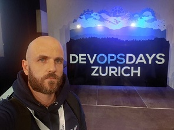
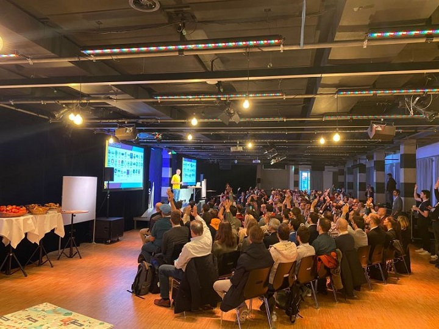
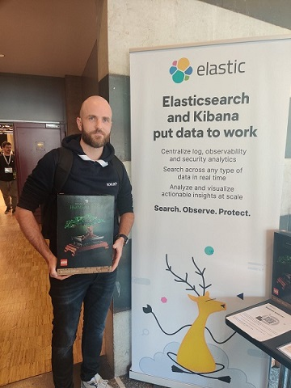

------------------------------------------------------------------------------------

---

## Day 1

[DevOpsDays Zurich](https://devopsdays.org/events/2023-zurich/welcome/) is a much-anticipated annual conference that brings together professionals from the DevOps community to share ideas, learn from one another, and explore the latest trends in technology. As an avid attendee of last year's event, I was thrilled to participate in this year's conference, which spanned two days of inspiring talks, informative workshops, and engaging discussions.

In this **blog post**, I will be sharing my experience and insights from the conference. It will cover the event, summarizing the talks I attended, highlighting key takeaways, and offering my perspective on the topics covered. Whether you were unable to attend **DevOpsDays Zurich 2023** or simply want to revisit some of the highlights, I hope you'll find these posts informative and engaging.

So without further ado, `let's dive in`!

### Talk 1: Building High-Performing Teams: The crucial Role of Psychological Safety
#### Summary
[Laurence Kozera](https://www.linkedin.com/in/laurence-kozera-foucault-56375466/) and [Arjanna van der Plas](https://www.linkedin.com/in/arjannavanderplas/), led a hands-on session on how to foster psychological safety in your team. The session covered the importance of psychological safety in high-performing teams and provided real-life examples on how to increase it, especially during remote or hybrid work and with diverse personalities or legacy tensions.
#### Key takeaways
- Implication of high psychological safety
  - less stress
  - more energy at work
  - higher productivity
  - fewer sick days
  - more engagement
  - less burnout
- Psychological safety is the critical foundation for great work
- Work on your attitude to risk and failure
- Have open conversations
- Be willing to help
- Embrace diversity

### Talk 2: Reporting on Reliability - Improving stakeholder conversations
#### Summary
[Ramón Medrano Llamas](https://ch.linkedin.com/in/rmedranollamas) discusses best practices for communicating about reliability, especially during and after incidents. Reliability engineers have long practiced blameless retrospectives to learn from past incidents, but stakeholders outside of the operations team may not be so forgiving. 
#### Key takeaways
- **What the heck? - Incident status**
  - Use appropriate channels (avoid conference call, use chats and live docs)
  - Be predictable (regular updates)
  - Most people should mostly listen
- **What was that? - Postmortem**
  - Criticize systems, not people
  - Asumme that everyone is involved in an incident had good intentions
  - "Human" errors are systems problems
- **How it's going? - Periodic reliability reviews**
  - DON'T focus on incident counts
  - Do focus on the aggregated impact of incidents

### Break

### Talk 3: From a Backend Developer to DevOps - THE FORCE AWAKENS
#### Summary
In this talk, [Mey Beisaron](https://www.linkedin.com/in/ladymey/) shares her journey of transitioning from a backend developer to a DevOps Engineer role. She discusses the challenges she faced, including learning about the complex CI/CD pipeline and architecture of multiple systems. She explains how she transformed her problem-solving approach from a narrow application perspective to a wide holistic system architecture approach.
#### Key takeaways
- **Learn** on your own (create pipelines, read documentation, write your own documentation, teach others)
- **Listen** to user requests in addition to non-functional requirements
- **Level Up** your skills (discovery sessions, Documentation feedback)

### Talk 4: Bridging Dev and Ops with eBPF: Extending Observability Upwards and Downwards
#### Summary
[Raphaël Pinson](https://www.linkedin.com/in/raphink/)'s talk discusses the use of eBPF (extended Berkeley Packet Filter) to enhance observability in Linux systems. By using eBPF, he shows how it can bridge the gap between development and operations teams by providing deeper insights into the kernel and OS internals and the applications running on top. The talk also covers how eBPF can be used to extend observability downwards by accessing low-level system information and upwards by offering application-level tracing capabilities.
#### Key takeaways
- From dumb monitoring to expertise
- Bring metrics to Developers and the right to deploy
- More metrics with eBPF
- **eBPF** : makes the Linux Kernel programmable in a secure and efficient way
- eBPF use cases : DDOS protection, load balancing, Kernel live patching
- **Cilium**
  - Performance gains (no iptables, bypass TCP/IP)
  - simpler architecture (no sidecar proxy for service mesh)
- **Hubble**
  - fine grained network observability
  - exports to SIEM
  - supports OpenTelemetry standard
- **Tetragon**  
  - observe and export kernel events
  - act on events (e.g SIGKILL)

### Talk 5: Priorities - the art of saying no
#### Summary
[Dorota Parad](https://www.linkedin.com/in/dorota-parad/)'s talk focused on how to manage workload effectively when there is always more work than time. She shared strategies for recognizing which tasks are worth prioritizing, learning when to say no, and avoiding getting trapped in a firefighting loop.
#### Key takeaways
- **Do** : Urgent and important tasks
- **Schedule** : Non urgent and important tasks
- **Delegate** : Urgent and non important tasks
- **Delete** : Non urgent and non important tasks
- Important task : Direct contribution to my goal or enabler to my goal
- **Time is finite** and there is always more work than time
- Urgency is a trap. Do what's important !
- **If I do this, what will I not do?**

### Lunch

### Ignite talks
#### Summary
- [Matthias Fritschi](https://www.linkedin.com/in/matthias-fritschi/) - 6 years and 15 meetups later - how to organize a (DevOps) meetup
- [Iris Hunkeler](https://www.linkedin.com/in/iris-hunkeler) - DevOps, ClickOps, GitOps, CloudOps, AIOps… making sense of the Buzzword-Bingo in 5 Minutes
- [Ralf Winter](https://www.linkedin.com/in/ralf-winter-66515191/) - Enabling true DevOps organizations with Value Stream Management
- [Daiany Palacios](https://www.linkedin.com/in/daiany-palacios/) - Full-stack DevOps engineers: a myth?
- [Sebastian Graf](https://www.linkedin.com/in/sebastiangraf/) - Platform Teams and Innersource, how to foster acceptance and generate synergies
- [Mike Long](https://www.linkedin.com/in/mikelongoslo/) - GitHopes and Terrorforms

### Workshops
#### Workshop 1: Engineering Lead Masterclass
##### Summary
[Thomas Krag](https://www.linkedin.com/in/vikingops/)'s workshop covers essential leadership skills for engineers, tech leads, and managers. It offers practical tips on effective mentorship, using systems thinking, eliminating bottlenecks, measuring performance, influencing teams and individuals, and recruiting. The workshop is interactive and uses a Miro board, so attendees should bring their laptops.
##### Key takeaways
- **Swarm ?**
  - Stop starting, start finishing !
  - Synchronous code reviews are great
- **Interviews**
  - Make it a conversation
  - Find a subject your candidate is interested in
  - Can you tell me about a time you $situation?
- **Teach to learn faster**
- Mentor toolbox
  - Encourage
  - Challenge
  - Coaching
  - Share
  - Set rules
  - Do things togethers

#### Workshop 2: How to deal with resistance from your team members
##### Summary
[Mark Heistek](https://www.linkedin.com/in/markheistek) and [Peter Nijenhuis](https://www.linkedin.com/in/peter-nijenhuis-%E2%9C%93-lion-0b83751/) have created a serious game to help individuals experience and understand the different phases of change resistance. In this workshop, participants will learn about the different stages of resistance, including insecurity, resistance, anger, joy, and happiness. The game is designed to help players shift from a fixed mindset to a growth mindset in less than an hour. Along with the game, participants will also receive background theory on the different phases of resistance.

#### Workshop 3: The Digital Awareness Session
##### Summary
By [Alessandra Patti](https://www.linkedin.com/in/alessandra-patti/) & [Theo Roblot](https://www.linkedin.com/in/th%C3%A9o-roblot)
This interactive session explores the concept of digital wellbeing, focusing on the impact of technology on our mental health. As experts in the digital space, the session leaders will guide participants through the potential triggers of social media and being constantly "available," and provide tips on how to navigate the digital world in a way that promotes wellbeing and prevents burnout.

### Talk 6: DevOps - like Riding a Bike or rather like Playing Golf?
#### Summary
For some people, DevOps is daily routine, for others it is still new ground. In this talk, [Dr. Martin Wechsler](https://www.linkedin.com/in/martinwechsler/) talks about challenges of an IT organisation, and how Migros Group IT approaches DevOps.
#### Key takeaways
- How to tackle DevOps :
  - allow teams to progress with goals
  - learn how to do DevOps with your current situation (even if it's SAP)
- **DevOps is more like Golf than Bike**
  - Requires larger effort to learn
  - No progress without practice
  - Mental condition is important
  - Sometimes does not work, and you don't know why

Migros has adopted SAFe in its transformation. Devops culture "You build it, you run it" remain an essential leverage for Migros teams. There is no "Golden Path" or standard tools for teams, they're free to chose their own tools. Communities of practices are the channel to share their practices and tools, but no enforcement is done.

### Evening Event

## Day 2

After a great first day and few beers, we're excited to dive into another day of insightful talks and engaging workshops. Last night's evening event provided a wonderful opportunity to connect with fellow professionals in the DevOps community, and we're looking forward to continuing those conversations throughout the day. Let's jump right in!

### Talk 1: Developer Productivity Engineering – The Next Big Thing in Software Development
#### Summary
In a keynote style talk, [Justin Reock](https://www.linkedin.com/in/justinreock/), Field CTO and Chief Evangelist at Gradle, discussed why Developer Productivity Engineering (DPE) is important for software engineering. He explained how DPE uses acceleration technologies and data analytics to speed up the software build and test process, improve developer efficiencies, and achieve faster feedback cycles. Reock also provided an overview of the key concepts and tools of DPE, the business impact on key objectives, the business case for DPE, and the role of AI/ML in DPE moving forward.
#### Key takeaways
- Productivity is significant at organizations level (and not developer level contrary to the 10x Engineer myth)
- Productive organizations are more attractive and retain their engineering workforce
- Productvity is directly linked to developers joy at work: joy is brought by having engineers do creative work, and briging as fast as possible the feedback of their work
- DPE is an engineering approach to productivity
- 81% of IT professionals would agree that DPE's make their job more enjoyable
- Effects on productivity AND quality
- Faster builds improve the creative flow, llower builds favor context-switching
- Solution for faster builds :
  - The use of **build caches** (complementary to dependency cache) allow to avoid unnecessary rebuilding of the portions of the code which are not related and can't be impacted by the change. 
  - Using **tests distributions**, in order to maximize the parallelism of the test phase
  - Using ML for **predictive test selection**, an interesting technique (for pre merge) that use Machine Learning to discard the tests which won't be necessary to re-run based on the change that has been made
  - **Scanning builds** (even locally) will help to start understanding some of the bottlenecks and inefficiencies that could be addressed
  - Address **test flakyness** with the highest importance, which reduces dramatically the trust in tests and brings only frustration
  - Ensure **performance continuity**, make it a standard routine that keeps being evolved
  - Stop asking: "Is the build cycle fast enough ?" but rather "Is the cycle as fast as it can possibly be ?"

### Talk 2: Great Security is One Question Away
#### Summary
[Wiktoria Dalach](https://www.linkedin.com/in/justinreock/) talked about the myths surrounding application security and how it is often perceived as difficult by developers. In her talk, she shared practical tips and the most useful pieces from the Application Security theory to make security less scary and not a boring topic.
#### Key takeaways
- Security concerns can be sorted in 3 categories (CIA)
  - Confidentiality
  - Integrity
  - Availability
- Ask yourself how the CIA can be break
- Discuss it with your team
- Make it part of your process
- Shift security left

### Break

### Talk 3: Development process of Cloud native applications - a story of transformation
#### Summary
[Thomas Stein](https://www.linkedin.com/in/thomas-stein83/) and [Timon Schuele](https://www.linkedin.com/in/timon-schuele-244901269/) present the cloud native journey of SAP Cloud ALM, a SaaS solution with over 2000 customers and 250 developers. They discuss the importance of asking the right questions when creating a new cloud product, having the right core beliefs to reach the Elite-Level of DORA, and the benefits of a paved road of tools to speed up cloud transformation. The talk aims to emphasize that the software development process should be viewed as a system rather than just the sum of individual tools and processes.
#### Key takeaways

The journey described by the presenters on how they moved from a legacy server-kind of deployment to regular delivery of applications. The biggest challenge, unsurprisingly, was changing the culture and having teams apply the famous devops mantra: "You build it, you run it". 

Main enablers for their transformation:
- Adopting a single trunk methodology (thus using an in-house feature toggles system & portal)
- Daily deployment to production by improving the automation
- Shift left principles for quality and security
- Paved road Deploy with confidence

    
### Talk 4: Effective Observability in Microservice Architectures
#### Summary
[Lesley Cordero](https://www.linkedin.com/in/lesleycordero/)'s talk focuses on managing microservice architectures by building effective observable architectures using a standardized platform-focused approach. The talk discusses the challenges specific to microservices and how this approach addresses them by considering the patterns used, organizational support needed, and stack used.
#### Key takeaways

An approach to provide a standardized observability plaftorm, based on 3 pillars:
- Patterns: provide standards for the teams in terms of terminology, formats and structure
- Support: providing onboarding for teams to establishing SLO's
- Stack: providing the necessary integrated tools stack for the teams

Recommendations:
- Use auto-instrumentation first
- Use manual instrumentation strategically

### Talk 5: Compliance by design | Continuous Compliance
#### Summary
[Marcel Britsch](https://www.linkedin.com/in/marcelbritsch/)'s talk is about the need for a new approach to compliance in product and service delivery. He discusses the shortcomings of traditional compliance methods and advocates for "compliance by design" or continuous compliance. Marcel presents a framework for continuous compliance throughout the entire product lifecycle and explains how involving compliance early and continuously can lead to better outcomes for products and compliance operations.
#### Key takeaways
- Compliance will be more complex
- Compliance is valuable
- Compliance is optional
- There is not 'one right way' to be compliant
- Shifting to a better model : compliance by design
- 4 steps to put in practice
  - Define scope of compliance
  - Stance on risk
  - Identify compliance stakeholders
  - Define ways of working

### Lunch

### Ignite talks
#### Summary
- [Marc Sallin](https://www.linkedin.com/in/marcsallin/) - The symbiosis of Continuous Deployment and Stability
- [Philipp Krenn](https://www.linkedin.com/in/philippkrenn/) - What Is Great About a Modern Monolithic Application?
- [Alessandro Vozza](https://www.linkedin.com/in/alessandrovozza) - The Neuroscience of Communities
- [Manuel Felipe Hintermayr](https://www.linkedin.com/in/manuel-hintermayr-787379123/) - The big 3 in automation: Playwright vs Cypress vs Selenium
- [Josep Perna](https://www.linkedin.com/in/josepperna/) - Jumping from Bi-Monthly to Daily Releases: Our Journey
- [Benjamin Huser-Berta](https://www.linkedin.com/in/huserben/), Imre Andor - From Dev || Sec to Dev && Sec
- [Christian Abegg](https://www.linkedin.com/in/christian-abegg-851681214/) - The environmental impact of software

### Workshops
#### Workshop 1: Test-Driven Development with Go
##### Summary
In this workshop, [Ivan Pesenti](https://www.linkedin.com/in/ivan-pesenti-735232119/) guide participants in building a REST API to manage TODOs stored in a PostgreSQL database using Test-Driven Development. The workshop assumes some prior knowledge of HTTP concepts and REST APIs, experience with tests, programming with Go, Docker, and databases. The agenda of the workshop includes an introduction to TDD, HTTP, and database design, as well as practical exercises for building and testing the application. The workshop aims to provide participants with a hands-on experience of TDD and prepare them to use it in their future projects.

#### Workshop 2: The Power of Developer Portals: a practical introduction to Backstage
##### Summary
By [Olivier Liechti](https://www.linkedin.com/in/olivierliechti) - The Backstage project is a platform for building Developer Portals, designed to provide a single entry point into the enterprise software ecosystem. It offers a 360 view on software assets, from both a build and a run perspective. In this workshop, attendees gained a hands-on introduction to Backstage and learn about its core features, such as the software catalog, documentation as code system, and scaffolder, as well as its plugin architecture. The session also covered learnings from creating portals with clients, including technical issues and business benefits.
##### Key takeaways
- Great for large companies
- Backstage is a framework, not a product:
  - Needs effort to build
  - Needs effort to maintain

#### Workshop 3: Setup a branch specific pipeline
##### Summary
By [Marc Herren](https://www.linkedin.com/in/marc-herren-7181b0ab/)- During this workshop, participants learned how to create a Gitlab CI pipeline from scratch and add a workflow to perform different steps on different branches. The goal was to create a fully functional pipeline that performs tests on merge requests, builds images on the main branch, scans images on the integration branch, and rolls out the image on the production branch. This will be accomplished by creating a version file of the frontend/backend image tag and reusing it in later stages.

## Conclusion
[DevOps Days Zurich 2023](https://devopsdays.org/events/2023-zurich/welcome/) was a great event where I learned a lot and got a glimpse of the latest trends in the industry. It was also a great opportunity to meet with our partners and network with other professionals. 

Overall, it was an **enriching experience** and I look forward to attending similar events in the future!
