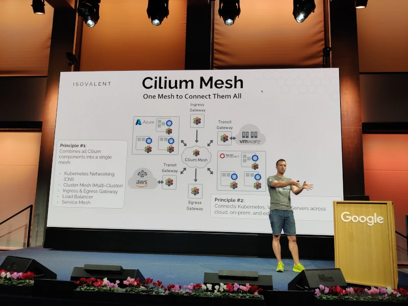
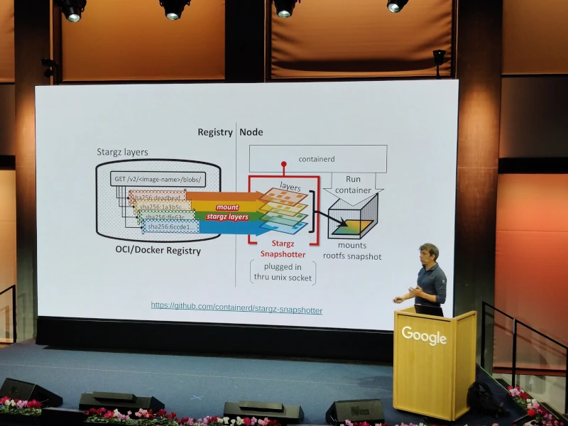
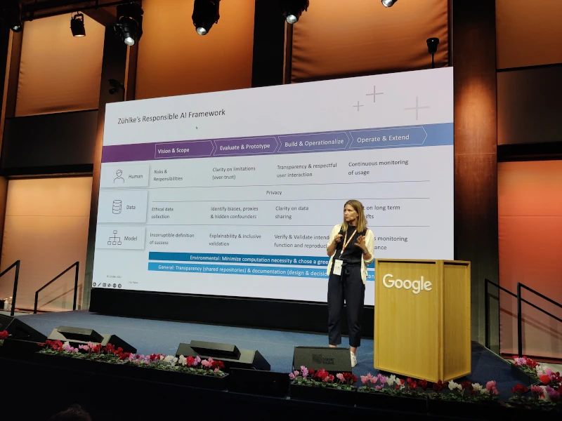
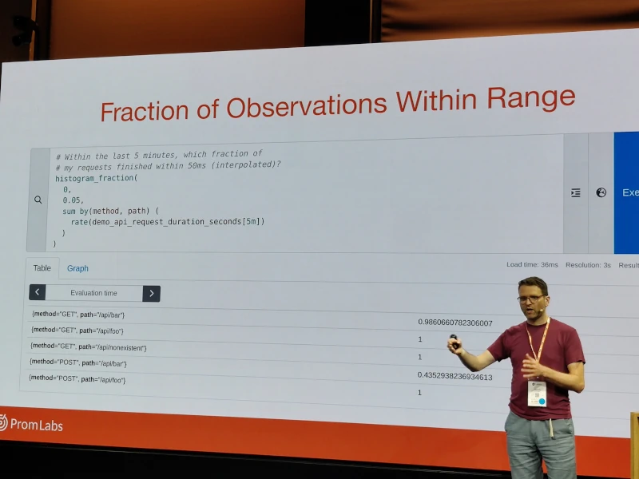
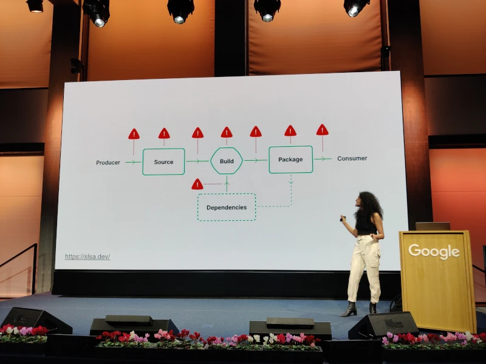

------------------------------------------------------------------------------------

---
## Introduction

The [Kubernetes Community Days](https://www.linkedin.com/company/kubernetes-community-days-zurich/) took place at Google's offices in Zurich Europaallee for the first time in Switzerland! Organized by the Cloud Native Computing Foundation (**CNCF**), these global events bring together experts and adopters from the open source and cloud native community.

The first day was dedicated to hands-on workshops where participants could apply their skills and learn from experts. In this article, we will focus on the second day of the Kubernetes Community Days, providing a summary of the different presentations and key takeaways.


So, without further ado, let's dive in!

### Talk 1: Cilium Mesh - How to Connect Kubernetes with Legacy VM and Server Infrastructure
#### Speaker(s): [Thomas Graf](https://www.linkedin.com/in/thomas-graf-73104547/)
#### Summary
Kubernetes is well-suited for containerized workloads. However, the majority of workloads will remain where they are for some time, running on VMs or physical servers in public or private cloud environments. How can we connect the new world of Kubernetes, consisting of services, identities, and CI/CD, with the existing world of VMs, servers, and network infrastructure? In this session, Thomas Graf explores the brand-new Cilium Mesh layer. Cilium Mesh is a novel universal networking layer that enables connecting workloads and machines across the cloud, on-premises, and edge environments. It includes a Kubernetes network component (CNI), a multi-cluster connectivity plan (Cluster Mesh), and a transit gateway to connect to VMs and servers in existing networks.



#### Key Takeaways
- **Cilium Mesh** combines all Cilium components into a single mesh:
    - *Kubernetes Networking (CNI)*
    - *Cluster Mesh (Multi-Cluster)*
    - *Ingress & Egress Gateway*
    - *Load Balancer*
    - *Service Mesh*
- **Cilium Mesh** connects Kubernetes, VMs, and servers across the cloud, on-premises, and at the edge.
- The **Cluster Mesh API Server** contains an instance of etcd to track the cluster state. States from multiple clusters are never mixed.
- Cilium's multi-cluster model's global service discovery is built using standard Kubernetes services and is designed to be fully transparent to existing Kubernetes application deployments.
- You can use **Cilium Network Policies** across multiple clusters!
- The **Cilium Identity Aware Security** feature provides security and observability, allowing you to easily observe and secure your applications regardless of their location.

### Talk 2: The State of Green Washing - or How to Build Sustainable Systems with Kubernetes
#### Speaker(s): [Max Körbächer](https://www.linkedin.com/in/maxkoerbaecher/)
#### Summary
This presentation focused on building sustainable systems with **Kubernetes**. While Kubernetes can be helpful in designing environmentally-friendly systems, it is important not to fall into the trap of "green washing." The presentation explored current possibilities, recent developments, and future needs to create a carbon-emission-conscious system landscape. Participants learned how designing environmentally-friendly system architectures can have a **sustainable impact**.

#### Key Takeaways
- Different challenges:
    - Energy consumption of data centers
    - Exponential increase in data on obsolete hardware
    - Carbon emissions are everywhere
- What we **can** do:
    - Optimize containers image size
    - Plan containers for high density
    - Scale containers to zero
    - Scale clusters to zero
    - Optimize nodes, hardware (e.g., ARM-based), and operating system (OS)
- What we **must** do:
    - A future without containers
    - Plan based on carbon emissions
    - Scale based on carbon emissions
    - Design architectures for sustainability
    - Improve energy management
- **How to reduce carbon footprint**:
    - Scale, reduce, and right-size resources
    - Change hardware or compute architecture
    - Adjust system architectures
    - Optimize software and build process

### Talk: Forensic Container Checkpointing and Analysis
#### Speaker(s): [Adrian Reber](https://www.linkedin.com/in/adrian-reber-9753424/)
#### Summary
The "Forensic Container Checkpointing" feature in Kubernetes 1.25 allows creating a checkpoint of a running container. This checkpoint can be used for analysis to understand the container's state at a specific moment. It can be useful in situations where there may be a security breach or another issue requiring investigation. This feature offers many new possibilities, such as container migration without losing their state, quick start from existing checkpoints, or more efficient use of Spot instances.

#### Key Takeaways
- Checkpointing technology enables snapshotting of the process (memory pages, mounting points, CPU registers, process state)
- Enables investigation and debugging of container processes
- Especially useful for moving "stateful" containers from one node to another with minimal service interruption
- Currently available only in RedHat technology (CRI-O with runc or crun)
- Pull requests in containerd and Kubernetes are in progress
- Native Kubernetes support with scheduler-level integration is eagerly awaited, which will provide the equivalent of V-Motion for stateful containers, similar to VMware's virtual machines.

### Coffee Break


### Talk: When Things Get Big: Scaling Cloud Native Workloads and Software Distribution
#### Speaker(s): [Ricardo Rocha](https://www.linkedin.com/in/ricardo-rocha-739aa718/)
#### Summary
The transition to containers has significantly improved the deployment and management of services and workloads in large-scale IT infrastructures. However, it has also introduced new challenges that may require intrusive workflow changes or be hidden in the software stack. This session focuses on one of these challenges and explains in detail how to efficiently distribute very large software packages across thousands of nodes for batch, compute-intensive, or machine learning workloads.


#### Key Takeaways
- The scale of Kubernetes cluster usage at CERN is mind-boggling:
    - 40 million particle collision images to store per second
    - An entire farm is present within the collision detector to filter 1 PB/s of information at 10 GB/s of information
    - 3000 nodes
- There are numerous challenges, and in this talk, the speaker focuses on one challenge related to the size of application images hosted on the clusters: typical size of 61 GB, with the largest one reaching 124 GB.
- This creates a significant application startup latency issue, as the cluster needs to respond quickly to massive job starts (245K jobs).
- The presented solution involves a rewrite of the container engine's layer provisioning system, which starts with minimal layers and requests container files only when they are actually needed. It's a sort of lazy-loading of files based on stargz-snapshotter.
- The demo is impressive, showing a comparison of application startups:
    - 5s vs. 50s
    - Bandwidth peaks of several hundred MB/s in the non-optimized case, compared to a more evenly distributed bandwidth of around 20 MB/s.

### Talk: Demystifying eBPF - eBPF Firewall from Scratch
#### Speaker(s): [Filip Nikolic](https://www.linkedin.com/in/filip-nikolic/)
#### Summary
eBPF is increasingly used in the cloud-native ecosystem, especially for implementing high-performance firewalls and other security features. Filip explores the fundamental concepts of eBPF and demonstrates how to build a firewall from scratch using this technology. By providing concrete examples of eBPF usage in CNCF projects like Cilium, Calico, and Pixie, he helps us better understand how eBPF can be applied to different use cases.

#### Key Takeaways
**eBPF (Extended Berkeley Packet Filter) is a kernel technology that allows programs to run without modifying the kernel source code** or adding additional modules.
We have seen that it is relatively easy to set up a script to test it.
Example code for a **firewall** that blocks all incoming traffic:
```
SEC("xdp_kcd_zurich") 
int xdp_kcd_zurich_firewall(struct xdp_md *ctx)
{
    // drop all packets
    return XDP_DROP
}
```
eBPF is:
- Event-driven
- Versatile
- Fast
- Secure
- Increasingly popular

### Talk: Responsible AI: The Key to Ethical, Safe, and Inclusive Software Development
#### Speaker(s): [Lisa Falco](https://www.linkedin.com/in/lisa-falco-jon)
#### Summary
This talk addresses the importance of responsible AI for ethical and inclusive software development. Lisa presents frameworks for the development of ethical and interpretable AI, based on experience in machine learning development in the medical field. The principles of responsible AI can be extended to software development in general to ensure a more inclusive and beneficial approach to society and minimize negative consequences.


#### Key Takeaways
- A comprehensive framework applied at Zuhlke for real governance of AI projects and applications focused on:
    - Human: defining project risks, clear assignment of responsibility, transparency about model limitations, and the obligation to continuously monitor model usage
    - Data: data collection modalities, privacy considerations, the obligation to analyze unintentional or malicious biases, and the conditions for data sharing and usage
    - Models: unambiguous definition of success criteria, model validation, including the link with mandatory clinical trials in the world of AI application in the medical field
- In conclusion, there are high expectations for the EU AI Act to be published at the end of 2023, defining a classification model for applications based on risk level and likely imposing requirements for each identified level.

### Talk: What Anime Taught Me About K8s & Tech Careers
#### Speaker(s): [Annie Talvasto](https://www.linkedin.com/in/talvasto/)
#### Summary
Annie's talk focuses on what anime can teach us about careers in Kubernetes development and technology. She discusses the importance of perseverance, inclusion, diversity, and always having a snack at hand. The presentation also provides tips for beginners to start their cloud-native journey. It's interesting to see how anime can boost one's career in Kubernetes development and technology!

#### Key Takeaways
Many analogies can be found between Kubernetes and anime.
Different lessons learned by Annie Talvasto:
- The importance of teamwork
- Personal development
- Listening skills
- Documentation
- Self-belief

### Lunch


### Talk: Buzzing Across the Cloud Native Landscape with eBPF
#### Speaker(s): [Bill Mulligan](https://www.linkedin.com/in/bamulligan/)
#### Summary
Bill explains how he entered the world of eBPF and how this technology is used in the cloud-native landscape. He shows how eBPF enables networking efficiency, instrumentation-free observability, easy traceability, and real-time security. Participants will leave with a better understanding of eBPF technology and the available tools to solve networking, observability, and security problems.

#### Key Takeaways
- A comprehensive overview of different tools and technologies in the eBPF ecosystem:
    - Inspektor Gadget
    - Pyroscope (acquired by Grafana)
    - Pixie
    - Parca
    - bpftrace
    - bcc
    - Optimyze
    - Katran, Facebook's load balancer

### Talk: Streamlined Troubleshooting in Kubernetes
#### Speaker(s): [Lena Fuhrimann](https://www.linkedin.com/in/lena-fuhrimann/)
#### Summary
In this presentation, Lena highlights different methods to make debugging and troubleshooting in Kubernetes more efficient and organized. She demonstrates various open-source techniques and tools that help understand common errors and solve problems more easily by following clear resolution strategies and using automation tools. The presentation also includes a live demonstration of some of these tools.

#### Key Takeaways
- The most common method to debug a problem in a pod or deployment:
    - `kubectl get deployments`
    - `kubectl get pods`
    - `kubectl describe pod xxx`
    - `kubectl log xxx`
- The Kubernetes documentation contains everything you need to debug each type of resource.
- The command `kubectl get events --field-selector type=Warning` can be helpful.
- **Debugging Tools**:
    - [stern](https://github.com/stern/stern): To tail multiple pods on Kubernetes and multiple containers within the pod, with color-coded output for faster debugging.
    - [k8sgpt](https://k8sgpt.ai/): A tool to analyze your Kubernetes clusters, diagnose, and resolve issues in plain English language.
    - [livelint](https://github.com/bespinian/livelint): To assist with debugging on Kubernetes.

### Talk: Native Histograms in Prometheus: A Better Histogram Experience for Everyone
#### Speaker(s): [Julius Volz](https://www.linkedin.com/in/julius-volz/)
#### Summary
In this presentation, [Julius Volz](https://www.linkedin.com/in/julius-volz/), co-founder of Prometheus, introduces "native histograms," a new method for tracking value distributions with more detail and lower storage and processing costs in Prometheus. Unlike existing "legacy" histograms, native histograms require less manual bucket configuration and generate fewer time series. Julius explains how native histograms work and how to use them experimentally in Prometheus.

#### Key Takeaways
- Current histograms in Prometheus are clearly a deviation from the float-based metric system associated with a timestamp.
- Buckets need to be known in advance, which is a big challenge to have histograms with consistent buckets (who can know the right buckets for latency in their application beforehand?).
- Prometheus has recently adopted a specific format for histograms, which is still an experimental feature:
    - Buckets are defined exponentially.
    - The technology supports sparse buckets by not broadcasting them.
    - To prevent the accumulation of almost empty buckets over time, a mechanism for resetting buckets (based on time intervals or a maximum number of buckets) is included in the instrumentation libraries (currently only for Golang).
- Finally! After years of waiting, we have an implementation close to HDR Histograms that properly captures and characterizes latency information. It's finally here!



### Talk: Tales of Serverless - a story about building scalable applications
#### Speaker(s): [Reto Lehmann](https://www.linkedin.com/in/retocode/)
#### Summary
In this presentation, Reto tells a story about building scalable serverless applications. Using the Knative Serverless platform, he showcases applications that appear and disappear. He explores the Serverless ecosystem and its mechanisms. By the end of this presentation, we should be able to understand the mechanisms.

#### Key Takeaways
- **Knative is an Open Source community project that adds components to Kubernetes for deploying, running, and managing cloud-native serverless applications.**
- Knative makes it easier to build serverless applications on Kubernetes.
- The serverless approach allows running code without worrying about the underlying infrastructure, leaving Knative responsible for resource management and automatic scaling.
- Knative enables automatic scaling of containers using a request-based model to serve workload on demand. We explored the possibility of having a scaled deployment with zero instances without disrupting the application's operation.
- Applications can be triggered by various sources such as events from your own applications, cloud services from multiple providers, or SaaS systems.
- **Other Knative features**:
    - Request buffering to avoid application overload.
    - Various traffic (scaling) targets such as fixed maximum request rate.
    - Tag-based routing.
    - Configuration and revisions.
    - Metrics and observability.

### Talk: Securing your Software Supply Chain on Kubernetes with Sigstore
#### Speaker: [Priya Wadhwa](https://www.linkedin.com/in/priya-wadhwa-693893b5/)
#### Summary
In this presentation, Priya Wadhwa addresses the security of images running in your Kubernetes cluster. She explains how to determine the composition and vulnerability risk of your images and how to secure them using container signing with Sigstore. She also demonstrates how to apply Software Supply Chain Security (SLSA) principles to secure your build pipeline and enforce policies associated with your images within your Kubernetes cluster using the Sigstore policy controller.
#### Key Points
- Sigstore is a toolkit project that enables verification of the authenticity and provenance of an image and/or its data.
- Traditional signature revolves around key pair generation.
- Sigstore introduces a paradigm shift:
    - The image is associated with an identity (supported by OIDC).
    - Generation of a time-limited key pair that will be recorded in a registry (Fulcio).
    - Transparent registry of operations is maintained (Rekor).
    - An Admission Controller for Kubernetes is provided, allowing the exclusion of unsigned, inauthentic images that don't come from specific registries or have confirmed vulnerabilities.
- The comprehensive demo of the entire chain, from image generation (based on nginx and scanned by Trivy, with the scan result attested in the registry) to its eviction in the cluster, is very convincing.
- However, the question of the validity period of vulnerability scanning is not addressed. Nevertheless, Priya already provides insights by mentioning SBOM instead of the scan result. This is a topic we extensively covered in our talk [How to protect yourself from a “Supply Chain Attack”?](https://www.sokube.io/en/blog/how-to-protect-yourself-from-a-supply-chain-attack-en) at DevOps D-Days 2022.


    
### Talk: Closing the Developer Experience Gap of your Container Platforms
#### Speaker: [Timo Salm](https://www.linkedin.com/in/timo-salm-8779a680/)
#### Summary
In this presentation, Timo discusses the challenges that developers face when working with container platforms due to a lack of user-friendliness. He explains that developers often need to have in-depth knowledge of containers and Kubernetes to deploy their applications, which can be time-consuming. Timo will present several open-source technologies, such as Backstage, Cloud Native Buildpacks, Knative, and Cartographer, that can help bridge this user experience gap and enable developers to focus on adding business value.
#### Key Points
Several tools were reviewed:
- **Cloud Native Buildpacks** are a set of tools and conventions that allow for easier and more consistent creation of container images from your application's source code. Instead of having to write complex Dockerfiles or build scripts, Cloud Native Buildpacks automate the process of creating container images by analyzing your source code and combining it with the necessary dependencies to create a final runnable image.
- **Kpack** is an open-source project that brings Cloud Native Buildpacks functionality to Kubernetes. It provides a native approach to Kubernetes for creating container images from your application's source code.
- **Kpack** uses Cloud Native Buildpacks as the build engine to automatically generate container images as your source code evolves.
- With Kpack and Cloud Native Buildpacks, you can benefit from a simpler and more automated method of creating container images from your source code. This allows you to focus more on developing your application without worrying about the details of image building. You can easily deploy your applications on Kubernetes and run them on any cloud in a portable manner.
- **Knative** facilitates the creation of serverless applications on Kubernetes.
- **Cartographer** is a tool that allows you to map and visualize the workflow of development and continuous deployment in a clear and understandable way.
- **Backstage** provides a centralized interface for managing services, deployment pipelines, and development-related information, offering an overview of the application's lifecycle.
    
### Talk: Process is what naturally follows - a cloud platform's guide on people-first transformation
#### Speaker: [Sebastian Kister](https://www.linkedin.com/in/sebastiankister/)
#### Summary
In this presentation, Sebastian discusses the transformation of businesses by putting people first. He explains how transformation can be made possible by turning it into a business argument. Sebastian also talks about time to market and the importance of changing cultural paradigms.

#### Key Points
- Transformation through processes results in people conforming to the process.
- Transformation through people results in people solving problems.
- Tools and their usage will naturally come to solve real problems.
- Standardization in processes should emerge as a result: a natural "golden path" can be encouraged as it will have naturally captured the entity's know-how.
- Deviation from the Golden Path should be possible, provided there is a reasoned presentation of why a group believes it is vital for their business case to adopt different practices, tools, or processes.

### Talk: Bridging Dev and Ops with eBPF: Extending Observability Upwards and Downwards
#### Speaker: [Raphaël Pinson](https://www.linkedin.com/in/raphink/)
#### Summary
[Raphaël Pinson](https://www.linkedin.com/in/raphink/) presents on the use of eBPF (extended Berkeley Packet Filter) to enhance observability in Linux systems. By utilizing eBPF, he demonstrates how it can bridge the gap between development and operations teams by providing deeper insights into the kernel, operating systems, and running applications. The presentation also covers how eBPF can be used to extend observability downwards by accessing low-level system information and upwards by offering application-level tracing capabilities.

#### Key Points
- From basic monitoring to expertise
- Bringing metrics to developers and the right to deploy
- More metrics with eBPF
- **eBPF**: Makes the Linux kernel programmable securely and efficiently
- Use cases for eBPF: DDoS protection, load balancing, live kernel patching
- **Cilium**
  - Performance improvements (no iptables, bypassing TCP/IP)
  - Simpler architecture (no sidecar proxy for service mesh)
- **Hubble**
  - Fine-grained network observability
  - Export to SIEM
  - Support for OpenTelemetry standard
- **Tetragon**
  - Kernel event observation and export
  - Action on events (e.g., SIGKILL)

### Talk: eBPF for Security
#### Speaker: [Liz Rice](https://www.linkedin.com/in/katie-gamanji/)
#### Summary
Liz revisits the fundamentals of eBPF and highlights its particular relevance from a security perspective. Due to its low-level position, eBPF allows for the observation of typical events indicating malicious usage of a compromised container, such as file system calls, network connections, etc.

#### Key Points
- eBPF enables us to run custom code in the kernel.
- No application or configuration modifications needed!
- eBPF programs can be aware of everything.
- Example of an eBPF HelloWorld script:
```
SEC("kprobe/sys_execve")
int hello(void *ctx){
    bpf_trace_printk("Hello World!");
    return 0;
}
```
- **LSM API (Linux Security Modules API)** is a Linux kernel interface that allows the development of security modules to control and protect system resource access.
- **Cilium Tetragon** monitors, analyzes, and controls system calls made by containers, providing an additional layer of security by detecting and preventing malicious or unauthorized activities at the operating system level.
- **Tetragon** is also capable of detecting and blocking suspicious actions by sending a termination signal (**sigkill**) to immediately stop malicious activities.

### Cocktail


## Conclusion

The **KCD Zurich** event was exceptional, where numerous experts and professionals shared their experience and knowledge on the latest trends in containerization and Kubernetes. With the high quality of the talks, we learned a lot about container security, compliance policy implementation, developer experience enhancement, eBPF, and much more. We hope this summary has been useful to our readers, and we look forward to coming back for the next **KCD** event.


