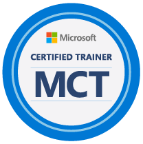
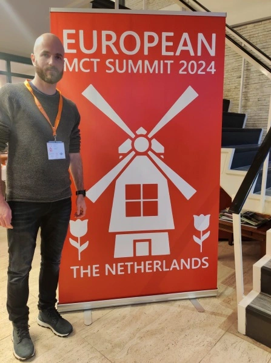
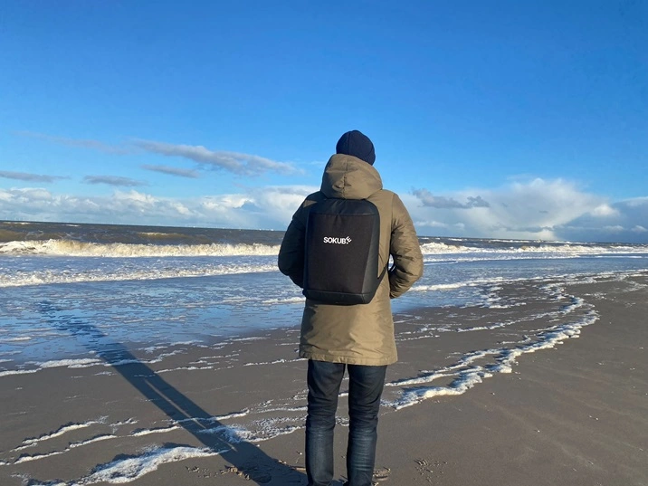
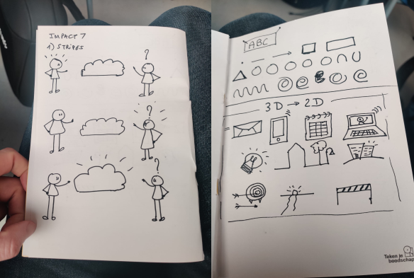
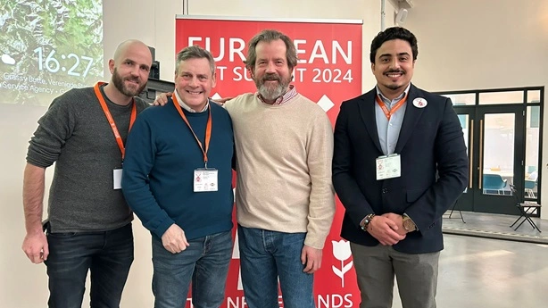
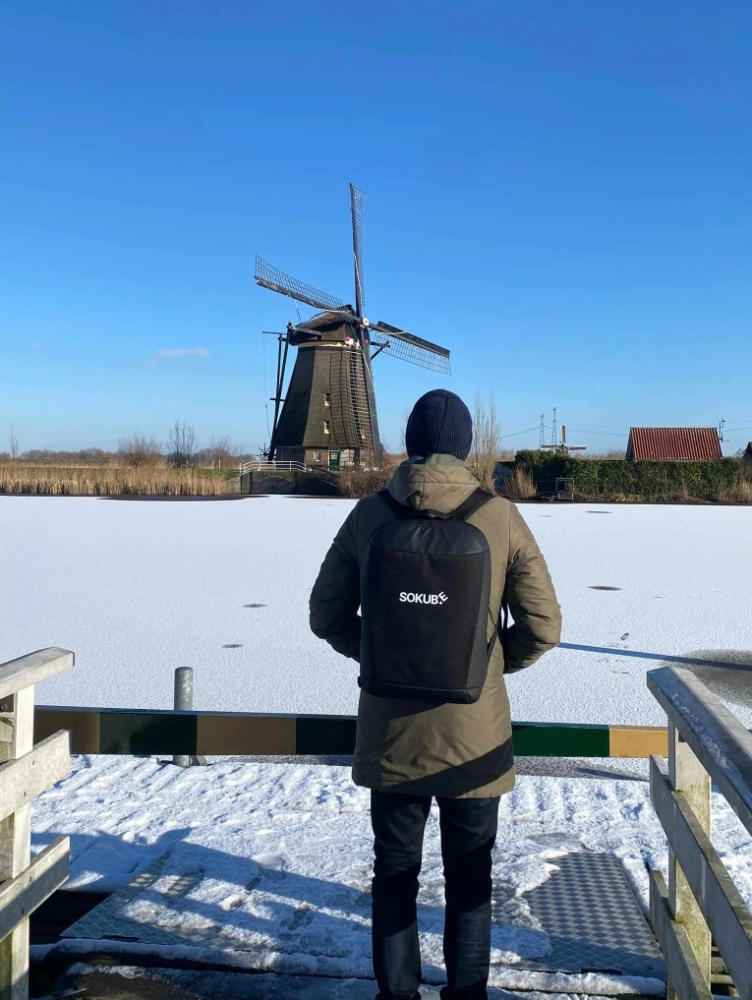

------------------------------------------------------------------------------------

---
## In Memory of René Kammer  

In remembrance of René Kammer, a beloved MCT who left us this year. His presence and contributions to our community are deeply missed.

## Introduction

Ever wondered what goes down when Europe's Microsoft Certified Trainers (MCTs) come together?

Well, it's the [MCT Summit Europe](https://www.mctsummit.nl/) — a gathering packed with talks to upskill, networking opportunities, and a chance to finesse your presentation game.

Lucky me, I was there in The Hague, and now I'm spilling the details on three action-packed days.

Get ready for the inside scoop on the MCT Summit experience! 🚀

## Welcoming Dinner: A Memorable Kickoff

The MCT Summit Europe 2024 began on a delightful note with a Welcoming Dinner on January 14th, and let me tell you—it set the perfect tone for the entire event. Picture this unique experience: cruising through the charming streets of The Hague aboard the Hoftramm, a tram transformed into a mobile restaurant.

The evening aboard the Hoftramm was more than just a dinner; it was an opportunity to connect with the vibrant community of Microsoft Certified Trainers.

## Day 1

### Keynote 1 - Announcements Microsoft
**Speaker**: [Koenraad Haedens](https://www.linkedin.com/in/khaedens)  
**Summary** : During the keynote, a poignant moment occurred as the audience paid tribute to **Rene Kammer**, an MCT who passed away in 2023. This heartfelt homage underscored the profound sense of community within the MCT family and the strong bonds that unite them. Then, Koenraad kicked off the MCT Summit Europe 2024 with exciting updates on the MCT program. The highlights include:

- **MCT 2024 Program Updates:**
  - Introduction of a new MCT badge.
  - Onboarding Hub for a seamless integration process.
  - Replacement of the MCT Anniversary Award with the MCT Quality Award.

Following these program updates, Koenraad let us know about promising developments for MCTs and their students that I can't disclose yet.

Another significant revelation was the introduction of the **MCT Lounge** this year, an interactive interface facilitating communication and information exchange among MCTs. This platform promises to be a valuable resource for fostering collaboration and keeping MCTs well-informed.

## Session 1 : USING ARTIFICIAL INTELLIGENCE TO CREATE AND DELIVER COURSES  
**Speaker** : [Gary Grudzinskas](https://linkedin.com/in/grudzinskas)  
**Summary** : Gary led an enlightening session on harnessing the power of Artificial Intelligence (AI) to generate compelling training content. The journey unfolded as follows:

- **AI-Driven Research and Outline Creation:**
  - Initiated by researching Cosmos DB, the session showcased the process of using ChatGPT to generate a comprehensive outline.
  - Emphasized the importance of providing context and constraints to ChatGPT for producing meaningful and relevant output.

- **Detailed Content Development:**
  - Explored the outline further and leveraged the [tome.app](https://tome.app/) platform to craft a detailed presentation.
  - Highlighted the significance of contextual input for ChatGPT to deliver valuable content.

- **Multimedia Integration:**
  - Utilized [DALL-E](https://openai.com/dall-e-3) for generating images to enhance the presentation slides.
  - Demonstrated the use of ChatGPT for creating hands-on labs, followed by generating a training video using [app.heygen.com](https://app.heygen.com/login).

- **Reflection on Training Profession:**
  - Revealed the fragility of the training profession by showcasing the ability to swiftly generate a course on a technology, acknowledging its perfectibility.

- **Creative Endeavors:**
  - Concluded with a creative twist by generating a song about the MCT Summit Europe 2024, set to the melody of the Dutch national anthem.

This session highlighted the transformative potential of AI in streamlining the course creation process and shed light on the delicate nature of the training profession. 

## Session 2 : BEYOND MOC: THE FUTURE OF ILT  
**Speaker** : [Julian Sharp](https://www.linkedin.com/in/juliansharp/)  
**Summary** : Julian delivered a captivating session, fostering interaction and insight into the future of Instructor-Led Training (ILT). The session encompassed various topics, engaging the audience in meaningful discussions:

- **MCT Achievements and Revenue Poll:**
  - Initiated with a poll to gauge the achievements and revenue sources of different MCTs, providing valuable insights into the diverse experiences within the community.

- **Evolution of Microsoft Courses:**
  - Explored the transformations in Microsoft courses, transitioning from a product-focused model to a more role-based approach. This shift reflects the industry's dynamic nature and the alignment of training with real-world job roles.

- **Impact of Interfaces like Microsoft Learn and Applied Skills on Certifications:**
  - Examined the influence of platforms such as Microsoft Learn and Applied Skills on certification processes, emphasizing the need for adaptability in response to evolving industry landscapes.

- **Empowering MCTs:**
  - Discussed the exciting opportunities for MCTs to create their own courses, showcasing the growing trend of personalized and tailored training content.

- **Engagement in SME Programs:**
  - Explored the option for MCTs to actively participate in Subject Matter Expert (SME) programs, contributing to question creation and receiving remuneration for their expertise.

- **Content Creation Beyond Traditional Platforms:**
  - Explored avenues beyond traditional courses, such as leveraging YouTube for content creation, acknowledging the evolving landscape of educational content dissemination.

## Session 3 : 10 DO'S AND DON'TS OF (UN)SUCCESSFUL PRESENTATIONS  
**Speaker** : [Sasha Kranjac](https://www.linkedin.com/in/sasakranjac/)  
**Summary** : Sasha shared great insights in a session focused on the key do's and don'ts for crafting successful presentations. Here are the 5 do's and 5 don'ts that Sasha highlighted:

### Do's:
1. **Carefully Choose Pictures:**
   - Emphasized the importance of selecting images thoughtfully to enhance visual appeal and engagement.

2. **Opt for Proper Fonts and Font Size:**
   - Stressed the significance of using readable fonts and appropriate font sizes for better comprehension.

3. **Ideal Presentation Duration:**
   - Suggested that a 20-minute timeframe is optimal, with regular and not overly extended breaks to maintain audience engagement.

4. **Keep Audience Informed:**
   - Advised presenters to ensure the audience is aware of the presentation's progress and context throughout.

5. **Chunk Information into Categories:**
   - Encouraged the organization of content into distinct categories for clarity and easier understanding.

### Don'ts:
1. **Beware of Translations:**
   - Cautioned against relying solely on translations to prevent misunderstandings.

2. **Be Mindful of Hand Gestures:**
   - Advised presenters to be cautious with hand gestures, ensuring they do not distract from the message.

3. **Watch for Typos:**
   - Highlighted the importance of proofreading to avoid typographical errors that can undermine professionalism.

4. **Return Microphone Post-Presentation:**
   - Shared a humorous note about the etiquette of promptly returning the microphone after concluding the presentation.

5. **Avoid Overloading Slides with Text:**
   - Discouraged the inclusion of excessive text on slides, promoting concise and visually appealing content.

### Tips and Extras:
- **Utilize Slide Sections in PowerPoint:**
  - Introduced the use of slide sections in PowerPoint for better organization and navigation.

- **Rehearse Timings in PowerPoint:**
  - Advocated for timing rehearsals within PowerPoint to ensure a smooth and well-paced presentation.

- **Record Your Demos:**
  - Emphasized the benefits of recording demos for added reliability and preparedness.

- **Backup:**
  - Stressed the importance of having backup plans to mitigate unforeseen technical issues.

- **Leverage Tools like Copilot, Designer, and Generative Pre-trained Transformer:**
  - Introduced various tools to enhance presentation creation, including Copilot, Designer, and Generative Pre-trained Transformer.

## Session 4 : USING CHATGPT AND OTHER GENERATIVE AI TOOLS IN EDUCATION  
**Speaker** : [Patrick Kersten](https://www.linkedin.com/in/patrickkersten/) & [Sjon Post](https://www.linkedin.com/in/sjon-post-46952310/)  
**Summary** : 

In a dynamic session, Patrick and Sjon delved into the application of ChatGPT and other generative AI tools to enhance the role of MCTs. Key highlights from the session include:

- **Understanding ChatGPT Prompts:**
  - Demonstrated the concept of a ChatGPT prompt using an example of content creation tailored to the style of author Stephen King.

- **Advancements with ChatGPT 4:**
  - Explored the capabilities of ChatGPT 4, enabling the input of text and images for impressive results. Notably, ChatGPT 4 showcased its ability to comprehend humor in images and summarize complex Azure architecture diagrams.

- **Education Use Cases:**
  - Discussed various applications in education, including:
    - Preparing students for exams.
    - Summarizing complex key points.
    - Brainstorming and generating content ideas.
    - Creating exercises.
    - Developing interactive learning scenarios through role-playing.

- **Focus on Interactive Learning:**
  - Explored creating a quiz for AZ-104 and engaging in a role-playing scenario where ChatGPT responded contextually.

- **Building a Custom Mentor ChatGPT:**
  - Illustrated the process of constructing a personalized Mentor ChatGPT. In this case, a Microsoft specialist was summoned to answer questions based on provided web pages and URLs as references.

- **Integration of Copilot in Teams:**
  - Outlined the use of Copilot in Teams for:
    - Following a training session remotely.
    - Catching up efficiently when joining later.
    - Receiving Teams notifications when the session recap is ready.
    - Recap highlighting and summarizing key points and action items.
    - Evaluating student behavior and sentiment.
    - Utilizing feedback for student mentoring.

## Session 5 : 10 TIPS FOR MORE ENGAGEMENT!  
**Speaker** : [Gerjon Kunst](https://www.linkedin.com/in/gerjonkunst/) & [Madelon Nonkes](https://www.linkedin.com/in/madelonnonkes/)  
**Summary** : 
In the final session of the day, Gerjon and Madelon shared invaluable tips on making training sessions more engaging and impactful. Here's a breakdown of their insights:

- **Invitation to the Event:**
  - Emphasized the importance of explaining what participants will take away from the course and generating excitement.

- **Slide Design and Content Complexity:**
  - Encouraged minimizing text on slides and avoiding overly complicated diagrams to enhance participant understanding.

- **Introduction and Connection:**
  - Stressed the significance of a brief introduction before the course to understand the audience and their daily experiences, including checking their LinkedIn profiles.

- **Captivating Course Start:**
  - Likened the beginning of a course to a DJ playing their first song and suggested starting with a captivating story.

- **Energy Management:**
  - Introduced the concept of appointing a person responsible for managing breaks (energy manager) and advocated using the Pomodoro technique.

- **Physical Movement and Interactions:**
  - Encouraged making participants move, stand up, and interact through quizzes, addressing them by name, sharing personal anecdotes, and leveraging participants comfortable with the material to assist others.

- **Daily Self-Evaluation and Feedback:**
  - Advised trainers to evaluate themselves daily and solicit feedback from participants.

- **Post-Training Engagement:**
  - Shared post-training strategies, including sending an email with a photo from the session, a gift, or additional technical content to leave a lasting impression and potentially lead to future sessions.

## Day 2

### Session 1: How to Not Get a Burnout  
**Speaker**: [Jeff Wouters](https://www.linkedin.com/in/jeffwouters/)  
**Summary**:

In a crucial session focused on mental well-being, Jeff addressed the vital topic of recognizing and preventing burnout. The session unfolded with an insightful exploration of burnout symptoms:

- **Identifying Burnout Symptoms:**
  - Highlighted key indicators, including fatigue, negative attitude, feelings of incompetence, health issues, self-neglect, and a loss of interest in hobbies.

Moving forward, Jeff provided a strategic approach to address and prevent burnout, emphasizing the following steps:

- **Steps to Address and Prevent Burnout:**
  - Recognize the Symptoms
  - Respond to the Symptoms
  - Take Regular Breaks to Rest
  - Learn to Say No
  - Don't Be Afraid to Ask for Help
  - Prioritize Yourself

### Session 2: GET THE GROUP YOU DESERVE  
**Speaker**: [Rick Kerssens](https://www.linkedin.com/in/rick-kerssens-a29071138)  
**Summary**:

In an insightful session led by Rick, participants delved into the dynamics of group interaction, understanding the transactional analysis framework and strategies to shape the desired group environment.

#### Key Takeaways:

- **Transactional Analysis Overview:**
  - Explored the concept of transactional analysis, understanding how individuals assume various roles in a group setting.

- **Group Dynamics and Group Selection:**
  - Examined the idea that we often get the group we deserve, exploring the roles trainers can adopt and how these roles influence group dynamics.

- **Roles in Group Interaction:**
  - Defined distinct roles:
    - *Nurturing Parent*: Proactive and encouraging.
    - *Critical Parent*: Leading, critical, and judgmental.
    - *Adult*: Rational, objective, and fact-based.
    - *Adapted Child*: Listens and follows.
    - *Free Child*: Impulsive and playful.

- **Importance of Non-Verbal Communication:**
  - Emphasized the significance of non-verbal cues in group interactions.

- **Strategies for Group Selection:**
  - Outlined methods to influence and shape the desired group, emphasizing the roles trainers can play.

- **Shaping Intention and Behavior:**
  - Encouraged awareness of the disparity between one's intention and behavior, observing the group's reaction, and analyzing one's own conduct.

### Session 3: BE A BETTER SPEAKER; 4 STEPS TO CREATE INSPIRING PRESENTATIONS THAT ENGAGE PEOPLE  
**Speaker**: [Erwin Derksen](https://www.linkedin.com/in/ederksen/)  
**Summary**:

Here are key insights and tips from the session:

#### Key Takeaways:

- **The Three Pillars of Presentation:**
  - Emphasized the importance of credibility, emotion, and rationality, with rationality being the least critical of the three.

- **Effective Persuasion:**
  - Discussed the art of convincing and the need to forget the 1-7-7 rule.

- **Preparation Strategies:**
  - Advocated preparing presentations through paper and notes, emphasizing simplicity and the generation of ideas in a relaxed state.

- **Powerful Presentation Start:**
  - Introduced the PUNCH method (Personal, Unexpected, Novel, Challenge, Humor) for a powerful start.
  - Suggested playing music before starting to signal the beginning of the presentation.

- **Conclusive End:**
  - Stressed the importance of having a clear and impactful conclusion.

- **Multitasking Myth:**
  - Debunked the myth of multitasking and encouraged removing non-essential elements.

- **Slide Design Principles:**
  - Advised one message per slide, utilizing contrast and size, and maximizing visual elements.
  - Discouraged the blind use of corporate templates, encouraging customization for better engagement.

- **PowerPoint Coach:**
  - Introduced the use of PowerPoint Coach for rehearsal and ensuring everything is in order.

- **Skip the Commercials:**
  - Encouraged authenticity and suggested skipping unnecessary promotional content.

### Keynote 2 - Draw your message  
**Speaker**: [Lotte Proot](https://www.linkedin.com/in/lotte-proot-302344b0/)  
**Summary**:

In a captivating keynote, Lotte shared the secrets of creating compelling and clear drawings and diagrams, even for those who consider themselves less artistically inclined. With a duration of 50 minutes, the session turned out to be a delightful surprise for individuals who may not consider themselves skilled drawers. Lotte demonstrated how simple shapes can be utilized to craft aesthetically pleasing, straightforward, and effective visual representations.

The session was not just informative but also a fun and interactive experience, breaking down the barriers for those who may have felt intimidated by the prospect of drawing. By the end of the keynote, participants discovered that creating visually appealing sketches and diagrams is not only achievable but also an enjoyable endeavor. Lotte Proot's keynote left the audience inspired and equipped with newfound confidence in expressing ideas visually.

### Session 4: TEACH YOUR STUDENTS POWERSHELL IN AN HOUR  
**Speaker**: [Elias Markelis](https://www.linkedin.com/in/eliasmarkelis/)  
**Summary**:

Elias delivered an intensive and detailed session on efficiently teaching students PowerShell within the span of an hour. The session provided an in-depth exploration of various key aspects, including:

- Where-Object Comparison Statement
- Foreach-Object
- Variables and Operators
- Arrays and Objects
- Conditions and Loops

Elias Markelis not only shared theoretical insights but also provided practical application through labs accessible on [GitHub](https://github.com/emarkelis/PSExamples). This resource serves as a valuable hands-on tool for students to reinforce their understanding of PowerShell concepts.

### Session 5: FROM MCT TO SUCCESSFUL YOUTUBER - TAKE YOUR AUDIENCE TO THE NEXT LEVEL  
**Speaker**: [Andy Malone](https://www.linkedin.com/in/andymalone/)  
**Summary**:

In a session tailored for aspiring YouTubers, Andy shared invaluable insights on transitioning from being an MCT to building a successful YouTube channel. The talk encompassed essential aspects for channel growth and audience engagement:

- **Key Attributes: Patience, Perseverance, and Consistency:**
  - Emphasized the paramount importance of patience, perseverance, and regularity in uploading videos for building a successful YouTube presence.

- **Tools and Equipment:**
  - Provided a comprehensive overview of the tools and equipment Andy utilizes for creating high-quality videos, offering practical guidance for those looking to enhance their production setup.

- **Content Improvement and Viewer Engagement:**
  - Shared strategies for enhancing video content and increasing viewership, delving into methods to captivate and retain the audience's attention.

- **Monetization Strategies:**
  - Explored various avenues for generating revenue through YouTube, including memberships, sponsorships, and advertisements.

- **Building a Sustainable YouTube Career:**
  - Offered insights on creating a sustainable and rewarding career on YouTube, leveraging the platform's potential for both personal and professional growth.

Andy's session provided a roadmap for MCTs venturing into the realm of YouTube, offering practical advice on content creation, audience engagement, and monetization strategies. The session served as a valuable resource for those looking to take their content creation journey to the next level and build a successful presence on the YouTube platform.

### Session 6: THE SCIENCE OF COMMUNICATION: HOW TO CHANGE BLAH-BLAHS INTO MEANINGFUL WORDS!  
**Speaker**: [Sasha Kranjac](https://www.linkedin.com/in/sasakranjac/)  
**Summary**:

In a captivating session, Sasha delved into the intricate dynamics of communication, shedding light on the complexities beyond mere verbal exchanges. The session provided a comprehensive understanding of the various layers involved in interpersonal communication:

- **Six Perspectives in Two-Person Communication:**
  - Explored the idea that communication between two individuals encompasses six perspectives, including how each person sees themselves and perceives the other.

- **Mastering the Art of Listening:**
  - Shared detailed insights on becoming an effective listener, highlighting key principles:
    - *Be Prepared to Listen:* Stressing the importance of mental readiness to engage in meaningful listening.
    - *Be Interested:* Cultivating genuine interest in the speaker's message.
    - *Be Open-Minded:* Approaching conversations with receptivity to diverse perspectives.
    - *Look at the Bigger Picture:* Encouraging a holistic understanding of the context.
    - *Listen Critically:* Engaging in thoughtful analysis while listening.
    - *Do Not Interrupt:* Emphasizing the value of allowing the speaker to express themselves fully.

## Day 3

### Session 1: Microsoft Tech Community Event Speaking, Is There a Secret Success Formula?
**Speaker**: [Sara Fennah](https://www.linkedin.com/in/sarafennah/)  
**Summary**:

In an empowering session, Sara unveiled her secret success formula for securing speaking engagements at Microsoft Tech Community events. The talk provided a step-by-step guide and valuable insights into navigating the event speaking landscape:

- **Finding Events to Apply to:**
  - Shared resources and links to identify and apply for relevant events, laying the groundwork for a successful speaking journey.

- **Crafting Compelling Session Abstracts:**
  - Offered tips on creating session abstracts that stand out and increase the chances of selection.

- **Choosing Session Topics:**
  - Guided participants on selecting impactful and relevant topics for their sessions, aligning with both personal expertise and audience interests.

- **Examples of Submission Forms:**
  - Provided real-world examples of submission forms, offering practical templates for crafting compelling event proposals.

- **Importance of Personal Branding:**
  - Emphasized the benefits of personal branding in enhancing visibility and increasing opportunities for speaking engagements.

- **Dealing with Rejection:**
  - Shared strategies for handling rejection, including taking it in stride, avoiding overanalysis, maintaining resilience, and continuing to pursue opportunities, even considering aiming for smaller events.

### Session 2: FORWARD TO THE PAST AND BACK TO THE FUTURE - CYBERCRIME IN 2023/2024  
**Speaker**: [Sami Laiho](https://www.linkedin.com/in/samilaiho)  
**Summary**:

Sami provided a comprehensive look at the evolving security threat landscape, reflecting on changes observed in 2023 and offering predictions for the future.

#### Key Insights:

- **Common Attack Targets:**
  - Explored prevalent attack vectors, shedding light on how individuals are most frequently targeted.

- **Security's Primary Goal: Slowdown vs. Protection:**
  - Emphasized that the primary goal of security is to slow down attackers, not just to protect systems.

- **Next-Level Threats with AI:**
  - Discussed the potential impact of AI in cyber attacks, showcasing the alarming use of deep fake technology in scams related to seduction.

#### Recommendations:

Sami Laiho also shared a set of crucial recommendations to enhance cybersecurity measures:

- Tiered Domain, Fabric, Backup
- Patch More, Test Less
- User Privileges Management
- Multi-Factor Authentication (MFA)
- User Awareness
- Directory Tiering
- SOC Implementation
- Privileged Access Workstations

### Session 3: MCTS MAKE GREAT MVPS (IF WE DO SAY SO OURSELVES)  
**Speaker**: [Sara Fennah](https://www.linkedin.com/in/sarafennah/)  
**Summary**:

In an open and insightful discussion around the MVP (Most Valuable Professional) Program, MCTs who also hold the prestigious title of MVP or Regional Director shared their experiences, shedding light on the implications, expectations, selection process, and both the rewarding and challenging aspects of being part of the MVP community.

#### Key Takeaways:

- **Dual Role as MCTs and MVPs:**
  - Explored the unique perspective of individuals who serve as both Microsoft Certified Trainers (MCTs) and MVPs or Regional Directors.

- **Expectations and Workload:**
  - Discussed the significant commitment and workload that come with being part of the MVP Program, emphasizing the passion and dedication required.

- **Selection Process:**
  - Provided insights into the selection process, offering a glimpse into the criteria and considerations for becoming an MVP.

- **Likes and Dislikes:**
  - Participants shared what they enjoy most about being part of the MVP Program and, equally, aspects that might pose challenges.

### Session 4: AZURE BASTION: ONE DOES (STILL) NOT SIMPLY WALK INTO MY VNET! V3.0  
**Speaker**: [Wim Matthyssen](https://www.linkedin.com/in/wim-matthyssen-9053737/)  
**Summary**:

Wim Matthyssen delivered an in-depth demonstration of the Azure Bastion service. The presentation covered various aspects of Azure Bastion, showcasing its capabilities and providing practical insights into deployment, configuration, security troubleshooting, and the latest features.

#### Key Highlights:

- Exploration of VM Administrative Access Methods
- Introduction to Azure Bastion
- Latest Features Showcase
- Deployment and Configuration Walkthrough
- Troubleshooting Security and Automation  

Check [Wim's Github](https://github.com/wimmatthyssen/Azure-Bastion) for interesting scripts related to Azure Bastion.

### Session 5: NEW MICROSOFT CERTIFIED TRAINER: WHAT DO I DO NOW?  
**Speaker**: [Julian Sharp](https://www.linkedin.com/in/juliansharp/)  
**Summary**:

Julian's session, "New Microsoft Certified Trainer: What Do I Do Now?" served as a comprehensive guide for recently certified trainers, offering valuable insights into the various interfaces available to Microsoft Certified Trainers (MCTs) and providing guidance on navigating the responsibilities and opportunities that come with the role.

#### Key Insights:

- **Overview of MCT Interfaces:**
  - Julian provided a detailed overview of the different interfaces accessible to MCTs, helping new trainers familiarize themselves with the platforms and tools available.

- **Benefits of Being an MCT:**
  - Highlighted the various benefits that come with being an MCT, emphasizing the advantages and privileges exclusive to certified trainers.

- **Adherence to Rules and Guidelines:**
  - Shared essential rules and guidelines that MCTs need to adhere to, ensuring a professional and compliant approach to training.

- **Finding Training Opportunities:**
  - Provided strategies and tips on how to identify and leverage training opportunities, empowering new MCTs to kickstart their training journey effectively.

- **MCT Renewal Process:**
  - Walked through the process of MCT renewal, guiding newly certified trainers on how to maintain their status and continue contributing to the community.

### Session 6: Contracts: Safeguards or Traps?
**Speaker**: [Marc Michault](https://www.linkedin.com/in/mmichault)  
**Summary**:

Marc shared his wealth of experience concerning the contracts that bind Microsoft Certified Trainers (MCTs) to training partners. The session delved into crucial aspects defining contracts, the various agreements involved, client contracts, and the nuanced differences existing between countries.

#### Key Insights:

- **Contract Definition and Parameters:**
  - Marc provided a comprehensive understanding of what defines a contract, exploring its parameters and elements essential for both trainers and training partners.

- **Overview of Different Agreements:**
  - Delved into the diverse agreements that MCTs may encounter, shedding light on the nuances and obligations associated with each.

- **Client Contracts:**
  - Shared insights into the dynamics of contracts with clients, emphasizing key considerations and potential challenges that trainers might encounter in client engagements.

- **International Variances:**
  - Explored the differences between contracts in various countries, recognizing the importance of understanding and navigating the diverse legal landscapes.

## Conclusion

MCT Summit Europe 2024 was an unforgettable experience filled with high-quality talks, ranging from technical deep-dives to invaluable soft skills insights. Connecting with passionate individuals highlighted the true sense of community.

A heartfelt thank you to the sponsors, speakers, and everyone involved for making this event exceptional. Looking forward to next year's gathering!
