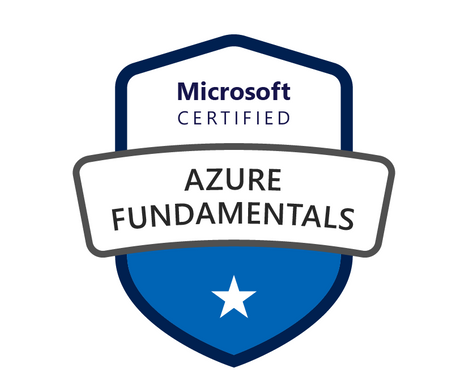

------------------------------------------------------------------------------------
---
# Microsoft Azure Fundamentals (AZ-900) Full Course

## Announcing Availability of AZ-900 Certification Prep Playlist!

Are you ready to ace the AZ-900 Microsoft Azure Fundamentals certification exam? Look no further! I'm excited to announce that my comprehensive playlist to prepare for the exam is now available for you to dive into.

By watching this playlist, you'll be equipped with all the essential knowledge to breeze through the exam after just 2 hours of video content. We'll cover crucial topics like Cloud concepts, Azure architecture and services, as well as Azure management and governance.

### Training Plan:

1. [AZ-900: Your ULTIMATE Prep Guide! | 2024 (1/16)](https://www.youtube.com/watch?v=56SFOxRjWiU&list=PLvliyonONHbS5rRYyC3AWVJmCSxXcvAVT)
2. [AZ-900: Decoding Cloud: Public, Private, Hybrid - Know the Difference! (2/16)](https://www.youtube.com/watch?v=TX7Y9N9tMAs&list=PLvliyonONHbS5rRYyC3AWVJmCSxXcvAVT)
3. [AZ-900: IaaS, PaaS, SaaS Decoded: Unveiling Key Differences in Under 3 Minutes! (3/16)](https://www.youtube.com/watch?v=nWmcWB_3jE0&list=PLvliyonONHbS5rRYyC3AWVJmCSxXcvAVT&index=4)
4. [AZ-900: Decoding Regions, Zones & Data Centers! (4/16)](https://www.youtube.com/watch?v=aWXU7QBPdTM&list=PLvliyonONHbS5rRYyC3AWVJmCSxXcvAVT)
5. [AZ-900: Explore Azure Resource groups, Subscriptions & Management Groups! (5/16)](https://www.youtube.com/watch?v=8VToTk95V-4&list=PLvliyonONHbS5rRYyC3AWVJmCSxXcvAVT)
6. [AZ-900: Azure Compute DECODED: VMs, Desktops, Containers, Functions, Web Apps! (6/16)](https://www.youtube.com/watch?v=bNY4Kxiuxo0&list=PLvliyonONHbS5rRYyC3AWVJmCSxXcvAVT)
7. [AZ-900: Networking Essentials for SUCCESS! (7/16)](https://www.youtube.com/watch?v=qPasK0dkJdA&list=PLvliyonONHbS5rRYyC3AWVJmCSxXcvAVT)
8. [AZ-900: Describe Azure Storage in 5 MINUTES! (8/16)](https://www.youtube.com/watch?v=M8A9pLIn2u4&list=PLvliyonONHbS5rRYyC3AWVJmCSxXcvAVT)
9. [AZ-900: Azure Storage: AzCopy, Explorer, File Sync | Unlock Essentials Now! (9/16)](https://www.youtube.com/watch?v=fduroJMq830&list=PLvliyonONHbS5rRYyC3AWVJmCSxXcvAVT)
10. [AZ-900: Microsoft Entra ID, Azure AD DS and Identities (10/16)](https://www.youtube.com/watch?v=u2cQAGVVb5g&list=PLvliyonONHbS5rRYyC3AWVJmCSxXcvAVT)
11. [AZ-900 : Azure AD Conditional Access, RBAC and Zero Trust (11/16)](https://www.youtube.com/watch?v=DZxzIUZqsA8&list=PLvliyonONHbS5rRYyC3AWVJmCSxXcvAVT)
12. [AZ-900: UNDERSTAND Defense-in-Depth Model and Microsoft Defender for Cloud! (12/16)](https://www.youtube.com/watch?v=qpUs48O3BLc&list=PLvliyonONHbS5rRYyC3AWVJmCSxXcvAVT)
13. [AZ-900: EVERYTHING you need to KNOW about Cost Management in Azure! (13/16)](https://www.youtube.com/watch?v=y0j2q1LIt7s&list=PLvliyonONHbS5rRYyC3AWVJmCSxXcvAVT)
14. [AZ-900: LEARN Governance and Compliance for the EXAM! (14/16)](https://www.youtube.com/watch?v=N8V54Of0Dpg&list=PLvliyonONHbS5rRYyC3AWVJmCSxXcvAVT)
15. [AZ-900: LEARN management and deployment tools (Arc, ARM templates, Bicep) (15/16)](https://www.youtube.com/watch?v=7Z0C4iaiu74&list=PLvliyonONHbS5rRYyC3AWVJmCSxXcvAVT)
16. [AZ-900: Mastering Azure Monitoring Tools (16/16)](https://www.youtube.com/watch?v=0jHrDSAst4A&list=PLvliyonONHbS5rRYyC3AWVJmCSxXcvAVT)

Make sure to review the [course modules](https://learn.microsoft.com/en-us/credentials/certifications/azure-fundamentals/?practice-assessment-type=certification) if needed, and most importantly, complete the [assessment](https://learn.microsoft.com/en-us/credentials/certifications/azure-fundamentals/practice/assessment?assessment-type=practice&assessmentId=23&practice-assessment-type=certification) before registering. 

Get ready to conquer the AZ-900 exam with confidence! Happy learning! 🚀

## Note

As we embark on this journey together, bear in mind that the quality of videos will steadily progress. I've already recorded about a dozen, witnessing improvement with each passing day!

I invite you to [subscribe](https://www.youtube.com/@thedevopsrunner?sub_confirmation=1), join the community, and grow with 'TheDevOpsRunner.'

Thank your so much and see you soon on YouTube!

# Here is the playlist link!

