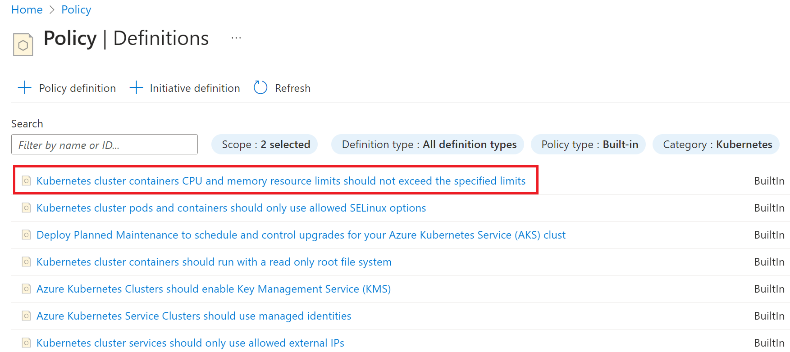
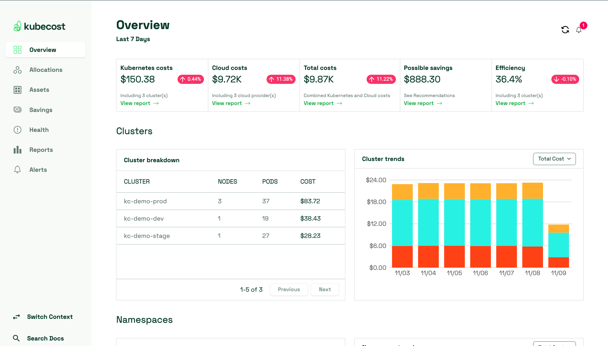
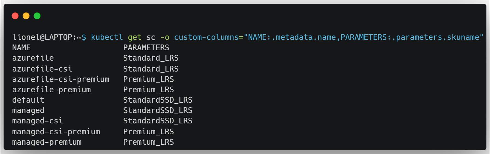
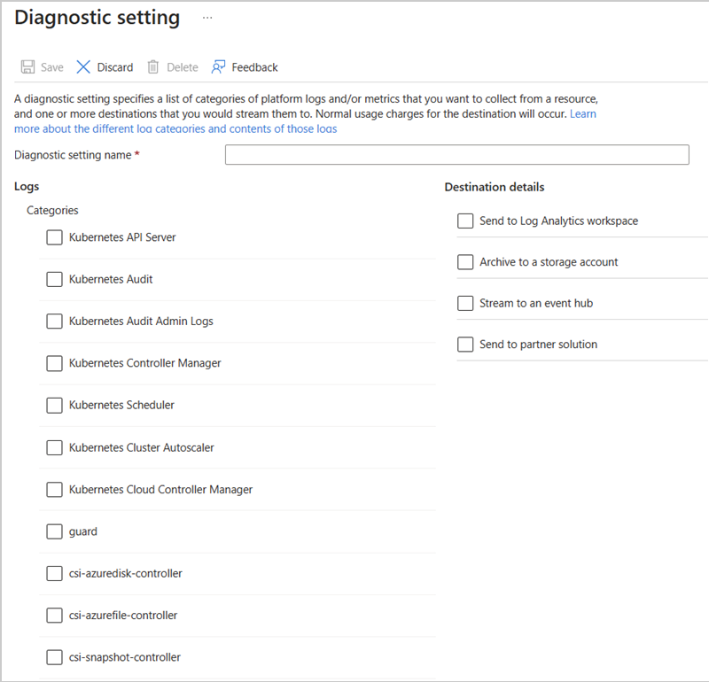
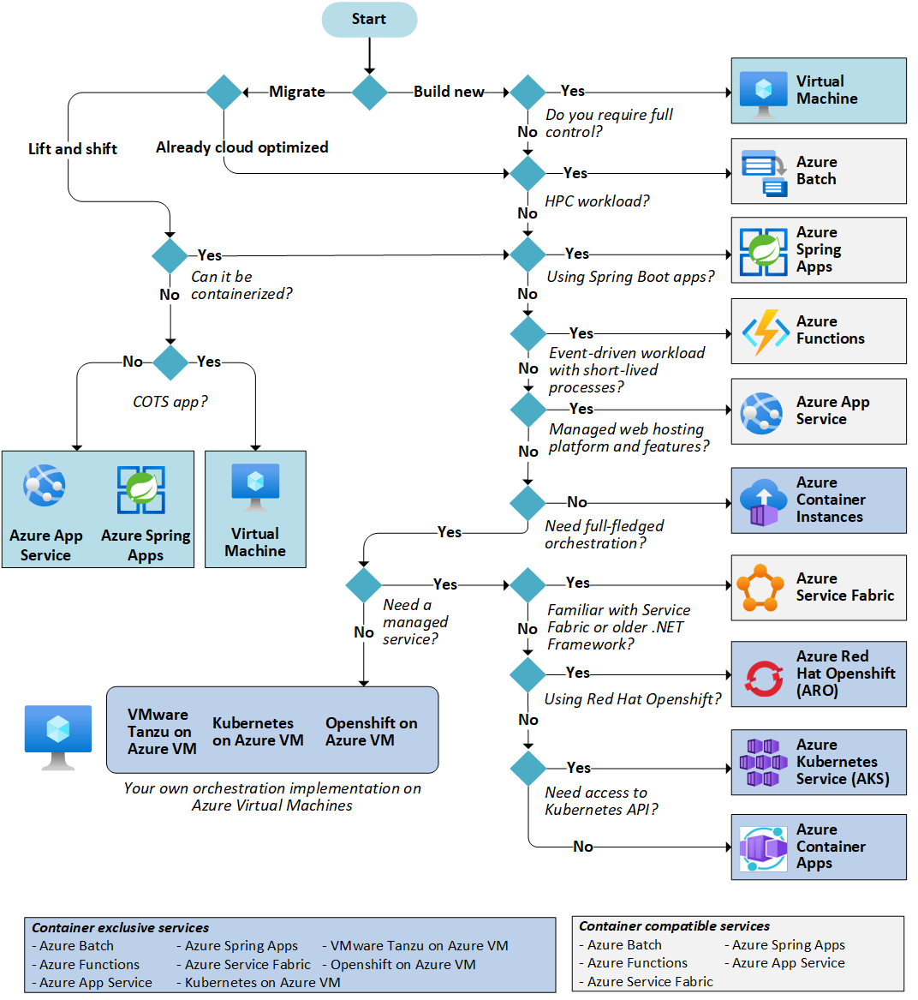

------------------------------------------------------------------------------------

---
# Optimizing the costs of your AKS cluster: Comprehensive FinOps Guide

## Introduction

## Determining the Cost of an AKS Infrastructure

To determine the cost of an Azure Kubernetes Service (AKS) cluster and explore the various factors that can help optimize your monthly bill, it's essential to first understand which elements will be directly or indirectly billed.

### Free Components of an AKS Infrastructure

In an AKS infrastructure, some components are provided for free by Microsoft.

The **Control Plane**, which handles orchestration and node management, is one of these elements.

Likewise, the **Managed Identity** required for security and authentication operations is also provided at no additional cost.

Finally, AKS extensions such as **Open Cluster Management** (OCM) and **Container Storage Interface** (CSI) drivers are included at no extra charge.


### Basic Costs of an AKS Cluster

**Virtual Machines**, whether used for system or user workloads, incur costs based on their size and quantity.

Load balancers and associated **IP addresses** are also billed in the case of a public cluster.

Similarly, network traffic between Availability Zones incurs fees, as does the use of a [**Standard**](https://learn.microsoft.com/en-us/azure/aks/free-standard-pricing-tiers) plan for the control plane.

In the case of a private cluster, consider the costs of traffic to **private endpoints** ([**Endpoints**](https://learn.microsoft.com/en-us/azure/virtual-network/virtual-network-service-endpoints-overview)).

### Costs Not to Forget

Other costs that should not be overlooked include expenses related to setting up virtual network peering ([**VNET Peering**](https://learn.microsoft.com/en-us/azure/virtual-network/virtual-network-peering-overview)) with a central network ([**Hub network**](https://learn.microsoft.com/en-us/azure/architecture/reference-architectures/hybrid-networking/hub-spoke?tabs=cli)).

You should also consider in your bill the potential use of an **Application Gateway** as an **Ingress Controller**, storing secrets and certificates in [**Azure Key Vault**](https://learn.microsoft.com/en-us/azure/key-vault/general/basic-concepts), as well as the costs associated with collecting **logs and metrics**.

Additionally, using **persistent volumes** based on Azure Disk, Blob, or File incurs fees, as does backing up the cluster itself!

You can estimate these costs before getting started using the [Azure Pricing Calculator](https://azure.microsoft.com/en-us/pricing/calculator).

Now that we've outlined the various mandatory and potential costs of an AKS cluster, let's move on to optimizing our bill in a FinOps approach.

## Optimizing Direct Kubernetes-Related Costs

### Optimized Images

Efficient management of Docker images is essential to optimize costs directly associated with your Kubernetes environment. By reducing image size and improving performance, you can decrease storage consumption and resource usage, resulting in long-term savings.

| Documentation related to this optimization |
|---------------------------------------|
| [How to build small images](https://thedevopsrunner.com/docker-series-how-to-build-small-images/) |


### Pod and Node Scalability

Next, **Horizontal Pod Autoscaling (HPA)** is a powerful tool for optimizing Kubernetes resources. By configuring autoscaling rules based on workload, you enable the cluster to dynamically adapt to your application's needs.

Furthermore, **Node Autoscaling** is an important feature to leverage. In AKS, you can configure node pool autoscaling based on your application's demand.

By automatically adjusting the number of pods and nodes in response to workload, you ensure optimal resource utilization and avoid paying for unused resources.

**Vertical Pod Autoscaler (VPA)** is a lesser-known feature that could also help in this situation. Instead of hardcoding CPU/Memory values in your deployment YAML (or any other Kubernetes resource), VPA finds the right value based on the 90th percentile (P90) using internal metrics or Prometheus metrics.

| Documentation related to these optimizations |
|---------------------------------------|
| [HPA with KEDA](https://keda.sh/) |
| [Cluster Autoscaler for AKS](https://learn.microsoft.com/en-us/azure/aks/cluster-autoscaler) |
| [Vertical Pod Autoscaler in Azure](https://learn.microsoft.com/en-us/azure/aks/vertical-pod-autoscaler) |

### Implementing Container Limits

An essential practice for optimizing Kubernetes resource utilization is using **limits** and **requests** at the container level. By setting limits on the maximum amount of CPU and memory a container can use, you prevent resource-intensive containers from monopolizing the cluster's resources.

You can configure these parameters directly in your manifests:


### Leveraging Azure Policies

It's also possible to leverage [Azure Policies](https://learn.microsoft.com/en-us/azure/governance/policy/overview) to establish standards and compliance to safeguard against resource overuse.

The policy below can be used to ensure that container CPU and memory resource limits do not exceed specified limits.



| Documentation related to this optimization |
|---------------------------------------|
| [Kubernetes.io](https://kubernetes.io/docs/concepts/configuration/manage-resources-containers/) |
| [Resource quota azure policy](https://learn.microsoft.com/en-us/training/modules/aks-optimize-compute-costs/7-exercise-resource-quota-azure-policy) |

### Cluster Cost Monitoring

Another key element for optimizing Kubernetes costs is the use of cost monitoring and management tools such as [Kubecost](https://www.kubecost.com/).

**Kubecost** allows you to precisely track Kubernetes resource-related costs, identify bottlenecks and optimization opportunities, and make informed decisions to reduce expenses.



| Documentation related to this optimization |
|---------------------------------------|
| [Kubecost](https://www.kubecost.com/) |

## Optimizing AKS-Related Costs

### Selecting the Right Node Pool Machine SKUs

One of the critical steps to optimize the costs of your Azure Kubernetes Service (AKS) cluster is to choose node pool machine SKUs wisely. **Most of your billing comes from running virtual machines**, and it's essential to select the appropriate SKUs based on your specific needs.

You can, for example, refer to this decision table:
| Workload Type                 | Recommended SKU  |
|--------------------------------|--------------------|
| Low resource utilization       | B Series            |
| Need more memory              | E Series            |
| Compute-intensive             | F Series            |

Additionally, note that you can take advantage of **temporary promotions** by choosing virtual machines according to your budget using the `az vm list-usage` command.

It's also important to consider the **processor type**, whether it's Arm processors (more cost-effective) or Intel, depending on your requirements.

Lastly, the **geographical location** of your AKS cluster plays a crucial role in cost management. Choose a region that meets both your needs and budget.

| Documentation related to this optimization |
|---------------------------------------|
| [Virtual Machine Sizes](https://learn.microsoft.com/en-us/azure/virtual-machines/sizes) |

### Select the Right SKU for Your AKS Control Plane

Azure Kubernetes Service (AKS) offers two pricing options for the control plane management: the Free SKU and the Standard SKU. The choice mainly depends on the use case for your AKS cluster.

**Free SKU:** AKS Free SKU is a unique option that allows you to pay only for virtual machines, associated storage, and consumed network resources. The managed Kubernetes control plane is included for free. This offering allows you to deploy unlimited test clusters at no cost to evaluate if AKS meets your needs. It's recommended for clusters with fewer than 10 nodes and is suitable for experimentation, learning, and simple testing.

**Standard SKU:** The Standard SKU is the recommended control plane management solution for production deployments and demanding environments. It offers increased control plane resources, improved scalability, and guaranteed availability support (SLA). The Standard SKU not only includes the availability SLA but also provides additional features such as support for up to 5000 nodes per cluster and automatic server API scaling.

| Documentation related to this optimization |
|---------------------------------------|
| [AKS Pricing Tiers](https://learn.microsoft.com/fr-ch/azure/aks/free-standard-pricing-tiers) |

### Optimize Storage Costs

The use of [Ephemeral OS Disk](https://learn.microsoft.com/en-us/azure/virtual-machines/ephemeral-os-disks) is enabled by default and recommended for node pools. There is nothing to configure for this except verifying your configuration.

However, for data stored through persistent volumes, it's essential to choose the right storage type. You can store your data on managed disks, Azure Files, or Azure Blob storage.

Additionally, on the following image, multiple storage classes are preconfigured on AKS clusters, and the default one (Azure disk managed) uses SSD storage:



It can be interesting to switch to a storage class offering HDD storage in a test or development environment.

Finally, the dynamic or static volume management, as well as the [Reclaim Policy](https://kubernetes.io/docs/tasks/administer-cluster/change-pv-reclaim-policy/) strategy, should be considered by the cluster administrator in our FinOps approach.

| Documentation related to this optimization |
|---------------------------------------|
| [AKS Storage Classes](https://learn.microsoft.com/en-us/azure/aks/concepts-storage#storage-classes) |


### Leveraging Reservation Systems and Spot Instances

Using a node pool with Azure Spot instances can lead to significant cost savings (up to 80%). This solution is ideal for workloads that can **handle interruptions, early terminations, and evictions**. For example, batch processing tasks, development and test environments, and compute-intensive workloads can be good candidates for scheduling on a **Spot node pool**.

On the other hand, if you've adequately planned your capacity, and your workload is predictable and extends over an extended period, consider subscribing to Azure **Reserved Instances**. This option allows you to further reduce resource costs (70% reduction) by committing to an instance SKU for a duration of 1, 3, or 5 years.

| Documentation related to this optimization |
|---------------------------------------|
| [Spot Instances](https://learn.microsoft.com/en-us/azure/virtual-machines/spot-vms) |
| [Reservations](https://learn.microsoft.com/en-us/azure/cost-management-billing/reservations/save-compute-costs-reservations) |


### Using Your AKS Cluster On-Demand

A straightforward way to reduce your AKS bill is to schedule the shutdown of your development clusters during non-usage hours. You can use the following command in your pipeline to automatically turn off your cluster:

```bash
az aks stop --name myAKSCluster --resource-group myResourceGroup
```

Keep in mind that this method allows you to save on node pool resources but not on costs related to load balancers, IP addresses, and other resources.

| Documentation related to this optimization |
|---------------------------------------|
| [Stop and Start AKS](https://learn.microsoft.com/en-us/azure/aks/start-stop-cluster?tabs=azure-cli) |

### Costs Related to AKS Logs

**Start by reading this [great blog post](https://lgmorand.github.io/blog/aks-monitoring-too-expensive) by [LG Morand](https://www.linkedin.com/in/lgmorand/).**

Collecting resource logs for an Azure Kubernetes Service (AKS) cluster can result in substantial costs, particularly for kube-audit logs. 

To reduce the amount of collected data and control costs, it is recommended to follow the guidelines below:

1. **Disable the collection of kube-audit logs when not needed.** Kube-audit logs, which record Kubernetes surveillance events, can quickly generate a considerable volume of data.

2. **Enable collection from kube-audit-admin.** This allows you to exclude "get" and "list" audit event types. These events are frequent and can significantly contribute to log growth.

3. **Enable resource-specific logs.** Rather than collecting all log types generically, configure your AKS cluster to specifically collect logs from resources that are essential for your monitoring. Additionally, configure AKSAudit log storage as basic logs to reduce costs.



| Documentation related to this optimization |
|---------------------------------------|
| [Monitor AKS](https://learn.microsoft.com/en-us/azure/aks/monitor-aks#resource-logs) |
| [How to optimize AKS monitoring costs](https://lgmorand.github.io/blog/aks-monitoring-too-expensive)|

## Optimizing Costs with Azure Tools

### Monitor Your Costs with Azure Cost Management

For this purpose, it is recommended to use **Azure Cost Management + Billing**, a powerful tool that enables you to track and analyze your expenses in the cloud.

With Azure Cost Management, you can establish **budgets** and monitor the monthly costs of your AKS resources. These budgets help you detect [anomalies](https://www.finops.org/framework/capabilities/manage-anomalies/) and alert you in case of overruns.

Sending monthly reports to your FinOps team will allow you to respond quickly to cost fluctuations and adjust your usage accordingly.

| Documentation related to this optimization |
|---------------------------------------|
| [Cost Management + Billing](https://learn.microsoft.com/en-us/azure/cost-management-billing/cost-management-billing-overview) |

### Automate Your Operations

To conclude, manual operations can also be costly, and automating certain update processes can help you reduce your company's management costs.

To achieve this, you can start by using the AKS **NodeImage** feature, which provides exclusive control over the security updates of your node's operating system.

Furthermore, for updating your AKS development clusters, try the **auto upgrade** feature. This will ensure that your clusters are up-to-date, and you won't miss the latest features or AKS fixes!

| Documentation related to this optimization |
|---------------------------------------|
| [AKS node auto upgrade](https://learn.microsoft.com/en-us/azure/aks/auto-upgrade-cluster) |
| [Node Image](https://learn.microsoft.com/en-us/azure/aks/node-image-upgrade) |

## Service Selection

Finally, don't forget to ask the right questions when choosing the service for running your containers. Some services such as [ACA](https://learn.microsoft.com/en-us/azure/container-apps/) and [ACI](https://learn.microsoft.com/fr-fr/azure/container-instances/) can be considered as good alternatives based on the desired level of orchestration and the interest in using the Kubernetes API. In fact, many essential features, which were considered as blockers for a long time, have recently become [available](https://thedevopsrunner.com/azure_updates_september_2023/) for these mentioned services. The choice of service can significantly impact your cloud bill!



## Sources

- https://techcommunity.microsoft.com/t5/startups-at-microsoft/maximizing-savings-cost-optimization-for-azure-s-most-used/ba-p/3784526
- https://blog.kubecost.com/
- https://learn.microsoft.com/en-us/training/modules/aks-optimize-compute-costs/
- https://learn.microsoft.com/en-us/azure/aks/best-practices-cost


