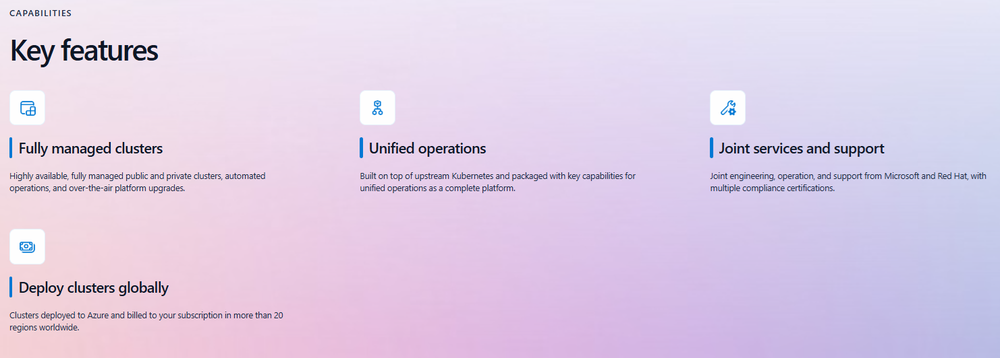
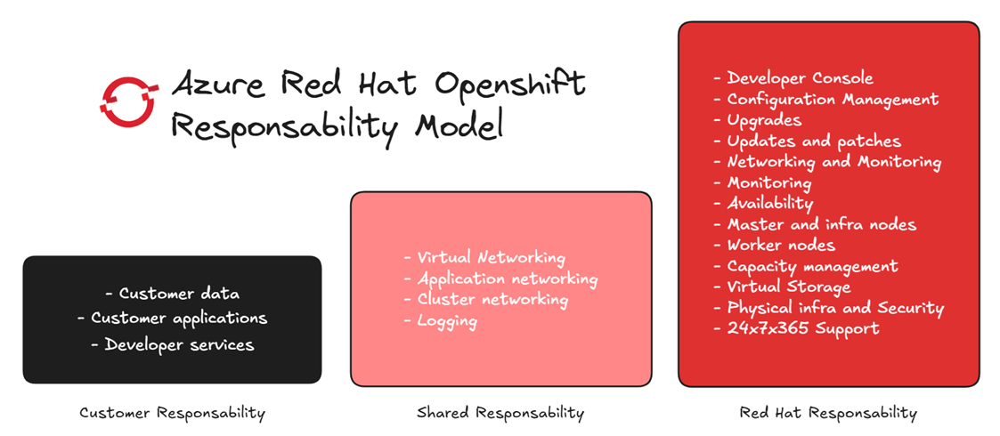
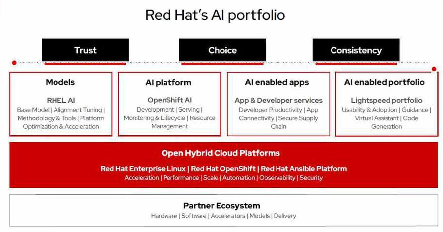

------------------------------------------------------------------------------------

---
## Introduction

Hi everyone!

In this blog, I’ll share my experience at the [Cloud Business Breakfast](https://events.redhat.com/profile/form/index.cfm?PKformID=0x12784546bc1) hosted by **RedHat** and **Microsoft** in Geneva at Warwick Hotel.

The event brought together professionals from diverse backgrounds to discuss cloud technologies and share insights over a delicious breakfast.  

The day started with a warm welcome and an overview of the agenda, followed by introductions from all attendees. It was great to see such a variety of profiles in the room, including an OpenShift Black Belt, Azure specialists, cloud migration experts, product owners, managers, account executives, and OpenShift users.  

## Cloud Trends and Strategic Opportunities  

**By [Matthias Egli](https://www.linkedin.com/in/matthias-egli-8001/) - Cloud Transformation Lead, Red Hat**  

### Summary  

[Matthias](https://www.linkedin.com/in/matthias-egli-8001/) provided an insightful overview of current cloud market trends and the strategic opportunities they present. He highlighted the growing shift of customers from on-premises environments to the cloud and the exponential growth of global sales through cloud marketplaces. Matthias emphasized how these trends are reshaping the IT landscape and enabling businesses to adopt more flexible, scalable, and cost-efficient solutions.  

### Key Points  

#### Cloud Market Trends  

- The cloud market is rapidly growing, with global sales of third-party products through hyperscalers doubling to **$16B in 2023**.  
- Projections indicate growth to **$45B by 2025** and potentially **$85B by 2028**.  

#### Benefits of the Public Cloud  

- Often more **cost-effective** than traditional on-premises solutions.  
- Eliminates the need for **CapEx investments**.  
- Provides **scalability** and **reliability**.  
- Enables more **efficient and flexible** use of resources.  

#### Advantages of Cloud Marketplaces  

- Offers **convenience** and **time savings**.  
- Provides **cost savings** and **easy integration** for businesses.  

## Leveraging Cloud Innovation for Business Agility  

**By [André Pereira](https://www.linkedin.com/in/andrefgpereira/) - Azure Digital & Apps Innovation Team, Microsoft**  

### Summary

[André](https://www.linkedin.com/in/andrefgpereira) delivered an engaging presentation focused on the key elements of modern cloud innovation: **people, processes, and technology**. He traced the evolution of cloud computing, from its initial phase of lift-and-shift to today’s complex Kubernetes ecosystems. He then emphasized the importance of **simplifying cloud operations** through managed platforms like [Azure Red Hat OpenShift (ARO)](https://azure.microsoft.com/en-us/products/openshift), showcasing the strong partnership between Microsoft and Red Hat. The talk also highlighted the transformative potential of AI, with real-world examples of its use and a live demo of [Copilot in Azure](https://learn.microsoft.com/en-us/azure/copilot/overview).  

### Key Points  

#### Evolution of Cloud Infrastructure  

- Cloud 1.0: Focused on **CPU, memory, and storage**—traditional lift-and-shift models.  
- Shift away from associating applications with physical servers; introduction of Docker and Kubernetes for orchestration.  
- Kubernetes remains complex to manage, even 10 years after its rise.  
  - **75% of enterprise users** cite implementation and operational complexity as the top adoption blocker.  

#### Managed Platforms and ARO’s Value  

- Building and maintaining a Kubernetes platform in-house is resource-intensive.  
- ARO offers:  
  - **Automated, full-stack installation** from container hosts to application services.  
  - **Autoscaling**, seamless Kubernetes deployment across environments.  
  - **One-click updates** for platform, services, and applications.  
- Strong Microsoft-Red Hat **partnership**:  
  - Joint support and engineering.  
  - Integration of DevOps tools and cloud-native services.  
  - Simplified operations through **single invoicing** and use of committed Azure cloud spend.  
- ARO simplifies cluster management, patching, monitoring, and security, letting teams focus on applications and user management with Azure Entra.  

*Source : Microsoft.com*

#### Benefits of Azure Ecosystem for ARO

- Direct Access to Azure services such as **databases**, **security tools**, **AI/ML capabilities**, and **integration services**.  

#### Focus on AI Innovation  

- **GitHub Copilot** insights:  
  - 87% reduction in mental effort on repetitive tasks.  
  - 74% increase in focus on satisfying work.  
  - 73% report being more in the flow.
- **Azure OpenAI Capabilities**:  
  - Content generation, semantic search, code generation, and summarization.  
  - Positioned as the **complete cloud for generative AI at scale**.  

## Customer Success: Realizing Business Value with Managed OpenShift  

**By** [Francis Werquin](https://www.linkedin.com/in/francis-werquin/), Technology Enthusiast AI & Cloud, Red Hat  

### Summary

[Francis](https://www.linkedin.com/in/francis-werquin/) highlighted the challenges modern organizations face in keeping pace with disruption and adapting their business models. He explored the evolution of IT landscapes, emphasizing the transition from centralized datacenter environments to distributed and heterogeneous multi-cloud architectures. The talk also covered the complexity of Kubernetes management and how solutions like OpenShift simplify operations while enabling innovation.  

Francis showcased how Red Hat OpenShift offers a platform that integrates trusted components, simplifies upgrades, and aligns with the demands of businesses deploying AI-enabled applications. He also touched on the collaboration between Red Hat and Microsoft to ensure seamless support for Azure Red Hat OpenShift (ARO).  

### Key Points

#### The Challenges of Modern IT Landscapes  

- **Disruption:**  
  - Over 60% of CEOs believe their organizations are not adapting fast enough to stay competitive.  
  - 63% of executives foresee significant changes to their business models within a year.  
- **Evolving IT Landscapes:**  
  - Shift from homogeneous, datacenter-centric environments to heterogeneous, multi-cloud, distributed systems.  
  - Increased silos across infrastructure, private/public cloud, applications, and developer processes.  
- **AI/ML Adoption:**  
  - Every industry (e.g., healthcare, finance, automotive) integrates AI/ML in its operations.  

#### The Complexity of Kubernetes and the Value of OpenShift  

- Managing Kubernetes clusters requires significant effort, often detracting from time spent on business innovation.  
- **Red Hat OpenShift Benefits:**  
  - A trusted, curated, and consistent **platform** *(more than a Kubernetes solution)*.  
  - Simplified **patching and upgrades** through integrated components.  
  - Clear division of responsibilities, with Red Hat managing most operational tasks like configuration, storage, and physical infrastructure.  

- Managed OpenShift enables:  
  - **60%** reduced development time.  
  - **50%** more efficient infrastructure management.  
  - **20%** less infrastructure maintenance work.  
  - **468%** 3-year ROI.

## OpenShift AI and Cloud: Driving Digital Transformation with AI  

**By** [Kyra Goud](https://www.linkedin.com/in/kyra-goud/), AI Platform Solution Architect, Red Hat  

### Summary

[Kyra](https://www.linkedin.com/in/kyra-goud/) explored how AI can transform businesses despite lingering fears around its adoption. She highlighted the growing investments in AI by leading organizations, practical use cases, and Red Hat's offerings for enabling AI-powered digital transformation.  

The presentation emphasized that successful AI initiatives require a combination of leadership commitment, strategy, scalable operating models, in-house talent, and technologies designed to empower innovation. [Red Hat's AI portfolio](https://www.redhat.com/en/products/ai), including OpenShift AI and other Lightspeed products, was showcased as a comprehensive ecosystem to support organizations throughout their AI journey, from experimentation to scaling in production.  

### Key Points

#### AI: A Strategic Priority  

- 55% of leading digital organizations have made AI their top **investment priority**.  
- 58% of CIOs plan to allocate over 5% of their 2024 IT **budget** to generative AI.  
- 40% of companies aim to expand AI use for **automating** processes and workflows.  

#### Challenges with Large Language Models (LLMs)  

- LLMs alone are insufficient; they need data, context, and cultural alignment to deliver value.  
- **Key LLM Agentic Patterns:**  
  - **Reflection:** Models self-review to refine outputs.  
  - **Tool Usage:** LLMs leverage tools like code execution and data analysis.  
  - **Planning:** Step-by-step strategy design and execution.  
  - **Multi-Agent Collaboration:** Teams of AI agents work together to achieve goals.  

### Red Hat AI Portfolio  

#### Red Hat Enterprise Linux AI  

- A foundation model platform for Granite family LLMs, supporting seamless AI app development, testing, and operation.  

#### OpenShift AI  

- A hybrid cloud platform for building, training, testing, and running AI-enabled applications.  
- Includes tools for development, serving, lifecycle management, and resource optimization for MLOps.  

#### Lightspeed AI Portfolio  

- **Ansible Lightspeed:** Accelerates playbook creation with a finely tuned, automation-specific AI model.  
- **OpenShift Lightspeed:** A generative AI virtual assistant integrated into the OpenShift console.  
- **Red Hat Enterprise Linux Lightspeed:** Simplifies Linux deployment, management, and maintenance through AI.  

### Flexibility and Ecosystem Support  

- Hybrid cloud deployment options compatible with:  
  - **Hardware accelerators:** NVIDIA, AMD, Intel.  
  - **OEM servers:** Dell, Lenovo, Cisco, HP.  
  - **Cloud environments:** AWS, Azure, IBM Cloud, GCP.  

### Key Takeaways  

- Red Hat's AI ecosystem delivers **flexibility, innovation, and security** across hybrid cloud environments.  
- **Investments in AI**, particularly generative models, are transforming industries by enhancing productivity, scalability, and automation.  
- The Lightspeed portfolio demonstrates **Red Hat's commitment to simplifying AI adoption** for developers and organizations alike.  

## Going further

If you're interested in exploring Azure Red Hat OpenShift further, here are some useful resources:  

- **Try Azure Red Hat OpenShift with a PoC**: [https://red.ht/Level-Up](https://red.ht/Level-Up)  
- **Watch the Azure Red Hat OpenShift Interactive Tour**: [https://red.ht/AROwalkthrough](https://red.ht/AROwalkthrough)  
- **Explore the Azure Red Hat OpenShift Learning Path**: [https://red.ht/azure-path](https://red.ht/azure-path)

## Don't miss this event in Zurich

This event will provide you the opportunity to join your peers, explore the latest Red Hat technologies, and collaborate with industry leaders to explore the future of technology.

- [Red Hat Summit: Connect Zurich](https://www.redhat.com/en/summit/connect/emea/zurich-2024)

## That's all folks

A heartfelt thank you to all the speakers for their insightful presentations and for sharing their expertise. These sessions not only highlighted the capabilities of OpenShift solutions and their impact on digital transformation but also showcased Microsoft and Red Hat's innovative vision in an evolving cloud and AI ecosystem.
