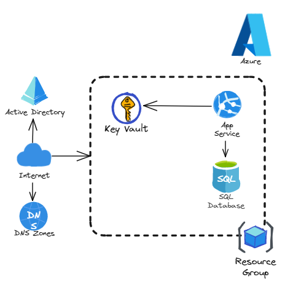
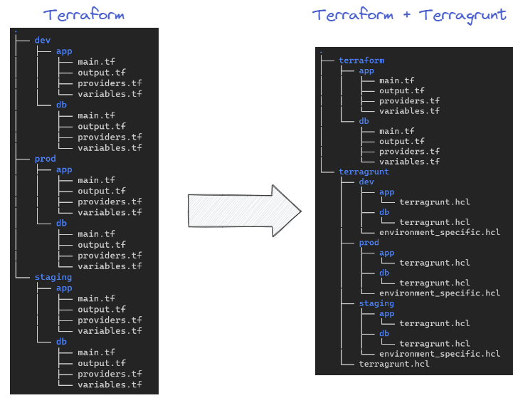

## Introduction

The setup and management of infrastructure for your Cloud computing projects can be a tedious and time-consuming process.

An Infrastructure as Code solution such as [Terraform](https://www.terraform.io/) allows you to create and manage cloud resources using configuration files.

As we will see in this article, Terraform can be particularly complex to manage when it is necessary to maintain multiple environments while minimizing code reuse (**DRY**: don't repeat yourself!), or to manage multiple [distinct backends](https://developer.hashicorp.com/terraform/language/settings/backends/configuration) for each environment. Despite the use of [workspaces](https://developer.hashicorp.com/terraform/language/state/workspaces), Terraform would only address the first of these issues!

Fortunately for us, [Terragrunt](https://terragrunt.gruntwork.io/) solves these problems!

## Introduction to Terragrunt

Let's take a look at the main advantages of Terragrunt.


### File Structure under Terragrunt

Terragrunt simplifies the management of Terraform configurations for multiple environments. Let's take a concrete example on [Azure](https://azure.microsoft.com/).

We want to provision an application that will use multiple resources ([AppService](https://learn.microsoft.com/en-us/azure/app-service/), [AppService Plan](https://learn.microsoft.com/en-us/azure/app-service/overview-hosting-plans), [Resource Group](https://learn.microsoft.com/en-us/azure/azure-resource-manager/management/manage-resource-groups-portal), [KeyVault](https://learn.microsoft.com/fr-fr/azure/key-vault/general/basic-concepts), etc.) as well as a [SQL database](https://azure.microsoft.com/en-us/products/azure-sql/database) for persistent data:



We want to deploy this application on a development environment (**dev**), a staging environment (**staging**), and a production environment (**prod**).

We will code 2 Terraform modules in advance:

* **app**: for the application and resource group
* **db**: for the database part

As an example, we could have this type of file structure on Terraform, where each Terraform file is duplicated per environment, whereas Terragrunt code is simpler to understand and considered DRY:



On the left side of the image, we can see that "classic" Terraform code **must be maintained for each environment**. We have to copy the code three times for both the app and db modules, which is not ideal for maintenance. Additionally, we will need to manage a "backend" block for each environment.

In contrast, with Terragrunt, we physically separate our Terraform code into a folder from Terragrunt code, which only contains environment-specific variables.

We can observe:

* A **root** `terragrunt.hcl` file that allows us to manage global configurations for all of our environments and dynamically generate a backend.
* An `environment_specific.hcl` file in each directory that will contain configurations specific to our environments and independent of modules. *We could have called it `terragrunt.hcl` but I renamed it for clarity.*
* A module-specific file `terragrunt.hcl` that will contain the module definition (*where is our module?*) as well as the variables to pass to it.

When we want to generate and apply our Terragrunt plan (`terragrunt plan`, `terragrunt apply`), it will be necessary to go to the specific folder for our environment.

Terragrunt will be able to read the hcl files in parent directories to have the complete code before being launched.

For example, if we want to apply changes following modifications to the `terragrunt/dev/app/terragrunt.hcl` file, we need to go to the `terragrunt/dev/app` directory to run the `terragrunt plan` and `terragrunt apply` commands.

As an additional note, it is also possible to go to the terragrunt/dev directory and run the `terragrunt run-all plan` command. All plans will be displayed sequentially.

*Of course, we could also manage all Terraform code in another repository so that each directory has its own lifecycle.*

### Backend Management

Terragrunt allows to simplify the backend management of Terraform by using a centralized configuration. In our case, we will store the backend on [Terraform Cloud](https://app.terraform.io/). We will have the possibility to create a backend for each environment (dev, staging, prod) by specifying a single Terragrunt block of code in the root file terragrunt.hcl:

```hcl
# /home/lionel/demo-terragrunt/terragrunt/terragrunt.hcl
locals {
    # Get Project Name
    env_config = read_terragrunt_config(find_in_parent_folders("environment_specific.hcl"))
    environment_name= local.env_config.locals.environment_name
    terraform_token   = get_env("TF_CLOUD_API_TOKEN")
}

# Generate a backend (one per project)
generate "backend" {
  path = "backend.tf"
  if_exists = "overwrite_terragrunt"
  contents = <<EOF
terraform {
  cloud {
  organization = "sokube-test"
    workspaces {
      name = "demo-${local.environment_name}"
    }
  }
}
EOF
}
```

Firstly, we can notice the use of a "locals" block which will contain two variables:

* `environment_name` which will be generated directly by reading the `environment_specific.hcl` file which will contain the name of our environment. It is interesting to note that we will use the [find_in_parent_folders()](https://terragrunt.gruntwork.io/docs/reference/built-in-functions/#find_in_parent_folders) command since, as mentioned earlier, we will run the terragrunt plan command in the `terragrunt/<environment>/<app|db>` folder.
* `terraform_token` which will be initialized by retrieving the `TF_CLOUD_API_TOKEN` environment variable to connect to Terraform Cloud to create the backend. We do not want to have this value in our code for obvious security reasons. We could have of course stored this backend locally or remotely on AWS, Azure or GCP.

We want to isolate environments as much as possible, with this solution, each environment will have its own TFState!

### Managing variables with the terragrunt.hcl files

As we have seen previously, we will store the `environment_name` variable in the `environment_specific.hcl` file present in each subdirectory `dev`, `staging`, and `prod`. This variable has served us to generate the backend but it could also serve us in our naming convention for our resources.

Here is what our file will look like:

```hcl
# /home/lionel/demo-terragrunt/terragrunt/dev/environment_specific.hcl
locals {
    environment_name = "dev"
}
```

### Managing modules

Now we will focus on the `terragrunt/dev/app/terragrunt.hcl` and `terragrunt/dev/db/terragrunt.hcl` files.

In these files, we will declare the path where the terraform module is located:

```hcl
# /home/lionel/demo-terragrunt/terragrunt/dev/app/terragrunt.hcl
# Include root terragrunt.hcl
include "root" {
  path = find_in_parent_folders()
}

locals {
  # Get Environment name from env_specific.hcl file
  env_config = read_terragrunt_config(find_in_parent_folders("env_specific.hcl"))
  environment_name = local.env_config.locals.environment_name
}

# Terraform bloc to call app module
terraform {
    source = "../../../terraform//app/"
}
```

```hcl
# /home/lionel/demo-terragrunt/terragrunt/dev/db/terragrunt.hcl
# Include root terragrunt.hcl
include "root" {
  path = find_in_parent_folders()
}

locals {
  # Get Environment name from env_specific.hcl file
  env_config = read_terragrunt_config(find_in_parent_folders("env_specific.hcl"))
  environment_name = local.env_config.locals.environment_name
}

# Terraform bloc to call db module
terraform {
    source = "../../../terraform//db/"
}
```

*It is also possible to specify a GIT repository as a source.*

### Environment-specific variables

We just need to pass the necessary variables to our modules so that they are called. To do this, simply use an `inputs` block. Here is what our final files could look like:

```hcl
# /home/lionel/demo-terragrunt/terragrunt/dev/app/terragrunt.hcl
# Include root terragrunt.hcl
include "root" {
  path = find_in_parent_folders()
}

locals {
  # Get Environment name from env_specific.hcl file
  env_config = read_terragrunt_config(find_in_parent_folders("env_specific.hcl"))
  environment_name = local.env_config.locals.environment_name
}

# Terraform bloc to call app module
terraform {
    source = "../../../terraform//app/"
}

# Values
inputs = {
  # I.e used for resources names
  env_name = local.environment_name
  # Other inputs
  variable1 = "My first value"
  variable2 = "My second value"
  variable3 = "My third value"
  variable4 = "My forth value"
  ...
}
```

```hcl
# /home/lionel/demo-terragrunt/terragrunt/dev/db/terragrunt.hcl
# Include root terragrunt.hcl
include "root" {
  path = find_in_parent_folders()
}

locals {
  # Get Environment name from env_specific.hcl file
  env_config = read_terragrunt_config(find_in_parent_folders("env_specific.hcl"))
  environment_name = local.env_config.locals.environment_name
}

# Terraform bloc to call db module
terraform {
    source = "../../../terraform//db/"
}

# Values
inputs = {
  # I.e used for resources names
  env_name = local.environment_name
  # Other inputs
  variable1 = "My first value"
  variable2 = "My second value"
  variable3 = "My third value"
  variable4 = "My forth value"
  ...
}
```

### Application des changements

Once our code is complete, all we have to do is generate the terragrunt plan and provision the resources.

Here's how we could provision the resources or apply changes after modifying an input variable in the `terragrunt/dev/db/terragrunt.hcl` file:

```bash
# We move to the following directory :
cd /home/lionel/demo-terragrunt/terragrunt/dev/db
# Initialize terragrunt
terragrunt init
# Generate Terragrunt plan
terragrunt plan -out myplan.tfplan
# Apply plan
terragrunt apply myplan.tfplan
```

This approach allows us to truly isolate environments as well as changes to a specific module.

The plan displayed will be in every way the same as a plan displayed via Terraform!

## Conclusion

After this basic use of Terragrunt, we have seen together how this tool offers many advantages for effectively managing Terraform deployments, in addition to minimizing code duplication.

It allows for easy navigation and understanding of the file system by defining different configurations in the `terragrunt.hcl` files.

We were also able to generate separate backends for each environment to isolate them from each other. This would not have been possible using Terraform workspaces.

However, while Terragrunt can offer practical advantages, it can also have some drawbacks, particularly in that it requires the installation of a separate tool and the learning of an additional layer of abstraction for teams.

Finally, it should be noted that Terragrunt is not natively supported by Terraform Cloud and Terraform Enterprise, although workarounds are available.

Terragrunt remains a very interesting solution, especially in contexts involving many environments. For simple usage on 1 or 2 environments, Terraform alone may suffice.


> *Keep it dry but keep it simple!*

### Sources

- [Terragrunt Documentation](https://terragrunt.gruntwork.io/)
- [Blog Terragrunt](https://blog.gruntwork.io/how-to-manage-multiple-environments-with-terraform-using-terragrunt-2c3e32fc60a8)
