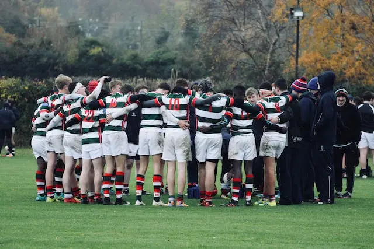

------------------------------------------------------------------------------------
---
# TheDevOpsRunner Channel is Live on YouTube!

## Announcing the Launch of TheDevOpsRunner YouTube Channel

I'm delighted to announce the launch of [TheDevOpsRunner YouTube channel](https://www.youtube.com/@thedevopsrunner), your ultimate resource for insightful content and hands-on expertise in the realm of DevOps, specifically tailored for the Microsoft Azure ecosystem.

Dive into a diverse range of topics, including cloud computing on **Azure** with its myriad services, **Infrastructure as Code**, exploration of the **Kubernetes** ecosystem, mastering **FinOps** practices, and much more.

Whether you're a beginner or an experienced professional in DevOps, 'TheDevOpsRunner' is your guide to navigating and excelling in this dynamic field.

I'm excited to share that our inaugural video series will be an in-depth preparation course for the **AZ-900 Azure Fundamentals certification**.

Join me on this educational journey, where we'll demystify complex concepts and empower you to excel in the world of DevOps on Microsoft Azure.

## Why did I open this channel?

There are several compelling reasons behind the creation of 'TheDevOpsRunner' YouTube channel:

1. **Passion for Progress:** The primary goal is to help individuals advance in their DevOps journey. Sharing our common passion for this dynamic field, 'TheDevOpsRunner' aims to be a valuable resource for learners at every stage.

2. **Building Connections:** This channel provides a platform to connect with like-minded individuals. By fostering discussions and exchanges, I hope to expand my network and learn from the diverse experiences of the DevOps community.

3. **Convenient and Informative Content:** With a preference for concise, informative videos, 'TheDevOpsRunner' is designed for easy consumption during commutes or downtime. Expect short, focused formats that get straight to the essentials.

4. **Learning Through Teaching:** Teaching is one of the most productive forms of learning. By creating content, I aim to deepen my understanding of even the simplest concepts and, in turn, contribute to the learning experience of the audience.

5. **Skill Enhancement:** The journey involves enhancing not just technical skills but also soft skills like video editing and effective communication. As the channel evolves, expect improvements in both content quality and presentation.

6. **Language Development:** With an opportunity to practice and refine my English, which has taken a back seat lately, 'TheDevOpsRunner' becomes a dual-purpose platform for sharing knowledge and improving language proficiency.

**Additionally, I want to assure you that the blog is not taking a backseat.** I'll continue to publish articles, recognizing that both mediums complement each other. Some topics are better suited for written exploration, and the blog remains a space for in-depth discussions.

As we embark on this journey together, bear in mind that the quality of videos will steadily progress. I've already recorded about a dozen, witnessing improvement with each passing day!

I invite you to [subscribe](https://www.youtube.com/@thedevopsrunner?sub_confirmation=1), join the community, and grow with 'TheDevOpsRunner.'

Thank your so much and see you soon on Youtube!

# Here is my first video!

