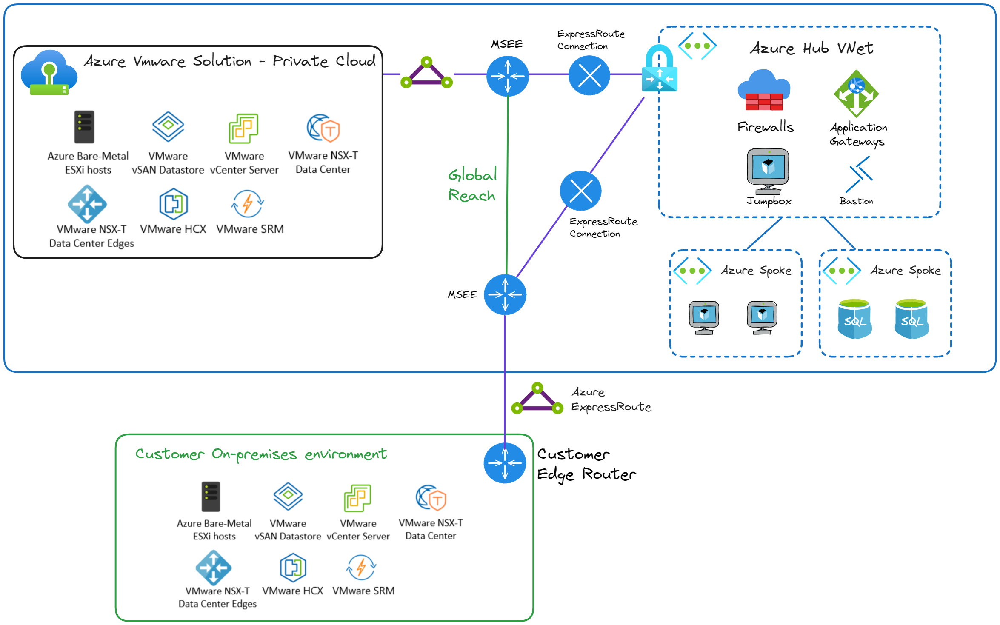
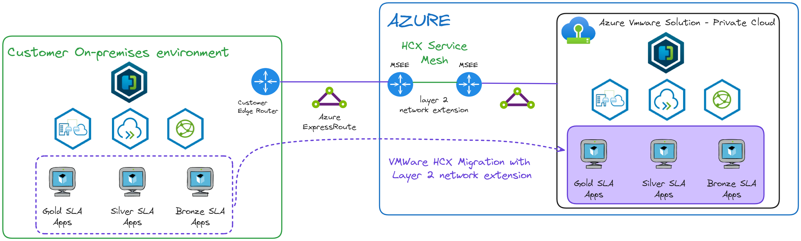
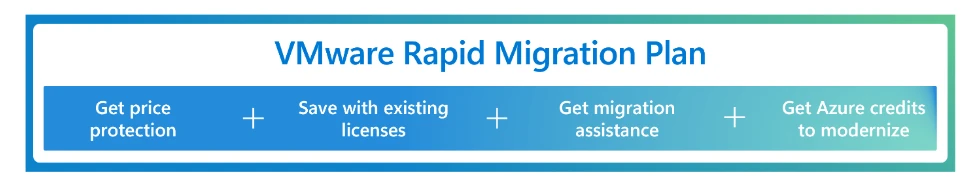
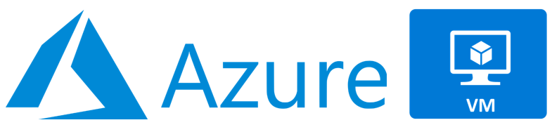
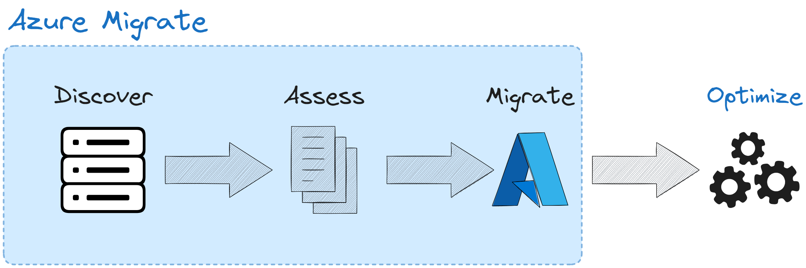
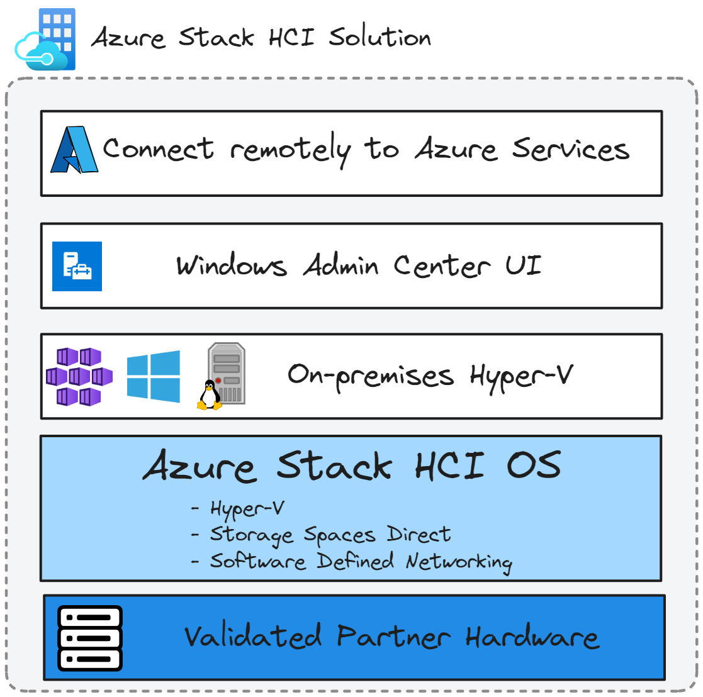
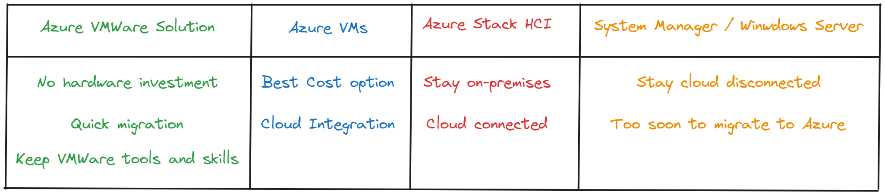

------------------------------------------------------------------------------------

---
# VMware to Azure: Exploring Cloud Migration Options

## Introduction

The recent acquisition of VMware by Broadcom has sent shockwaves through the IT industry, particularly in Europe. This move has led to drastic changes in VMware's business strategy. Broadcom has radically simplified the product offering and licensing model, ending perpetual licenses in favor of subscriptions and replacing individual product purchases with bundled offerings.

These changes have resulted in significant cost increases for many customers, with prices tripling or even quintupling for some! In light of this situation, about 20% of users are considering leaving VMware.

Several options are available for companies looking to migrate their VMware infrastructure to the cloud, but choosing the ideal solution is not always easy.

Each option has specific advantages that can address different needs based on several criteria: budget, time constraints for migration, and the skills of the existing teams.

In this article, we will explore the solutions offered by Microsoft, which allow the migration of on-premise VMware environments to Azure. This guide aims to help you make the best decision considering your constraints and objectives.

## Azure VMware Solution

### Why Choose Azure VMware Solution?

- Do you need to quickly leave your datacenter?
- Do you want to continue using tools you are already familiar with? (Vcenter, HCX, NSX-T)
- Do you want to minimize changes in your processes and infrastructure?
- Are you looking to avoid a CAPEX investment in hardware?

If you answered "yes" to one or more of these questions, Azure VMware Solution is an excellent alternative. This solution allows you to easily migrate your VMware workloads to Azure while keeping your familiar tools and minimizing disruptions to your operations.

### What is Azure VMware Solution?

Azure VMware Solution (AVS) is a dedicated deployment of bare metal servers running VMware in Azure. This solution enables you to benefit from the same tools you had on-premises while leveraging Azure's cloud infrastructure.

AVS provides a complete software-defined data center (SDDC) stack, including: 

- ESXi: the VMware hypervisor that manages your virtual machines.
- NSX-T: for network virtualization, ensuring security and connectivity.
- vSAN: for hyper-converged storage, optimizing performance and management.
- HCX: to facilitate migration and integration between your on-premise VMware environments and Azure.

This service is now available in around [30 regions!](https://techcommunity.microsoft.com/t5/azure-migration-and/azure-vmware-solution-now-available-in-italy-north-switzerland/ba-p/4129032)

As we can see in the diagram representing a Hub and Spoke context, Azure VMware Solution is a private cloud, isolated from our Azure workloads. However, nothing prevents us from linking it with ExpressRoute and our VNets (here the hub, in this case).
If you have an ExpressRoute circuit between your site and Azure, the Global Reach service will allow you to interconnect AVS to your VNets as well as to your on-premises infrastructure through Microsoft's global backbone network, offering private, secure, and low-latency connectivity.

Thus, you can use VMware HCX for both your migrations and to extend your infrastructure or set up a disaster recovery solution.

### Benefits

Azure VMware Solution offers numerous benefits that make it an attractive choice for companies looking to migrate to the cloud:

1. **Consistency**: You benefit from a VMware-based solution identical to the one you use on-premises, ensuring a smooth transition.
2. **Integration with Azure Services**: AVS easily integrates with Azure services such as backup, threat protection, and performance monitoring, enhancing your overall infrastructure.
3. **Simplified Migration**: No need for virtual machine conversion; you can simply move your VMs. This can reduce migration costs by up to 69%.
4. **Leverage Your Existing VMware Investments**: You take advantage of the skills and tools you already have, making AVS adoption easier.
5. **Managed Infrastructure**: The bare metal hardware is fully managed by Microsoft, freeing you from hardware maintenance.
6. **Scalability and Rapid Provisioning**: You can maintain your on-premises infrastructure while scaling in Azure without needing to purchase new hardware. Provisioning can occur in as little as two hours.
7. **Use for Disaster Recovery (DR)**: AVS can be used as an effective DR solution, providing additional protection for your servers.
8. **Backup with Azure Backup**: Your servers can be securely backed up using Azure Backup services.

### How to Migrate to This Service?

Here are the steps to follow to migrate your on-premise VMware workloads to AVS.

1. **Assessment with Azure Migrate**: Start by using **Azure Migrate** to evaluate your current environment. This will help you plan your migration and check your readiness.

2. **Creating Your Azure VMware Environment**: Once the assessment is complete, create your Azure VMware environment in the cloud.

3. **Migrating Your VMs**: Use **HCX** (Hybrid Cloud Extension) to migrate your virtual machines. HCX facilitates bi-directional movement of your VMs, allowing you to transfer them seamlessly.

4. **Integrating Azure Services**: After migrating your VMs, you can enhance your environment with various Azure services, such as:
   - Azure Functions
   - Azure Kubernetes Service (AKS)
   - App Services
   - Azure SQL Database
   - Power BI
   - and many more

5. **Adding Features**: To enhance the security and performance of your environment, add capabilities such as backup, threat protection, and performance monitoring.

Of course, like after any migration, an optimization phase is to be expected!

### Pricing

The pricing for Azure VMware Solution is structured around different SKUs and takes several factors into account:

- **Example SKU**: The **AV36** model includes:
  - 36 cores
  - 576 GB of RAM
  - 15 TB of SSD storage
  - 3 TB of NVMe cache

- **Minimum Configuration**: To use AVS, a minimum of 3 hosts is required, which represents a minimum cost of **$20,158 per month** based on AV36 hosts.

- **Bandwidth Costs**: Remember that additional charges for bandwidth apply, especially if you are using ExpressRoute.

This solution may seem expensive, but don't forget that it includes, among other things, the cost of hardware, datacenter rental, VMware licenses, and maintenance performed by Microsoft (firmware, hardware, node maintenance, and the vSphere version...)

Fortunately, several options are available to significantly reduce the price:

- **Free Trial**: Take advantage of a 30-day free trial to evaluate the solution.

- **Reserved Instances**: You can benefit from a discount of up to 30% for one year or 50% for three or five years if you opt for reserved instances.

- **Hybrid Benefits**: Bring your on-premise Windows Server and SQL Server licenses to benefit from a 40% discount.

- **Security Updates**: Enjoy 3 years of free security updates for Windows Server and SQL Server.

- **VMware Rapid Migration Plan**: Microsoft provides a comprehensive set of [licensing benefits and programs](https://azure.microsoft.com/en-us/blog/introducing-the-vmware-rapid-migration-plan/) to give you price protection and savings as you migrate to Azure VMware Solution.

For more information on discounts and offers, check the [Azure blog](https://azure.microsoft.com/en-us/blog/introducing-the-vmware-rapid-migration-plan/).

## Azure VMs

### Why Choose Azure VMs?

If you are looking to go beyond VMware and further reduce your costs, Azure Virtual Machines (VM) is an excellent option.

Here are some key questions to consider:

- Do you want to significantly reduce your costs?
- Is Cloud Integration an important thing for you?

### What are Azure VMs?

I’m sure you’re already familiar with Azure Virtual Machines (VM), one of the most popular cloud solutions. It’s a service that allows you to create and manage virtual machines in Azure, offering great flexibility in terms of operating systems, configuration, and capacity.

### Benefits

1. **Cost Optimization**: Unlike Azure VMware Solution, you no longer need to pay for VMware licenses. Azure VM uses native cloud resources, which helps reduce maintenance and infrastructure costs.

2. **Scalability**: Azure VM allows you to easily adjust your resources based on your needs, whether to increase or decrease the capacity of your virtual machines.

3. **Integration with Azure Services**: By choosing Azure VM, you gain access to the full ecosystem of Azure services, such as Azure Backup, Azure Security Center, and Azure Monitor, for simplified workload management.

4. **Security**: Azure VM includes automatic security updates, ensuring that your systems are always protected against vulnerabilities.

5. **Hybrid and Multi-Cloud Consistency**: Azure VM offers seamless continuity if you operate in a hybrid or multi-cloud environment, allowing you to manage your resources consistently across your infrastructures.

### How to Migrate to This Service?

The process of migrating your on-premise VMware machines to Azure VM is simple and structured. It relies on the Azure Migrate tool, which guides you through three key steps:

1. **Discovery**: Azure Migrate identifies and inventories your existing VMware machines to understand their status and configuration.

2. **Assessment**: Next, a comprehensive analysis of your infrastructure is performed. Azure Migrate helps you assess the compatibility of your virtual machines with Azure VM, as well as the potential costs and performance in the cloud.

3. **Migration**: Once the assessment is complete, you can begin the actual migration of your VMs to Azure VM. The process is automated, facilitating the transfer of your machines with minimal disruption.

### Pricing

The price of a virtual machine depends on several factors, such as the size of the VM, the type of storage, and the region. For a standard machine, costs can range between $30 and $200 per month, depending on the specifications of the VM you choose.

Azure also offers reserved instance options and hybrid benefits, which can further reduce costs, especially if you commit to a long-term plan or bring your Windows Server or SQL Server licenses.

## Azure Stack HCI

### Why Choose Azure Stack HCI?

If you’re wondering whether Azure Stack HCI is the right solution for your environment, consider these questions:

- Do you need to run certain applications locally in a highly distributed environment?
- Are you looking for a hybrid product that combines the best of cloud and on-premise infrastructure?
- Do you want to reduce your rack size and optimize your physical space?

### What is Azure Stack HCI?

Azure Stack HCI is a solution that allows you to run virtual machines (VMs) and containers on dedicated hardware, providing a hyper-converged infrastructure. This system operates on integrated virtualization hosts and is managed from the Azure platform, simplifying the management of your resources. To ensure optimal performance, Azure Stack HCI requires specific hardware, which you can select from the [Azure Stack HCI catalog](https://azurestackhcisolutions.azure.microsoft.com/#/catalog). Additionally, Microsoft offers a tool called [Azure Stack HCI Sizer](https://azurestackhcisolutions.azure.microsoft.com/#/sizer) to help you size your infrastructure according to your needs.

### Benefits

- **Software Defined**: Everything is included, including virtualization, software-defined compute, and software-defined storage.
- **High Performance**: A hyper-converged platform designed to run virtual machines, containers, and virtual desktops on-premise.
- **Integration with Azure Services**: Enrich your workloads with advanced features and Azure services.
- **Security Updates**: A high level of security, achieving up to 90% by default according to Azure security standards.
- **High Availability and Resilience**: Ensures the smooth operation of your critical applications.
- **Cost-Effectiveness**: You pay for the software via an Azure subscription rather than at the time of hardware purchase.
- **Ease of Management**: Simplified monitoring and administration through an intuitive interface in the Azure portal.

### How to Migrate to This Service?

The migration of Hyper-V VMs to Azure Stack HCI is in public preview, allowing the transfer of both Windows and Linux VMs from Windows Server 2012 R2 to 2022. With the agentless migration option of Azure Migrate, no agent installation is necessary; only two appliances are required. Management is done via the cloud, while data transfer is local. Migrated VMs are automatically compatible with Azure Arc for comprehensive management.

The migration of VMware VMs to Azure Stack HCI is currently in private preview, with a form available to participate in this phase.

I invite you to check out [Thomas Maurer's article](https://www.thomasmaurer.ch/2024/02/migrate-vms-to-azure-stack-hci/) on the subject!

### Pricing

The cost of Azure Stack HCI is not limited to $10 per physical core per month. To assess the total cost of ownership (TCO), it's essential to consider several elements. In addition to the monthly fees, you need to include the price of hardware, such as servers, SSD storage, and networking equipment. Infrastructure costs for the data center, such as space, electricity, and cooling, must also be considered. Finally, operational costs related to IT labor, maintenance, and training are important factors. While Azure Hybrid Benefit can reduce some costs, it’s crucial to analyze all expenses for a complete view of the TCO of Azure Stack HCI. Nonetheless, this solution offers a good cost-benefit ratio.

## Windows Server / System Center

### Why Choose Windows Server and System Center?

Consider these questions:

- I can’t connect to the cloud!
- Do you have very few use cases that require the cloud?
- Perhaps you simply need more time to consider a migration to a cloud solution.

### What are Windows Server and System Center?

Windows Server is an operating system designed for servers, enabling the management of both general and guest servers. It offers numerous built-in roles, such as file services, DNS, DHCP, Active Directory, and Hyper-V. Windows Server is essential for running Windows applications and can operate on both physical and virtual hardware.

System Center, on the other hand, is a suite of management tools that facilitate the management of your IT infrastructure. It allows you to monitor and manage your servers, applications, and services, providing a unified view of your environment.

You do not need to join Azure Cloud to use Windows Server and System Center, but it’s important to note that this means you will lose the ability to deploy VMs on your own infrastructure.

### Benefits

- **Powerful and Flexible**: You can run numerous applications like SQL, Exchange, and SharePoint.
- **Advanced Virtualization Capabilities**: Offers the same features as Hyper-V.
- **Enterprise Identity Management**: Integration with Entra ID for effective user and access management.
- **Security**: Robust security features to protect your data and applications.
- **Integrated Applications**: Includes essential applications like Active Directory, DHCP, DNS, File Services, and IIS.
- **Cloud on Your Terms**: Enable your servers with Azure Arc according to your needs.

**Note**

- You will need to install System Center and all associated products (protection, automation, monitoring).
- This requires hardware, and you will need to manage updates.
- The cloud offers numerous options, necessitating careful consideration before considering this solution.

### How to Migrate to This Service?

Migration from VMware to Windows Server / System Center can be done via **System Center Virtual Machine Manager (VMM)**. Use the built-in conversion function by clicking the **Convert** button to convert your VMs.

With **System Center VMM 2022 UR2**, the VM conversion process is up to four times faster, making your transition to this solution easier and quicker.

### Pricing

This solution will be very cost-effective, but you will miss out on many features offered by Azure or VMware Cloud.

### Summary

To help you make the best decision, I suggest you base it on the following points:

- If you want to **migrate quickly**, without repurchasing hardware, and want to retain your investments in VMware, opt for **Azure VMware Solution**.
- If **price** is your priority: go for **Azure VMs**.
- If you want to leave VMware but remain on an **on-premise infrastructure** with the benefits of the Cloud: **Azure Stack HCI**.
- If you have no other options and must remain **disconnected from the Cloud**: **System Center + Windows Server**.

## Sources

- <https://siliconangle.com/2024/09/04/broadcom-vmware-acquisition-private-cloud-solutions-vmwareexplore/>
- <https://www.forbes.com/sites/emilsayegh/2024/04/16/broadcoms-acquisition-of-vmware-a-new-dawn-for-managed-service-providers/>
- <https://www.ninjaone.com/blog/broadcom-vmware-acquisition/>
- <https://learn.microsoft.com/en-us/azure/migrate/migrate-services-overview>
- <https://www.thomasmaurer.ch/2024/02/migrate-vms-to-azure-stack-hci/>
- <https://www.youtube.com/watch?v=Le1HdObHT8I>
